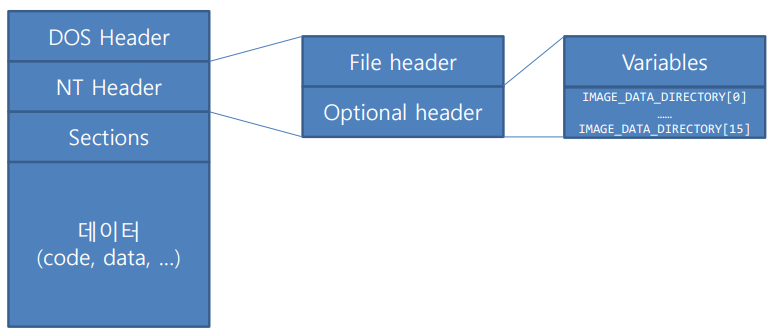

**상위 포스트 -** [PE File Format](/Anti-Cheat/Window_Reversing/PE/PE)

---

**Index**

[전반적인 PE 구조](#전반적인-pe-구조)

[DOS Header](#dos-header)

[NT Header](#nt-header)

[&emsp;File Header](#file-header)

[&emsp;Optional Header](#optional-header)

[Section Header](#section-header)

[IAT](#iat-import-address-table)

---

## 전반적인 PE 구조




---

## DOS Header

16 bit 시스템을 위한 header

```c
typedef struct _IMAGE_DOS_HEADER { // DOS .EXE header
	 WORD e_magic; // Magic number
	 WORD e_cblp; // Bytes on last page of file
	 WORD e_cp; // Pages in file
	 WORD e_crlc; // Relocations
	 WORD e_cparhdr; // Size of header in paragraphs
	 WORD e_minalloc; // Minimum extra paragraphs needed
	 WORD e_maxalloc; // Maximum extra paragraphs needed
	 WORD e_ss; // Initial (relative) SS value
	 WORD e_sp; // Initial SP value
	 WORD e_csum; // Checksum
	 WORD e_ip; // Initial IP value
	 WORD e_cs; // Initial (relative) CS value
	 WORD e_lfarlc; // File address of relocation table
	 WORD e_ovno; // Overlay number
	 WORD e_res[4]; // Reserved words
	 WORD e_oemid; // OEM identifier (for e_oeminfo)
	 WORD e_oeminfo; // OEM information; e_oemid specific
	 WORD e_res2[10]; // Reserved words
	 LONG e_lfanew; // File address of new exe header
} IMAGE_DOS_HEADER, *PIMAGE_DOS_HEADER;
```

`e_magic` : 그 유명한 `MZ` 시그니처가 들어 있음.

`e_lfanew` : NT Header를 가르키는 포인터

---

## NT Header

```c
typedef struct _IMAGE_NT_HEADERS {
	 DWORD Signature;
	 IMAGE_FILE_HEADER FileHeader;
	 IMAGE_OPTIONAL_HEADER32 OptionalHeader;
} IMAGE_NT_HEADERS32, *PIMAGE_NT_HEADERS32;
```

`Signature` : `b”PE\x00\x00”`

### File Header

```c
typedef struct _IMAGE_FILE_HEADER {
		WORD Machine;
		WORD NumberOfSections;
		DWORD TimeDateStamp;
		DWORD PointerToSymbolTable;
		DWORD NumberOfSymbols;
		WORD SizeOfOptionalHeader;
		WORD Characteristics;
} IMAGE_FILE_HEADER, *PIMAGE_FILE_HEADER;
```

`Machine` : 기계어 종류 (x86, x64, arm, mips, …)

`NumberOfSections` : section의 개수 (.text, .rdata, .data, …)

`TimeDateStamp` : 빌드 완료 시각

`SizeOfOptionalHeader` : Optional Header의 크기

### Optional Header

```c
typedef struct _IMAGE_OPTIONAL_HEADER {
		WORD Magic;
		BYTE MajorLinkerVersion;
		BYTE MinorLinkerVersion;
		DWORD SizeOfCode;
		… 중략
		DWORD AddressOfEntryPoint;
		DWORD BaseOfCode;
		… 중략
		DWORD ImageBase;
		DWORD SectionAlignment;
		DWORD FileAlignment;
		… 중략
		DWORD SizeOfImage;
		DWORD SizeOfHeaders;
		… 중략
		WORD Subsystem;
		… 중략
		IMAGE_DATA_DIRECTORY DataDirectory[IMAGE_NUMBEROF_DIRECTORY_ENTRIES];
} IMAGE_OPTIONAL_HEADER32,
*PIMAGE_OPTIONAL_HEADER32;
```

`Magic` : x86 바이너리의 경우 0x10B

`SizeOfCode` : 코드 영역의 크기

`AddressOfEntrypPoint` : 프로그램 로드 직후 ip가 가리켜야 할 메모리 주소 (RVA)

`BaseOfCode` : 기계어가 탑재될 메모리 주소 (RVA)

`ImageBase` : 파일이 가상 메모리에 탑재되는 지점

`SectionAlignment` : 메모리가 올라갔을 때의 alignment 간격

`FileAlignment` : 파일 상태에서 alignment 간격

`SizeOfImage` : EXE/DLL이 메모리에 로드 되었을 때의 이미지 총 크기

`SizeOfHeader` : PE 헤더 크기

`Subsystem` : GUI 프로그램인지, 콘솔 프로그램인지 구분

`DataDirectory` : `IMAGE_NUMBEROF_DIRECTORY_ENTRIES`는 16으로 정의됨

- 16개의 순서는 고정됨
- 순서 별로 의미를 가지며 다음과 같음
    
    ```c
    // Directory Entries
    #define IMAGE_DIRECTORY_ENTRY_EXPORT 0 // Export Directory, 중요
    #define IMAGE_DIRECTORY_ENTRY_IMPORT 1 // Import Directory, 중요
    #define IMAGE_DIRECTORY_ENTRY_RESOURCE 2 // Resource Directory
    #define IMAGE_DIRECTORY_ENTRY_EXCEPTION 3 // Exception Directory
    #define IMAGE_DIRECTORY_ENTRY_SECURITY 4 // Security Directory
    #define IMAGE_DIRECTORY_ENTRY_BASERELOC 5 // Base Relocation Table
    #define IMAGE_DIRECTORY_ENTRY_DEBUG 6 // Debug Directory
    #define IMAGE_DIRECTORY_ENTRY_ARCHITECTURE 7 // Architecture Specific Data
    #define IMAGE_DIRECTORY_ENTRY_GLOBALPTR 8 // RVA of GP
    #define IMAGE_DIRECTORY_ENTRY_TLS 9 // TLS Directory
    #define IMAGE_DIRECTORY_ENTRY_LOAD_CONFIG 10 // Load Configuration Directory
    #define IMAGE_DIRECTORY_ENTRY_BOUND_IMPORT 11 // Bound Import Directory in headers
    #define IMAGE_DIRECTORY_ENTRY_IAT 12 // Import Address Table
    #define IMAGE_DIRECTORY_ENTRY_DELAY_IMPORT 13 // Delay Load Import Descriptors
    #define IMAGE_DIRECTORY_ENTRY_COM_DESCRIPTOR 14 // COM Runtime descriptor
    ```
    
- 구조체 멤버 변수
    
    ```c
    typedef struct _IMAGE_DATA_DIRECTORY {
    		DWORD VirtualAddress;
    		DWORD Size;
    } IMAGE_DATA_DIRECTORY, *PIMAGE_DATA_DIRECTORY;
    ```
    

`DataDirectory`에서 `DataDirectory[IMAGE_DIRECTORY_ENTRY_IMPORT]`는 상당히 중요한데, 해당 `DataDirectory`의 `VirtualAddress`에 가면

Import해오는 외부 함수들 목록이 적혀 있는 `IAT`가 있다.

---

## Section Header

섹션 개수만큼 section header가 존재한다.

```c
#define IMAGE_SIZEOF_SHORT_NAME 8
typedef struct _IMAGE_SECTION_HEADER {
		BYTE Name[IMAGE_SIZEOF_SHORT_NAME];
		union {
				DWORD PhysicalAddress;
				DWORD VirtualSize;
		} Misc;
		DWORD VirtualAddress;
		DWORD SizeOfRawData;
		DWORD PointerToRawData;
		DWORD PointerToRelocations;
		DWORD PointerToLinenumbers;
		WORD NumberOfRelocations;
		WORD NumberOfLinenumbers;
		DWORD Characteristics;
} IMAGE_SECTION_HEADER, *PIMAGE_SECTION_HEADER;
```

`Name` : section의 이름. 통상적으로 `.text`, `.data` 등으로 지어지나, 꼭 그럴 필요는 없음.

`VirtualSize` : 메모리에 로드 되었을 때 section이 차지하는 크기

`VirtualAddress` : 메모리에서 섹션의 시작 주소

`SizeOfRawData` : 파일에서 섹션이 차지하는 크기

`PointerToRawData` : 파일에서 섹션의 시작 주소

`Caracteristics` : 섹션의 속성

```c
#define IMAGE_SCN_CNT_CODE 0x00000020
// Section contains code.
#define IMAGE_SCN_CNT_INITIALIZED_DATA 0x00000040
// Section contains initialized data.
#define IMAGE_SCN_CNT_UNINITIALIZED_DATA 0x00000080
// Section contains uninitialized data.
#define IMAGE_SCN_MEM_EXECUTE 0x20000000
// Section is executable.
#define IMAGE_SCN_MEM_READ 0x40000000
// Section is readable.
#define IMAGE_SCN_MEM_WRITE 0x80000000
// Section is writeable.
```

---

## IAT (Import Address Table)

`IMAGE_OPTIONAL_HEADER32.DataDirectory[1].VirtualAddress` 이곳에 위치하고 있다.

```c
typedef struct _IMAGE_IMPORT_DESCRIPTOR {
		DWORD OriginalFirstThunk; // 참고: VX PE-Viewer에서는 ID_Characteristics로 표현됨
		DWORD TimeDateStamp;
		DWORD ForwarderChain;
		DWORD Name;
		DWORD FirstThunk;
} IMAGE_IMPORT_DESCRIPTOR;
typedef IMAGE_IMPORT_DESCRIPTOR *PIMAGE_IMPORT_DESCRIPTOR;
```

기본적으로 모두 RVA 형식으로 표기되기 때문에, RAW 파일에서 읽기 위해서는 Physical Address로 변환하는 작업이 필요하다.

`Name` : DLL의 이름이 적혀 있다.

`OriginalFirstThunk` : 바이너리가 필요로 하는 함수 이름 목록이 있다.

`FirstThunk` : 함수 포인터 테이블이 담기는 위치.