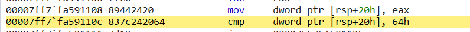

**상위 포스트 -** [WinDbg](/Anti-Cheat/Window_Reversing/windbg/windbg)

---

**Index**

[Access Breakpoint](#access-breakpoint)

[Advanced Breakpoint](#advanced-breakpoint)

---

## Access Breakpoint

`ba <Access Type> <Size> <Address> [Options]`

1. `<Access Type>`
    
    메모리 접근 유형을 지정
    
    - `e` : Execute
    - `w` : Write
    - `r` : Read
2. `<Size>`
    
    메모리 영역의 크기를 지정(바이트 단위)
    
3. `<Address>`
    
    bp를 설정할 메모리 주소
    
4. 추가 옵션 설정 가능. 아래에서 advanced bp에서 자세한 설명

예시)
`ba w 4 @rsp+0x20`

함수 내에서 `rsp+0x20` 위치의 지역 변수에 write에 대한 bp를 설정

`gc`로 continue 이후

`[rsp+0x20]`에 mov 연산을 수행한 직후에 bp가 걸리는 것을 확인할 수 있음

---

## Advanced Breakpoint

`bp <주소/함수명/심볼> "<명령어>"` : bp 적중 시 “ ” 안에 있는 명령어 실행

`~n bp <주소/함수명/심볼>` : n번 thread에만 bp 적용

`bp <주소/함수명/심볼> n` : n번 적중 시에만 bp에서 멈춤

`.if (condition) {...}`

`.elsif (condition) {...}`

`.else {...}`

`poi( )`를 이용하면 *와 동일한 효과를 얻을 수 있음.

예시)
`bp 00007ff7`fa59111d ".if (@ecx >= 55) {.echo Hit!}.else{gc}"`

ecx의 값이 0x55보다 클 때 bp가 hit (windbg에서는 기본적으로 16진수로 인식)

`bp MSVCR110D!malloc ".echo Current argument(size) is....; dd esp+4 L1;
.if(poi(@esp+4)>1024){.echo HIT!!!!!}
.else{gc}"`

malloc의 첫 번째 인자가 1024보다 클 때, hit하는 중단점