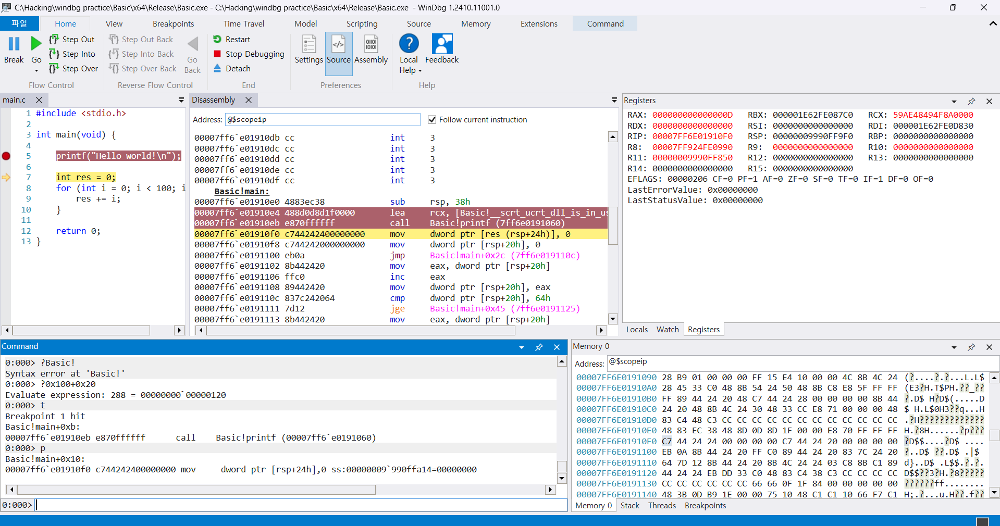

**상위 포스트 -** [WinDbg](/Anti-Cheat/Window_Reversing/windbg/windbg)

---

**Index**

[Workspace Configuration](#workspace-configuration)

[Start Debugging](#start-debugging)

[Basic Command](#basic-command)

[&emsp;Breakpoint 관련 명령어](#breakpoint-관련-명령어)

[&emsp;module 관련 명령어](#module-관련-명령어)

[&emsp;실행 관련 명령어](#실행-관련-명령어)

[&emsp;Display 관련 명령어](#display-관련-명령어)

[&emsp;Edit 관련 명령어](#edit-관련-명령어)

[&emsp;Thread 디버깅](#thread-디버깅)

[&emsp;디버거 제어 명령어](#디버거-제어-명령어)

[&emsp;!명령어](#-명령어)

---

## Workspace Configuration

위와 같은 화면 배치를 기본으로 사용한다.

source code가 있는 경우에만 왼쪽 상단에 소스 코드 창이 뜨고, 없는 경우 assembly 창으로만 구성된 형태이다.

인터페이스를 입맛대로 설정하였으면 `file > save workspace`로 저장하면,

이후 windbg를 킬 때 자동으로 저장한 workspace대로 인터페이스가 구축된다.

---

## Start Debugging

좌측 상단에 `파일`에 들어가면 `Launch executable` 혹은 `Attach to process`가 있다.

`Launch executable`의 경우에 디버거 위에서 프로세스를 올릴 수 있고, `Attach to process`의 경우 이미 실행 중인 프로세스에 디버거를 붙일 수 있다.

---

## Basic Command

### Breakpoint 관련 명령어

`bp` , `bu` : set breakpoint

심볼이 있을 경우 `bp <module명>!<심볼명>+<offset>` 형태로 bp를 걸 수 있지만, 심볼이 없는 경우에는 그냥 절대 주소로 bp를 거는 것이 일반적이다.

`bc` : Breakpoint Clear

`bd` : Breakpoint disable

`be` : Breakpoint enable

### module 관련 명령어

`lm` : list loaded modules

gdb에서 `vmmap`의 거의 축약 버전으로 보면 된다.

section보다는 module 단위에서 보여준다.

정적 분석 tool에서 RVA를 알아온 뒤, `lm`에서 확인한 base주소에 더해서 bp를 걸면 된다.

`ln` : list nearest symbol

이런 식으로 가장 가까운 심볼을 찾아준다.

library 내부가 아니면 pdb 없는 바이너리에서는 굳이 사용할 일이 있을까 싶다.

### 실행 관련 명령어

`g` : 실행. gdb에서 run과 continue가 합쳐진 명령어.

`p` : step over (F10)

`t` : step into (F11)

`gu` : step out (Shift + F11)

`pc` : 함수 내에서 다음 call 지점까지 실행

`tb` : 분기(jmp, branch, call, return)에 도달할 때까지 실행

`tc` : call에 도달할 때까지 실행

<aside>
💡

`pc` vs `tc`

`pc`는 현재 함수 내에서 국한됨. 함수 내에서 call을 마주치지 않는다면 함수가 return될 때 멈춤

`tc`는 함수에 국한되지 않고 그냥 `call`을 마주칠 때까지 계속 실행

</aside>

### Display 관련 명령어

`da` : display ASCII

`db` , `dw`, `dd`, `dq` : 1byte, 2byte, 4byte, 8byte 단위로 display

`ds` : display string

대충 이런 정도 출력해 주는데, 원하는 만큼만 출력하고 싶으면

뒤에 `L<길이>`를 사용하면 된다.

`dv` : local variable을 보여주는 것인데, 디버깅 정보가 없는 경우에는 무용지물. local view도 마찬가지

`k` : stack backtrace를 보여준다.

### Edit 관련 명령어

`ea` : edit ascii

`eb`, `ew`, `ed`, `eq` : edit 1byte, 2byte, 4byte, 8byte

대충 이런 느낌

register를 바꾸고 싶을 때는 `r`을 사용하면 된다.

기본적으로는 register 값을 출력하는 명령어지만, 수정도 가능

이런 느낌

### Thread 디버깅

`~`: 스레드 정보 확인

현재 활성화된 thread에는 `.` 표시가 있음.

위 사진에서는 4번 thread가 활성화된 상태

특정 Thread에 대해서 작업을 할 때는 `~<thread num>`과 함께 명령어를 작성하면 됨.

예시)

`~4k`  → 4번 thread의 stack backtrace를 확인

`~2bp <address>` → 2번 thread만 적용되는 bp 설정

`~3gc` → 3번 스레드만 실행

`~*k` → *를 활용하면 모든 thread에 대해서 명령을 실행할 수 있음

`~<thread num>s` : 해당 thread로 전환

### 디버거 제어 명령어

`.` 으로 시작하는 형식을 가짐

`.cls` : clear screen

`.enable_Unicode` : enable unicode display

`.reload` : reload module

`.bugcheck` : display bug check data

`.ofilter` : filter target output

`.crash` : force system crash

`.dump` : create dump file

`.reboot` : reboot target computer

`.cxr` : display context record

`.exr` : display exception record

`.ecxr` : display exception context record

`.trap` : display trap frame

`.exepath` : set executable path

`.srcpath` : set source path

`.sympath` : set symbol path

`.symfix` : set symbol store path

`.context` : set user-mode address context

`.process` : set process context

`.thread` : set register context

`.tss` : display task state segment

`.load` : load extention DLL

### ! 명령어

`!analyze` : displays information about the current bug checks

`!cupid` : displays information about the processors on the system

`!error` : decodes and displays information about an error value

`!gle` : displays the last error value for the current thread

`!obja` : displays the attributes of an object in the object manager

`!peb` : displays a formatted view of the information in the process environment block (PEB)

`!teb` : displays a formatted view of the information in the thread environment block (TEB)

`!token` : displays a formatted view of a security token or object

`!process` : displays information about specified process or all

`!stacks` : displays information about the current kernel stacks

`!thread` : displays summary information about a thread

`!zombies` : displays all dead process of threads