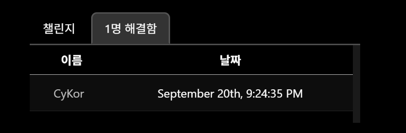

## Overview




This was quite a tough challenge, so snagging the **First Blood** felt really good. The core theme of the challenge was **obfuscation**, and looking at the binary as-is was extremely painful. I managed to fully deobfuscate some parts almost perfectly, while for others I couldn’t completely undo the obfuscation — but instead came up with alternative ways to analyze around it. With that in mind, let’s dive in and break this challenge down.

## Resolving Decompilation Issues

When open the binary in IDA, I quickly noticed that the decompilation results don’t look quite right. Take a look at the screenshot below.


The code block that IDA has marked as a “function” doesn’t really look like one if you check the assembly. This so-called function is being called with a `jmp` instruction, and then it goes on to call yet another function using `jmp` as well. Sure, there *can* be unusual calling conventions like that, but it’s definitely not common. On top of that, in the decompiled view, the local variable `v0` is used without ever being initialized. Meanwhile, in the assembly, the code clearly never sets up a proper stack frame, yet it still accesses the stack.

From this, we can form a pretty solid hypothesis: what IDA claims to be a “function” is actually just a **fragment of a larger function**. Because of indirect jumps like `jmp rax`, IDA fails to recognize the next block as part of the same function, and ends up treating each chunk separately. To be honest, calling this a hypothesis is generous — it’s most or less obvious at this point.

So, how do we deal with this issue? The root cause is the indirect jumps using `jmp rax`. The fix is to give IDA the exact target addresses for the following code blocks — in other words, patch every indirect jump into a direct one.

While skimming through the code, I noticed a clear pattern: all the indirect jumps fell into one of two categories — **unconditional** or **conditional**

- For unconditional jumps, the pattern was always `lea rax, LABEL; jmp rax`.
- For conditional jumps, the pattern looked like this:
    
    `lea rcx, LABEL1; lea rax, LABEL2; cmov<cc> rax, rcx; jmp rax;`
    
    Here’s the deobfuscation script I wrote for that:
    

Since these patterns were so distinct, it was easy to grab the indirect jumps and their branch targets using simple pattern matching.

Using [capstone engine](https://github.com/capstone-engine/capstone) to walk through the assembly, I replaced each indirect jump pattern with a direct jump instruction. Luckily, the `lea` instruction is quite long (7 bytes), so the patched bytecode never exceeded the length of the original — no size mismatch issue to worry about.

```python
from capstone import Cs, CsInsn, CS_ARCH_X86, CS_MODE_64
from capstone import CS_GRP_JUMP, CS_GRP_CALL
import capstone.x86 as x86
from keystone import Ks, KS_ARCH_X86, KS_MODE_64
import lief

from typing import Tuple

from call_table import call_table

CS_GRP_CMOV = [
    x86.X86_INS_CMOVA,
    x86.X86_INS_CMOVAE,
    x86.X86_INS_CMOVB,
    x86.X86_INS_CMOVBE,
    x86.X86_INS_CMOVE,
    x86.X86_INS_CMOVG,
    x86.X86_INS_CMOVGE,
    x86.X86_INS_CMOVL,
    x86.X86_INS_CMOVLE,
    x86.X86_INS_CMOVNE,
    x86.X86_INS_CMOVNO,
    x86.X86_INS_CMOVNP,
    x86.X86_INS_CMOVNS,
    x86.X86_INS_CMOVO,
    x86.X86_INS_CMOVP,
    x86.X86_INS_CMOVS
]

def get_label(insn, operand):
    if operand.type == x86.X86_OP_IMM:
        return operand.imm
    elif operand.type == x86.X86_OP_MEM:
        return insn.address + insn.size + operand.mem.disp
    else:
        return None

def calc_jmp_disp(insn_addr, label_addr):
    offset = label_addr - (insn_addr + 2)
    if -128 <= offset < 128:
        return offset
    
    offset = label_addr - (insn_addr + 5)
    return offset

class InsnQueue:
    def __init__(self):
        self.queue = [None, None, None, None]
        return
    
    def push(self, val):
        self.queue.pop(0)
        self.queue.append(val)
        return
    
    def get(self):
        return self.queue

class BranchDeobfuscator:
    def __init__(self, bin_path: str, out_path: str):
        self.bin: lief.ELF.Binary = lief.parse(bin_path)
        self.out = out_path

        self.md = Cs(CS_ARCH_X86, CS_MODE_64)
        self.md.detail = True

        self.to_patch = []
        self.ks = Ks(KS_ARCH_X86, KS_MODE_64)
        return
    
    def match_jmp_pattern(self, insn: CsInsn) -> bool:
        if insn.group(CS_GRP_JUMP):
            operand = insn.operands[0]
            if operand.type == x86.CS_OP_REG:
                return True
        return False

    def match_obf_pattern_1(self, insn: CsInsn, prev_set: InsnQueue) -> Tuple[bool, int, int]:
        prev_l = prev_set.get()
        last_insn: CsInsn = prev_l[-1]
        if last_insn.id == x86.X86_INS_LEA:
            operands = last_insn.operands
            if operands[0].type == x86.X86_OP_REG:
                if operands[1].type == x86.X86_OP_MEM:
                    assert insn.operands[0].reg == operands[0].reg
                    label = operands[1].mem.disp + last_insn.address + last_insn.size
                    return (True, last_insn.address, label)
                elif operands[1].type == x86.X86_OP_IMM:
                    assert insn.operands[0].reg == operands[0].reg
                    label = operands[1].imm
                    return (True, last_insn.address, label)
        return (False, None, None)

    def match_obf_pattern_2(self, insn: CsInsn, prev_set: InsnQueue) -> Tuple[bool, int, int, int, str]:
        prev_l = prev_set.get()
        lea_ins1: CsInsn = prev_l[-3]
        lea_ins2: CsInsn = prev_l[-2]
        cmov_ins: CsInsn = prev_l[-1]

        if cmov_ins.id in CS_GRP_CMOV:
            operands = cmov_ins.operands
            if operands[0].type != x86.X86_OP_REG or operands[1].type != x86.X86_OP_REG:
                return False, None, None, None, None
            dst_reg = operands[0].reg
            src_reg = operands[1].reg
        
        if lea_ins1.id != x86.X86_INS_LEA or lea_ins2.id != x86.X86_INS_LEA:
            return False, None, None, None, None
        assert lea_ins1.id == x86.X86_INS_LEA
        assert lea_ins2.id == x86.X86_INS_LEA
        lea1_reg, lea1_label = lea_ins1.operands[0].reg, get_label(lea_ins1, lea_ins1.operands[1])
        lea2_reg, lea2_label = lea_ins2.operands[0].reg, get_label(lea_ins2, lea_ins2.operands[1])

        if dst_reg == lea1_reg:
            return (True, lea_ins1.address, lea1_label, lea2_label, cmov_ins.mnemonic[4:])
        elif dst_reg == lea2_reg:
            return (True, lea_ins1.address, lea2_label, lea1_label, cmov_ins.mnemonic[4:])

        return False, None, None, None, None

    def scan_patterns(self):
        text = None
        for sec in self.bin.sections:
            if sec.name == ".text":
                text = sec
                break
        if text is None:
            raise RuntimeError(".text section not found")
        
        code = self.bin.get_content_from_virtual_address(text.virtual_address, text.size)
        prev_set = InsnQueue()
        for insn in self.md.disasm(code, text.virtual_address):
            if self.match_jmp_pattern(insn):
                # pattern 1: lea; jmp
                is_match, address, label = self.match_obf_pattern_1(insn, prev_set)
                if is_match:
                    self.to_patch.append(
                        {
                            "type": 1,
                            "addr": address,
                            "label": label
                        }
                    )

                # pattern 2: lea; lea; cmov; jmp
                is_match, address, dst_label, src_label, cc = self.match_obf_pattern_2(insn, prev_set)
                if is_match:
                    self.to_patch.append(
                        {
                            "type": 2,
                            "addr": address,
                            "dst_label": dst_label,
                            "src_label": src_label,
                            "cc": cc
                        }
                    )
            
            prev_set.push(insn)
        return

    def patch(self):
        for info in self.to_patch:
            # pattern 1
            if info["type"] == 1:
                addr = info["addr"]
                label = info["label"]
                disp = calc_jmp_disp(addr, label)
                asm = f"jmp {hex(label)}"
                seq, _ = self.ks.asm(asm, addr)
                self.bin.patch_address(addr, seq)

            # pattern 2
            elif info["type"] == 2:
                addr = info["addr"]
                dst_label = info["dst_label"]
                src_label = info["src_label"]
                cc = info["cc"]
                
                asm = f"j{cc} {hex(src_label)}"
                seq, _ = self.ks.asm(asm, addr)
                self.bin.patch_address(addr, seq)

                addr += len(seq)
                asm = f"jmp {hex(dst_label)}"
                seq, _ = self.ks.asm(asm, addr)
                self.bin.patch_address(addr, seq)

        return
    
    def build(self):
        builder = lief.ELF.Builder(self.bin)
        builder.build()
        builder.write(self.out)
        return
    
    def deobf(self):
        self.scan_patterns()
        self.patch()
        self.build()
        return

if __name__ == "__main__":
    deobf = BranchDeobfuscator("flagchecker", "deobf")
    deobf.deobf()
```

Okay, let’s see how it turned out. Below is `main()` decompiled.

```c
__int64 __fastcall main(int a1, char **a2, char **a3)
{
  // [COLLAPSED LOCAL DECLARATIONS. PRESS NUMPAD "+" TO EXPAND]

  v26 = 0;
  off_1EC08((int)&dword_1ECF0, &qword_15010, (char **)&stru_3F0.st_size);
  off_1EC10();
  v3 = (char *)&unk_1F118;
  off_1EC10();
  qword_1F110 = 0LL;
  dword_1F198 = 1;
  dword_1F19C = 0;
  dword_1F1A0 = 0;
  for ( i = 0x42821D7C0A08634FLL; ; i = 0x3C3BDF8A82F2D241LL )
  {
    while ( 1 )
    {
      while ( 1 )
      {
        while ( 1 )
        {
          while ( 1 )
          {
            while ( 1 )
            {
              while ( 1 )
              {
                while ( 1 )
                {
                  while ( 1 )
                  {
                    while ( 1 )
                    {
                      while ( 1 )
                      {
                        while ( 1 )
                        {
                          while ( 1 )
                          {
                            while ( 1 )
                            {
                              while ( 1 )
                              {
                                while ( 1 )
                                {
                                  while ( 1 )
                                  {
                                    while ( 1 )
                                    {
                                      while ( 1 )
                                      {
                                        while ( 1 )
                                        {
                                          while ( 1 )
                                          {
                                            while ( 1 )
                                            {
                                              while ( 1 )
                                              {
                                                while ( 1 )
                                                {
                                                  while ( 1 )
                                                  {
                                                    while ( 1 )
                                                    {
                                                      while ( 1 )
                                                      {
                                                        while ( 1 )
                                                        {
                                                          while ( 1 )
                                                          {
                                                            while ( 1 )
                                                            {
                                                              while ( 1 )
                                                              {
                                                                while ( 1 )
                                                                {
                                                                  while ( 1 )
                                                                  {
                                                                    while ( 1 )
                                                                    {
                                                                      while ( 1 )
                                                                      {
                                                                        while ( 1 )
                                                                        {
                                                                          while ( 1 )
                                                                          {
                                                                            while ( 1 )
                                                                            {
                                                                              while ( 1 )
                                                                              {
                                                                                while ( 1 )
                                                                                {
                                                                                  while ( 1 )
                                                                                  {
                                                                                    while ( 1 )
                                                                                    {
                                                                                      while ( 1 )
                                                                                      {
                                                                                        while ( 1 )
                                                                                        {
                                                                                          while ( 1 )
                                                                                          {
                                                                                            while ( 1 )
                                                                                            {
                                                                                              while ( 1 )
                                                                                              {
                                                                                                while ( 1 )
                                                                                                {
                                                                                                  while ( i == 0x42821D7C0A08634FLL )
                                                                                                  {
                                                                                                    v7 = 0x639E65135D5EC277LL;
                                                                                                    if ( dword_1F198 )
                                                                                                      v7 = 0xD5C74F24848DE9CELL;
                                                                                                    i = v7;
                                                                                                  }
                                                                                                  if ( i != 0xD5C74F24848DE9CELL )
                                                                                                    break;
                                                                                                  v24 = off_1EC18();
                                                                                                  i = 0xC8FCF709AC51C5EFLL;
                                                                                                }
                                                                                                if ( i != 0xC8FCF709AC51C5EFLL )
                                                                                                  break;
                                                                                                v25 = v24;
                                                                                                v8 = 0x812A6F883CE25BF5LL;
                                                                                                if ( v24 == 1 )
                                                                                                  v8 = 0xEFAFF8536DFF6A6ELL;
                                                                                                i = v8;
                                                                                              }
                                                                                              if ( i != 0xEFAFF8536DFF6A6ELL )
                                                                                                break;
                                                                                              off_1EC20(
                                                                                                (_DWORD)v3,
                                                                                                0,
                                                                                                (_DWORD)v4,
                                                                                                1845455470,
                                                                                                v5,
                                                                                                v6,
                                                                                                110);
                                                                                              i = 0x42AF997937406439LL;
                                                                                            }
                                                                                            if ( i != 0x812A6F883CE25BF5LL )
                                                                                              break;
                                                                                            v9 = 0x9CDC5275EEE2F9EDLL;
                                                                                            if ( v25 == 2 )
                                                                                              v9 = 0x76C5239BC57E63F3LL;
                                                                                            i = v9;
                                                                                          }
                                                                                          if ( i != 0x76C5239BC57E63F3LL )
                                                                                            break;
                                                                                          off_1EC28();
                                                                                          i = 0x75EFF1AE13121EA6LL;
                                                                                        }
                                                                                        if ( i != 0x9CDC5275EEE2F9EDLL )
                                                                                          break;
                                                                                        v10 = 0xCA1B494604DBCE54LL;
                                                                                        if ( v25 == 16 )
                                                                                          v10 = 0x3CCE3D71574CF2EFLL;
                                                                                        i = v10;
                                                                                      }
                                                                                      if ( i != 0x3CCE3D71574CF2EFLL )
                                                                                        break;
                                                                                      off_1EC30();
                                                                                      i = 0x247305920486271ELL;
                                                                                    }
                                                                                    if ( i != 0xCA1B494604DBCE54LL )
                                                                                      break;
                                                                                    v11 = 0x7988A6AB130180F2LL;
                                                                                    if ( v25 == 17 )
                                                                                      v11 = 0x22732FD33DAC2E76LL;
                                                                                    i = v11;
                                                                                  }
                                                                                  if ( i != 0x22732FD33DAC2E76LL )
                                                                                    break;
                                                                                  off_1EC38();
                                                                                  i = 0x96ED27CA15F007F6LL;
                                                                                }
                                                                                if ( i != 0x7988A6AB130180F2LL )
                                                                                  break;
                                                                                v12 = 0xAC2168B8C36F3238LL;
                                                                                if ( v25 == 32 )
                                                                                  v12 = 0xAB01774A4325C9E9LL;
                                                                                i = v12;
                                                                              }
                                                                              if ( i != 0xAB01774A4325C9E9LL )
                                                                                break;
                                                                              off_1EC40();
                                                                              i = 0xAF519EF57740FCEALL;
                                                                            }
                                                                            if ( i != 0xAC2168B8C36F3238LL )
                                                                              break;
                                                                            v13 = 0x81D3EA6A08993426LL;
                                                                            if ( v25 == 33 )
                                                                              v13 = 0x6773D1CFDBAB94B8LL;
                                                                            i = v13;
                                                                          }
                                                                          if ( i != 0x6773D1CFDBAB94B8LL )
                                                                            break;
                                                                          off_1EC48(v3, 0, v4);
                                                                          i = 0x4723E25283E357ABLL;
                                                                        }
                                                                        if ( i != 0x81D3EA6A08993426LL )
                                                                          break;
                                                                        v14 = 0x3364F531F9E3A31LL;
                                                                        if ( v25 == 34 )
                                                                          v14 = 0x428452F79A37E9C6LL;
                                                                        i = v14;
                                                                      }
                                                                      if ( i != 0x428452F79A37E9C6LL )
                                                                        break;
                                                                      off_1EC50();
                                                                      i = 0xC590484BEDC2E86DLL;
                                                                    }
                                                                    if ( i != 0x3364F531F9E3A31LL )
                                                                      break;
                                                                    v15 = 0x9B684677A02A1833LL;
                                                                    if ( v25 == 35 )
                                                                      v15 = 0xE545E91ED9C915FBLL;
                                                                    i = v15;
                                                                  }
                                                                  if ( i != 0xE545E91ED9C915FBLL )
                                                                    break;
                                                                  off_1EC58();
                                                                  i = 0xA3FD0F5BE369C5D9LL;
                                                                }
                                                                if ( i != 0x9B684677A02A1833LL )
                                                                  break;
                                                                v16 = 0x9C56116F0C964847LL;
                                                                if ( v25 == 64 )
                                                                  v16 = 0xD4F2992832583997LL;
                                                                i = v16;
                                                              }
                                                              if ( i != 0xD4F2992832583997LL )
                                                                break;
                                                              off_1EC60();
                                                              i = 0x5F1F2D5102BA9EE9LL;
                                                            }
                                                            if ( i != 0x9C56116F0C964847LL )
                                                              break;
                                                            v17 = 0x6C42EDADA35215E9LL;
                                                            if ( v25 == 80 )
                                                              v17 = 0x59D34BFE07C16745LL;
                                                            i = v17;
                                                          }
                                                          if ( i != 0x59D34BFE07C16745LL )
                                                            break;
                                                          off_1EC68();
                                                          i = 0x507CC48025B611D9LL;
                                                        }
                                                        if ( i != 0x6C42EDADA35215E9LL )
                                                          break;
                                                        v18 = 0xF84CD80F24AF0D04LL;
                                                        if ( v25 == 81 )
                                                          v18 = 0x3E36004FEE3BE05CLL;
                                                        i = v18;
                                                      }
                                                      if ( i != 0x3E36004FEE3BE05CLL )
                                                        break;
                                                      off_1EC70();
                                                      i = 0x261759A3DCE619BELL;
                                                    }
                                                    if ( i != 0xF84CD80F24AF0D04LL )
                                                      break;
                                                    v19 = 0x72DB3E2070FD935DLL;
                                                    if ( v25 == 82 )
                                                      v19 = 0x8B21EF5BDD9A672BLL;
                                                    i = v19;
                                                  }
                                                  if ( i != 0x8B21EF5BDD9A672BLL )
                                                    break;
                                                  off_1EC78();
                                                  i = 0x58FFEA4967C4F1DALL;
                                                }
                                                if ( i != 0x72DB3E2070FD935DLL )
                                                  break;
                                                v20 = 0xCCE1CBC84861D219LL;
                                                if ( v25 == 96 )
                                                  v20 = 0xDA4415969A702357LL;
                                                i = v20;
                                              }
                                              if ( i != 0xDA4415969A702357LL )
                                                break;
                                              off_1EC80();
                                              i = 0xDD296D2FA3FDFA93LL;
                                            }
                                            if ( i != 0xCCE1CBC84861D219LL )
                                              break;
                                            v21 = 0x46FD75DF8E50DD08LL;
                                            if ( v25 == 97 )
                                              v21 = 0xFE13D5976F526578LL;
                                            i = v21;
                                          }
                                          if ( i != 0xFE13D5976F526578LL )
                                            break;
                                          off_1EC88();
                                          i = 0x3794F96C1A35FB48LL;
                                        }
                                        if ( i != 0x46FD75DF8E50DD08LL )
                                          break;
                                        v22 = 0xF25389F3539CE920LL;
                                        if ( v25 == -1 )
                                          v22 = 0xBA5E1FF70E40D27FLL;
                                        i = v22;
                                      }
                                      if ( i != 0xBA5E1FF70E40D27FLL )
                                        break;
                                      off_1EC90();
                                      i = 0x85BAEF64DCFE2ACALL;
                                    }
                                    if ( i != 0xF25389F3539CE920LL )
                                      break;
                                    v3 = (char *)&unk_15410;
                                    off_1EC98();
                                    v26 = 2;
                                    i = 0x3C3BDF8A82F2D241LL;
                                  }
                                  if ( i != 0x85BAEF64DCFE2ACALL )
                                    break;
                                  i = 0x3794F96C1A35FB48LL;
                                }
                                if ( i != 0x3794F96C1A35FB48LL )
                                  break;
                                i = 0xDD296D2FA3FDFA93LL;
                              }
                              if ( i != 0xDD296D2FA3FDFA93LL )
                                break;
                              i = 0x58FFEA4967C4F1DALL;
                            }
                            if ( i != 0x58FFEA4967C4F1DALL )
                              break;
                            i = 0x261759A3DCE619BELL;
                          }
                          if ( i != 0x261759A3DCE619BELL )
                            break;
                          i = 0x507CC48025B611D9LL;
                        }
                        if ( i != 0x507CC48025B611D9LL )
                          break;
                        i = 0x5F1F2D5102BA9EE9LL;
                      }
                      if ( i != 0x5F1F2D5102BA9EE9LL )
                        break;
                      i = 0xA3FD0F5BE369C5D9LL;
                    }
                    if ( i != 0xA3FD0F5BE369C5D9LL )
                      break;
                    i = 0xC590484BEDC2E86DLL;
                  }
                  if ( i != 0xC590484BEDC2E86DLL )
                    break;
                  i = 0x4723E25283E357ABLL;
                }
                if ( i != 0x4723E25283E357ABLL )
                  break;
                i = 0xAF519EF57740FCEALL;
              }
              if ( i != 0xAF519EF57740FCEALL )
                break;
              i = 0x96ED27CA15F007F6LL;
            }
            if ( i != 0x96ED27CA15F007F6LL )
              break;
            i = 0x247305920486271ELL;
          }
          if ( i != 0x247305920486271ELL )
            break;
          i = 0x75EFF1AE13121EA6LL;
        }
        if ( i != 0x75EFF1AE13121EA6LL )
          break;
        i = 0x42AF997937406439LL;
      }
      if ( i != 0x42AF997937406439LL )
        break;
      i = 0x42821D7C0A08634FLL;
    }
    if ( i != 0x639E65135D5EC277LL )
      break;
    v26 = dword_1F19C;
  }
  return v26;
}
```

No way… Although the decompilation went through just fine, yet another layer of obfuscation was waiting for me. From the looks of it, this seems to be a form of **CFF(Control Flow Flattening)**, though I can’t say for sure just yet. What I *can* say for certain is that I’m still a long way from actually getting the flag.

## Digging Into the Code

Looking through the decompiled code, it definitely seemed to be some kind of **CFF**. Figuring out the order and timing of each branch’s code blocks was really tricky, and at the core of that ordering was particularly nasty functions. Let me show you one of them.

```c
int *sub_2020()
{
  __int64 v0; // rdx
  unsigned __int64 v1; // rsi
  __int64 v2; // rdx
  __int64 v3; // rax
  __int64 v4; // rdi
  __int64 v5; // rax
  __int64 v6; // rdi
  __int64 v7; // rdx
  __int64 v8; // r8
  __int64 v9; // rax
  unsigned __int64 v10; // rax
  unsigned __int64 v11; // rax
  unsigned __int64 v12; // rax
  __int64 v13; // rdx
  __int64 v14; // rdi
  unsigned __int64 v15; // rsi
  unsigned __int64 v16; // r8
  __int64 v17; // rsi
  __int64 v18; // r8
  __int64 v19; // rax
  __int64 v20; // r8
  __int64 v21; // rdx
  __int64 v22; // rsi

  v0 = -2
     * (-(__int64)(2 * (1 - ((~(-qword_1F110 - 1) & 0xFFFFFFFFFFFFFFFELL) + ((-qword_1F110 - 1) & 1)) - 2)
                 + 2
                 - (1
                  - ((~(-qword_1F110 - 1) & 0xFFFFFFFFFFFFFFFELL)
                   + ((-qword_1F110 - 1) & 1))))
      - 1);
  v1 = 2
     * (v0 | (3 * ~((~(-qword_1F110 - 1) & 0xFFFFFFFFFFFFFFFELL) + ((-qword_1F110 - 1) & 1))
            + 2 * ((~(-qword_1F110 - 1) & 0xFFFFFFFFFFFFFFFELL) + ((-qword_1F110 - 1) & 1))
            - 2 * ~((~(-qword_1F110 - 1) & 0xFFFFFFFFFFFFFFFELL) + ((-qword_1F110 - 1) & 1))))
     - (v0 & ~(3 * ~((~(-qword_1F110 - 1) & 0xFFFFFFFFFFFFFFFELL) + ((-qword_1F110 - 1) & 1))
             + 2 * ((~(-qword_1F110 - 1) & 0xFFFFFFFFFFFFFFFELL) + ((-qword_1F110 - 1) & 1))
             - 2 * ~((~(-qword_1F110 - 1) & 0xFFFFFFFFFFFFFFFELL) + ((-qword_1F110 - 1) & 1))))
     - (~v0 & (3 * ~((~(-qword_1F110 - 1) & 0xFFFFFFFFFFFFFFFELL) + ((-qword_1F110 - 1) & 1))
             + 2 * ((~(-qword_1F110 - 1) & 0xFFFFFFFFFFFFFFFELL) + ((-qword_1F110 - 1) & 1))
             - 2 * ~((~(-qword_1F110 - 1) & 0xFFFFFFFFFFFFFFFELL) + ((-qword_1F110 - 1) & 1))));
  v2 = ~qword_1F110 + qword_1F110 - (~qword_1F110 | qword_1F110);
  v3 = (~v2 | v2) + ~v2 + 2 * v2 + 2;
  v4 = -2 * ~(~qword_1F110 & v3) + 3 * (qword_1F110 | ~qword_1F110) + (~qword_1F110 ^ v3) + 1;
  v5 = 2 * (~qword_1F110 ^ (2 * ~v4 + 3 * v4 + 2))
     + 3 * (~qword_1F110 & (2 * ~v4 + 3 * v4 + 2))
     + -2 * ~(qword_1F110 & (2 * ~v4 + 3 * v4 + 2))
     + 3 * (qword_1F110 & ~(2 * ~v4 + 3 * v4 + 2));
  v6 = -(v4 + 1 + (~v4 | qword_1F110));
  v7 = (~v6 | v5) + -2 * ~v6 + 2 * (~v5 | v5) - (v6 | ~v5);
  v8 = 2 * ((v7 ^ ~(3 * (~v1 | v1) - v1 + 2)) + (v7 | (3 * (~v1 | v1) - v1 + 2)) + 1);
  v9 = 3
     * (v8 & ~((~(-2 * ~(-2 * (-(__int64)v1 - 1)) + 2 * (-(__int64)v1 - 1) - 2) | (-2 * ~(-2 * (-(__int64)v1 - 1))
                                                                                 + 2 * (-(__int64)v1 - 1)
                                                                                 - 2))
             + 2
             * (((v7 | ~v1) + ~(v7 & v1) + v1 + 1 - (v7 ^ ~v1)) & (-2 * ~(-2 * (-(__int64)v1 - 1))
                                                                 + 2 * (-(__int64)v1 - 1)
                                                                 - 2))
             - (~((v7 | ~v1) + ~(v7 & v1) + v1 + 1 - (v7 ^ ~v1)) ^ (-2 * ~(-2 * (-(__int64)v1 - 1))
                                                                  + 2 * (-(__int64)v1 - 1)
                                                                  - 2))));
  v10 = -2LL
      * ~(v8 & ((~(-2 * ~(-2 * (-(__int64)v1 - 1)) + 2 * (-(__int64)v1 - 1) - 2) | (-2 * ~(-2 * (-(__int64)v1 - 1))
                                                                                  + 2 * (-(__int64)v1 - 1)
                                                                                  - 2))
              + 2
              * (((v7 | ~v1) + ~(v7 & v1) + v1 + 1 - (v7 ^ ~v1)) & (-2 * ~(-2 * (-(__int64)v1 - 1))
                                                                  + 2 * (-(__int64)v1 - 1)
                                                                  - 2))
              - (~((v7 | ~v1) + ~(v7 & v1) + v1 + 1 - (v7 ^ ~v1)) ^ (-2 * ~(-2 * (-(__int64)v1 - 1))
                                                                   + 2 * (-(__int64)v1 - 1)
                                                                   - 2))))
      + v9;
  v11 = 3
      * (~v8 & ((~(-2 * ~(-2 * (-(__int64)v1 - 1)) + 2 * (-(__int64)v1 - 1) - 2) | (-2 * ~(-2 * (-(__int64)v1 - 1))
                                                                                  + 2 * (-(__int64)v1 - 1)
                                                                                  - 2))
              + 2
              * (((v7 | ~v1) + ~(v7 & v1) + v1 + 1 - (v7 ^ ~v1)) & (-2 * ~(-2 * (-(__int64)v1 - 1))
                                                                  + 2 * (-(__int64)v1 - 1)
                                                                  - 2))
              - (~((v7 | ~v1) + ~(v7 & v1) + v1 + 1 - (v7 ^ ~v1)) ^ (-2 * ~(-2 * (-(__int64)v1 - 1))
                                                                   + 2 * (-(__int64)v1 - 1)
                                                                   - 2))))
      + v10;
  v12 = 2
      * (~v8 ^ ((~(-2 * ~(-2 * (-(__int64)v1 - 1)) + 2 * (-(__int64)v1 - 1) - 2) | (-2 * ~(-2 * (-(__int64)v1 - 1))
                                                                                  + 2 * (-(__int64)v1 - 1)
                                                                                  - 2))
              + 2
              * (((v7 | ~v1) + ~(v7 & v1) + v1 + 1 - (v7 ^ ~v1)) & (-2 * ~(-2 * (-(__int64)v1 - 1))
                                                                  + 2 * (-(__int64)v1 - 1)
                                                                  - 2))
              - (~((v7 | ~v1) + ~(v7 & v1) + v1 + 1 - (v7 ^ ~v1)) ^ (-2 * ~(-2 * (-(__int64)v1 - 1))
                                                                   + 2 * (-(__int64)v1 - 1)
                                                                   - 2))))
      + v11;
  v13 = 2 * ((~v1 | v1) - (~(-v7 - 1) ^ v1));
  v14 = 2 * (~v13 ^ v12) + 3 * (~v13 & v12) + -2LL * ~(v13 & v12) + 3 * (v13 & ~v12);
  v15 = 3
      * (-(__int64)((qword_1F110 | 0xFFFFFFFFFFFFFFFELL) + 2) ^ (2 * (qword_1F110 ^ 0xFFFFFFFFFFFFFFFELL)
                                                               + -3 * ~(qword_1F110 | 1)
                                                               + ~(unsigned __int64)(qword_1F110 & 1)))
      + 2
      * (((qword_1F110 | 0xFFFFFFFFFFFFFFFELL) + 1) | (2 * (qword_1F110 ^ 0xFFFFFFFFFFFFFFFELL)
                                                     + -3 * ~(qword_1F110 | 1)
                                                     + ~(unsigned __int64)(qword_1F110 & 1)))
      + -2LL
      * ~(2 * (qword_1F110 ^ 0xFFFFFFFFFFFFFFFELL) + -3 * ~(qword_1F110 | 1) + ~(unsigned __int64)(qword_1F110 & 1))
      - 4
      * (((qword_1F110 | 0xFFFFFFFFFFFFFFFELL) + 1) & (2 * (qword_1F110 ^ 0xFFFFFFFFFFFFFFFELL)
                                                     + -3 * ~(qword_1F110 | 1)
                                                     + ~(unsigned __int64)(qword_1F110 & 1)));
  v16 = ~v15 + v15 - (~v15 | v15);
  v17 = -2LL
      * (2 * ((-(__int64)v15 - 1) | (2 * ~v16 + -3LL * ~v16 - 1))
       - ((-(__int64)v15 - 1) & ~(2 * ~v16 + -3LL * ~v16 - 1))
       - (~(-(__int64)v15 - 1) & (2 * ~v16 + -3LL * ~v16 - 1)));
  v18 = v17 + 2 * (~v17 & v14) - v14;
  v19 = (v18 & ~(2 * ~(-2 * (-v14 - 1)) + -4 * (-v14 - 1) + -2 * (-v14 - 1) + 2))
      + -2 * ~(v18 | (2 * ~(-2 * (-v14 - 1)) + -4 * (-v14 - 1) + -2 * (-v14 - 1) + 2))
      + (~v18 | (2 * ~(-2 * (-v14 - 1)) + -4 * (-v14 - 1) + -2 * (-v14 - 1) + 2))
      + (v18 ^ ~(2 * ~(-2 * (-v14 - 1)) + -4 * (-v14 - 1) + -2 * (-v14 - 1) + 2));
  v20 = 2 * (~(v17 ^ (-v14 - 1)) + (v17 | (-v14 - 1)) + 1);
  v21 = -2 * ~(v20 & v19) + 2 * (v20 ^ ~v19) + 3 * (v20 ^ v19);
  v22 = 2 * (~(-1 - v17) + ((-1 - v17) ^ v14) - v17);
  qword_1F110 = (v22 & ~v21) + -2 * ~(v22 | v21) + (~v22 | v21) + (v22 ^ ~v21);
  return off_1ECA0();
}
```

It looked like the return value of this function had a huge influence on the execution order of the code blocks. On top of that, its return value was used in plenty of other places as well. And as you see, the function itself looked absolutely terrifying.

This style of code is called **MBA (Mixed Boolean Arithmetic)** — a way of combining logical and arithmetic operations to make simple expressions look ridiculously complex. IDA Pro does ship with a built-in plugin called [gooMBA](https://github.com/HexRaysSA/goomba) to simplify MBA obfuscation, but in this case it didn’t work. The MBA expressions were spread out across multiple functions, and there were global variables that, while technically deterministic, appeared to behave non-deterministically.

Since, I’ve never been great at math, instead of trying to breakthrough those expressions, I knew I needed to find a different approach.

So the approach I ended up taking was basically **endless debugging**. Starting from the input point, I traced the input buffer to see what kinds of operations were being applied and what overall structure the program seemed to follow. And through that, I discovered a few meaningful clues.

1. The program was working with **two separate memory sets** (though later I realized one of them was actually more like a register set, but at the time I didn’t know that yet).
2. Some of the functions called from `main()` behaved suspiciously like **VM handlers**.

Putting these together, it looked like the two memory sets were the virtual machine’s memory, and the whole program was running by calling these VM handlers.

Of course, because of the CFF, I still couldn’t tell the exact order in which the VM handlers were being executed. But there was a workaround: by **hooking the VM handlers** and watching them run, I could observe both the order of execution and the arguments being passed to each one.

With that, it became possible to **pseudo-disassemble** the VM program. Let me talk you through how I did it.

```python
# gdb -q -batch -x disasm_hook.py ./flagchecker
import gdb

ge = gdb.execute
gp = gdb.parse_and_eval
rm = lambda addr, size: int.from_bytes(bytes(gdb.selected_inferior().read_memory(addr, size)), "little")

IMAGE_BASE = 0x555555554000

LOG = True

class sub_44B0(gdb.Breakpoint):
    def __init__(self):
        super(sub_44B0, self).__init__(f"*{IMAGE_BASE+0x44E4}")
        return
    
    def stop(self):
        src = int(gp("$rdx"))
        dst_idx = int(gp("$rcx"))
        c = f"B[{dst_idx}] = {src}\n"
        if LOG:
            with open("log", "a") as f:
                f.write(c)
        return False
    
class sub_4500(gdb.Breakpoint):
    def __init__(self):
        super(sub_4500, self).__init__(f"*{IMAGE_BASE+0x4527}")
        return
    
    def stop(self):
        src_idx = int(gp("$rcx"))
        rsp = int(gp("$rsp"))
        dst_idx = rm(rsp+0xF, 1)
        c = f"B[{dst_idx}] = B[{src_idx}]\n"
        if LOG:
            with open("log", "a") as f:
                f.write(c)
        return False

class sub_4550(gdb.Breakpoint):
    def __init__(self):
        super(sub_4550, self).__init__(f"*{IMAGE_BASE+0x4578}")
        return
    
    def stop(self):
        src_idx = int(gp("$rcx"))
        rsp = int(gp("$rsp"))
        dst_idx = rm(rsp+0xF, 1)
        c = f"B[{dst_idx}] = A[{src_idx}]\n"
        if LOG:
            with open("log", "a") as f:
                f.write(c)
        return False

class sub_45A0(gdb.Breakpoint):
    def __init__(self):
        super(sub_45A0, self).__init__(f"*{IMAGE_BASE+0x45C8}")
        return
    
    def stop(self):
        src_idx = int(gp("$rcx"))
        rsp = int(gp("$rsp"))
        dst_idx = rm(rsp+0xE, 2)
        c = f"A[{dst_idx}] = B[{src_idx}]\n"
        if LOG:
            with open("log", "a") as f:
                f.write(c)
        return False

class sub_45F0(gdb.Breakpoint):
    def __init__(self):
        super(sub_45F0, self).__init__(f"*{IMAGE_BASE+0x5750}")
        return
    
    def stop(self):
        rsp = int(gp("$rsp"))
        dst_idx = rm(rsp+0xF, 1)
        src1_idx = rm(rsp+0xE, 1)
        src2_idx = rm(rsp+0xD, 1)

        c = f"B[{dst_idx}] = (B[{src1_idx}] + B[{src2_idx}]) % 257\n"
        if LOG:
            with open("log", "a") as f:
                f.write(c)
        return False

class sub_5760(gdb.Breakpoint):
    def __init__(self):
        super(sub_45F0, self).__init__(f"*{IMAGE_BASE+0x5760}")
        return
    
    def stop(self):
        c = f"sub_5760 called\n"
        if LOG:
            with open("log", "a") as f:
                f.write(c)
        return True

class sub_6780(gdb.Breakpoint):
    def __init__(self):
        super(sub_6780, self).__init__(f"*{IMAGE_BASE+0x67E6}")
        return
    
    def stop(self):
        rsp = int(gp("$rsp"))
        dst_idx = rm(rsp+0xF, 1)
        src1_idx = rm(rsp+0xE, 1)
        src2_idx = rm(rsp+0xD, 1)

        c = f"B[{dst_idx}] = (B[{src1_idx}] * B[{src2_idx}]) % 257\n"
        if LOG:
            with open("log", "a") as f:
                f.write(c)
        return False

def rt(ta):
    raw = list(bytes(gdb.selected_inferior().read_memory(ta, 128)))
    res = []
    for i in range(64):
        res.append(int.from_bytes(raw[2*i:2*i+2], "little"))
    
    res = [hex(elem) for elem in res]
    for i in range(8):
        for j in range(8):
            print(res[i*8+j], end=" ")
        print()

class sub_6800(gdb.Breakpoint):
    def __init__(self):
        super(sub_6800, self).__init__(f"*{IMAGE_BASE+0x6826}")
        return
    
    def stop(self):
        rcx = int(gp("$rcx"))
        c = f"DWORD_1F1A0 = (B[{rcx}] == 0)\n"
        if LOG:
            with open("log", "a") as f:
                f.write(c)
        else:
            A = IMAGE_BASE + 0x000000000001ECF0
            print("R0:")
            rt(A+64*2)
            print()

            print("R1:")
            rt(A+128*2)

            print("R2:")
            rt(A+192*2)

            print("R3:")
            rt(A+256*2)

            print("T1:")
            rt(A+320*2)

            print("T2:")
            rt(A+384*2)

            print("T3:")
            rt(A+448*2)
            return True

        return False

if __name__ == "__main__":
    if LOG:
        with open("log", "w") as f:
            f.write("")

    sub_44B0()
    sub_4500()
    sub_4550()
    sub_45A0()
    sub_45F0()
    sub_6780()
    sub_6800()

    input = "0123456789abcdef" * 4
    ge(f"run < input")
    
```

Here’s the script I used to hook into the VM and log its behavior. You’ll notice bits of code mixed in that I later added for VM debugging, but the core idea was simple: every time a handler function executed, I recorded its behavior into a log file.

Now, there’s one important point to clear up: **how did I analyze the behavior of each handler function?** In reality, some of them were heavily obfuscated with MBA expressions — additions and multiplications being examples. But the way I dealt with them was surprisingly straightforward.

The key observation was that these functions had a **very small input and output domain**: about 2 bytes for input (specifically, 257 x 257), and just 1 byte for the output (exactly 257). This meant that with just a small debugging script, I could map out a complete **input-output table** without having to deobfuscate the MBA itself. (In fact, since the logic was fairly simple, I personally just figured it out after a few rounds of debugging.)

## One Last Step to the Flag: Analyzing the VM

Honestly, there isn’t much more to say here — except for the fact that I messed up my hooking script and ended up wasting a few hours chasing my own tail. Aside from that, the log file came out just fine (though the loops did get unrolled…), and once I had the logs, an LLM did a fantastic job analyzing them for me.

```python
...
B[2] = (B[2] + B[1]) % 257
B[5] = 0
B[5] = (B[5] + B[2]) % 257
B[1] = (B[5] + B[4]) % 257
B[3] = A[480]
B[4] = (B[12] * B[3]) % 257
B[2] = 0
B[2] = (B[2] + B[1]) % 257
B[5] = 0
B[5] = (B[5] + B[2]) % 257
B[1] = (B[5] + B[4]) % 257
B[3] = A[488]
B[4] = (B[13] * B[3]) % 257
B[2] = 0
B[2] = (B[2] + B[1]) % 257
B[5] = 0
B[5] = (B[5] + B[2]) % 257
B[1] = (B[5] + B[4]) % 257
B[3] = A[496]
B[4] = (B[14] * B[3]) % 257
B[2] = 0
B[2] = (B[2] + B[1]) % 257
B[5] = 0
B[5] = (B[5] + B[2]) % 257
B[1] = (B[5] + B[4]) % 257
B[3] = A[504]
B[4] = (B[15] * B[3]) % 257
B[2] = 0
B[2] = (B[2] + B[1]) % 257
B[5] = 0
B[5] = (B[5] + B[2]) % 257
B[1] = (B[5] + B[4]) % 257
A[256] = B[1]
B[1] = 0
B[3] = A[449]
...
```

Thanks to the endless loops, it all looked like some insanely complex computation — but in reality, it was just a set of sell-known matrix operations. With that in mind, I was able to put together both an implementation and a reverse-calc script, like this:

```python
from typing import List, Dict

MOD = 257

class MachineState:
    def __init__(self, capacity: int = 1024):
        self.A = [0] * capacity

    def load_input(self, data64: List[int]) -> None:
        assert len(data64) == 64
        for i, v in enumerate(data64):
            self.A[i] = int(v) % MOD

    def load_C_from_flat(self, cflat64: List[int], base: int) -> None:
        assert len(cflat64) == 64
        for idx, v in enumerate(cflat64):
            self.A[base + idx] = int(v) % MOD

    def set_constants_block(self, base: int, values: List[int]) -> None:
        for i, v in enumerate(values):
            self.A[base + i] = int(v) % MOD

    def scatter_input_8x8(self) -> None:
        for i in range(64):
            self.A[64 + (i // 8) + 8 * (i % 8)] = self.A[i] % MOD

    def apply_linear_layer(self, src_base: int, coeff_base: int, dst_base: int) -> None:
        for j in range(8):
            for r in range(8):
                acc = 0
                for t in range(8):
                    x = self.A[src_base + 8*j + t]
                    coef = self.A[coeff_base + r + 8*t]
                    acc = (acc + x * coef) % MOD
                self.A[dst_base + 8*j + r] = acc

    def fill_affine_192_255(self) -> None:
        for k in range(64):
            self.A[192 + k] = (self.A[128 + k] + self.A[320 + k]) % MOD

    def run_full_pipeline(
        self,
        input64: List[int],
        coeffs1_flat_64: List[int],
        affine_l: List[int],
        coeffs2_flat_64: List[int],
    ) -> Dict[str, List[int]]:

        self.load_input(input64)
        self.load_C_from_flat(coeffs1_flat_64, base=384)
        self.set_constants_block(320, affine_l)
        self.load_C_from_flat(coeffs2_flat_64, base=448)

        self.scatter_input_8x8()
        self.apply_linear_layer(src_base=64, coeff_base=384, dst_base=128)

        self.fill_affine_192_255()

        self.apply_linear_layer(src_base=192, coeff_base=448, dst_base=256)

        return {
            "s":   self.A[64:128],
            "l":   self.A[128:192],
            "a":   self.A[192:256],
            "l2":  self.A[256:320],
        }

def rt(res):
    res = [hex(elem) for elem in res]
    for i in range(8):
        for j in range(8):
            print(res[i*8+j], end=" ")
        print()
    return

from typing import List, Tuple

MOD = 257

# ---------- utility ----------
def modinv(a: int) -> int:
    a %= MOD
    if a == 0:
        raise ZeroDivisionError("no inverse for 0 mod 257")
    return pow(a, MOD - 2, MOD)

def mat_from_colmajor(cflat64: List[int]) -> List[List[int]]:
    assert len(cflat64) == 64
    C = [[0]*8 for _ in range(8)]
    for t in range(8):
        for r in range(8):
            C[r][t] = cflat64[8*t + r] % MOD
    return C

def colmajor_from_mat(C: List[List[int]]) -> List[int]:
    out = [0]*64
    for t in range(8):
        for r in range(8):
            out[8*t + r] = C[r][t] % MOD
    return out

def mat_vec_mul(C: List[List[int]], v: List[int]) -> List[int]:
    assert len(v) == 8
    out = [0]*8
    for r in range(8):
        s = 0
        for t in range(8):
            s += C[r][t] * v[t]
        out[r] = s % MOD
    return out

def mat_inv_8x8(C: List[List[int]]) -> List[List[int]]:
    n = 8
    A = [[C[r][t] % MOD for t in range(n)] for r in range(n)]
    I = [[1 if r == t else 0 for t in range(n)] for r in range(n)]
    for col in range(n):
        piv = col
        while piv < n and A[piv][col] % MOD == 0:
            piv += 1
        if piv == n:
            raise ValueError("Matrix is singular mod 257")
        if piv != col:
            A[col], A[piv] = A[piv], A[col]
            I[col], I[piv] = I[piv], I[col]
        inv = modinv(A[col][col])
        for t in range(n):
            A[col][t] = (A[col][t] * inv) % MOD
            I[col][t] = (I[col][t] * inv) % MOD
        for r in range(n):
            if r == col: 
                continue
            f = A[r][col] % MOD
            if f:
                for t in range(n):
                    A[r][t] = (A[r][t] - f * A[col][t]) % MOD
                    I[r][t] = (I[r][t] - f * I[col][t]) % MOD
    return I

def inverse_scatter_8x8(scattered64: List[int]) -> List[int]:
    assert len(scattered64) == 64
    inp = [0]*64
    for k, val in enumerate(scattered64):
        r = k % 8
        c = k // 8
        i = 8*r + c
        inp[i] = val % MOD
    return inp

# ---------- reverse ----------
def recover_input_from_l2(
    target_l2_64: List[int],
    coeffs1_flat_64: List[int],
    affine_l_64: List[int],    
    coeffs2_flat_64: List[int],
) -> Tuple[List[int], dict]:
    assert len(target_l2_64) == 64
    assert len(coeffs1_flat_64) == 64
    assert len(coeffs2_flat_64) == 64
    assert len(affine_l_64) == 64

    C2 = mat_from_colmajor(coeffs2_flat_64)
    C2_inv = mat_inv_8x8(C2)

    Yaff = [0]*64
    for j in range(8):
        blk = target_l2_64[8*j:8*j+8]
        src = mat_vec_mul(C2_inv, blk)
        Yaff[8*j:8*j+8] = src

    Y1 = [(Yaff[k] - affine_l_64[k]) % MOD for k in range(64)]

    C1 = mat_from_colmajor(coeffs1_flat_64)
    C1_inv = mat_inv_8x8(C1)
    Scatter = [0]*64
    for j in range(8):
        col = Y1[8*j:8*j+8]
        src = mat_vec_mul(C1_inv, col)
        Scatter[8*j:8*j+8] = src

    input64 = inverse_scatter_8x8(Scatter)

    debug = {
        "Yaff(A192..255)": Yaff,
        "Y1(A128..191)": Y1,
        "Scatter(A64..127)": Scatter,
    }
    return input64, debug

if __name__ == "__main__":
    A = [0]*512

    A[0:64] = [0x30, 0x31, 0x32, 0x33, 0x34, 0x35, 0x36, 0x37, 0x38, 0x39, 0x61, 0x62, 0x63, 0x64, 0x65, 0x66]*4

    with open("input", "wb") as f:
        f.write(bytes(A[:64]) + b"\n")

    with open("W1.bin", "rb") as f:
        w1_raw = f.read()
    
    W1demo = []
    for i in range(8):
        tmp = []
        for j in range(8):
            idx = 2*(8*i+j)
            tmp.append(int.from_bytes(w1_raw[idx:idx+2], "little"))
        W1demo.append(tmp)
    with open("W2.bin", "rb") as f:
        w2_raw = f.read()
    W2demo = []
    for i in range(8):
        tmp = []
        for j in range(8):
            idx = 2*(8*i+j)
            tmp.append(int.from_bytes(w2_raw[idx:idx+2], "little"))
        W2demo.append(tmp)
    idx = 384
    for j in range(8):
        for t in range(8):
            A[idx] = W1demo[j][t]; idx += 1
    idx = 448
    for j in range(8):
        for t in range(8):
            A[idx] = W2demo[j][t]; idx += 1

    with open("Mix.bin", "rb") as f:
        mix_raw = f.read()
    
    for i in range(64):
        A[320+i] = int.from_bytes(mix_raw[2*i:2*i+2], "little")

    A[256:320] = [((i*17 + 3) % MOD) for i in range(64)]

    m = MachineState()
    snap = m.run_full_pipeline(A[0:64], A[384:448], A[320:384], A[448:512])

    rt(snap["s"])
    print()
    rt(snap["l"])
    print()
    rt(snap["a"])
    print()
    rt(snap["l2"])
    print()

    target1 = [1] * 64
    inp64, _ = recover_input_from_l2(
        target1,
        A[384:448],
        A[320:384],
        A[448:512]
    )

    print(bytes(inp64))
```

The binary files loaded by this script are just the dumped **constant tables** required for the operations

All in all, it was quite a rough journey to finally reach the flag.

**Flag:** `crew{c3dacb19a3d5eaa0966b068d729fa5dc63606656182378912371273acb}`
