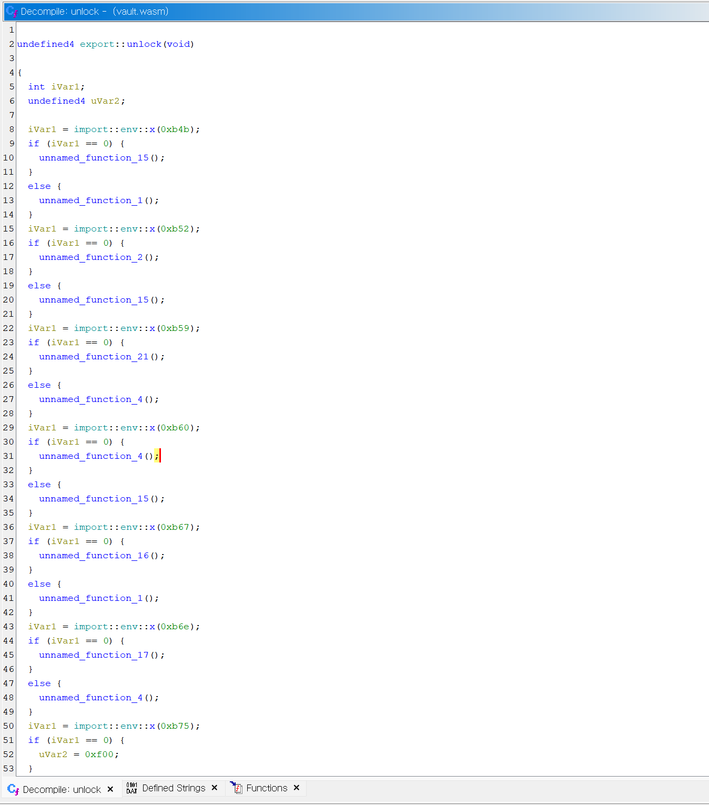

## Overview

This challenge was about **WASM(WebAssembly)** reversing, but the target wasm binary was **obfuscated.**

To analyze wasm binary, I usually use the [Ghidra plugin](https://github.com/nneonneo/ghidra-wasm-plugin). But… to solve this challenge, I converted the binary into `.c` file using [wasm2c](https://github.com/WebAssembly/wabt) and then rebuilt it for the x64. The reason was pretty simple: the original binary had some **opaque predicates** as part of its obfuscation, and I wanted to deal with them in a way I’m comfortable with. Sure, I could’ve tried breaking the obfuscation directly in WASM, but honestly, I’m way more used to working on x64 — so this route just felt easier and more nature for me.

## Decompile WASM with Ghidra

At first, I did what I usually do — I opened up the binary with **Ghidra plugin**. Take a look at the screenshot below.



Hmm… it turns out the control flow depends on the return value of `import::env::x()`. The function itself looks like this:

```jsx
async function load() {
    window.vault = await WebAssembly.instantiateStreaming(fetch("vault.wasm"), {
        env: {
            x(number) {
                let result = 0;
                while (number !== 0) {
                    result ^= number & 1;
                    number >>>= 1;
                }
                return result;
            }
        }
    });
}
```

Since all the arguments passed to `x()` are **constants**, each branch will always resolve in the same direction, making the other path pure **dead code**. Normally, compilers would optimize away such branches automatically, and tools like Ghidra or IDA would also show you the simplified version in the decompiled code.

But in this case, by putting `x()` outside of the  binary, the actual return value isn’t know statically. That clever trick prevents optimization and creates **opaque predicates**, making the analysis a bit more annoying.

## Breaking Down the Obfuscation

When I first came across those opaque predicates, I thought they’d just be a minor nuisance during analysis. But once I actually started reading through the code, they turned out to be way more of a headache than I expected. Honestly, my patience just wasn’t enough to keep analyzing them as-is.

I decided it was time to strip away the obfuscation — and the idea was actually pretty simple. Since I already knew what the return value of those `x()` calls would be, all I had to do was patch the code so that instead of `call x`, it would **just load the corresponding constant**. But the only problem was that I had never really looked into the WASM ISA before.

Fortunately, there’s a neat trick that’s already pretty well-known among reversers: rebuild the WASM to x64. The process is to run [wasm2c](https://github.com/WebAssembly/wabt) to extract a `.c` file and then recompile it with gcc. With the resulting x64 binary in hand, I figured I’d finally be able to craft the right patches to deobfuscate the code.


Right, take a look at the screenshot above. When `_w2c_env_x()` is executed with `rdi` set to `0xB4B`, I already know exactly what it will return. And if I just load that value directly into `rax`, IDA will do the rest — it’ll optimize away the dead code and show me the cleaner version.

Below is the patch code.

```python
from capstone import Cs, CsInsn, CS_ARCH_X86, CS_MODE_64
from capstone import CS_GRP_CALL
import capstone.x86 as x86
from keystone import Ks, KS_ARCH_X86, KS_MODE_64
import lief

def env(x):
    result = 0
    while x != 0:
        result ^= x & 1
        x >>= 1
    
    return result

class Deobfuscator:
    def __init__(self, bin_path: str, out_path: str):
        self.bin: lief.ELF.Binary = lief.parse(bin_path)
        self.out = out_path

        self.md = Cs(CS_ARCH_X86, CS_MODE_64)
        self.md.detail = True

        self.ks = Ks(KS_ARCH_X86, KS_MODE_64)

        self.to_patch = []
        return
    
    def scan(self):
        text = None

        for sec in self.bin.sections:
            if sec.name == ".text":
                text = sec
        if text is None:
            raise RuntimeError(".text section not found")
        
        code = self.bin.get_content_from_virtual_address(text.virtual_address, text.size)

        insns = []
        for insn in self.md.disasm(code, text.virtual_address):
            insns.append(insn)
            if insn.group(CS_GRP_CALL):
                operand = insn.operands[0]
                if operand.type == x86.X86_OP_IMM:
                    func = operand.imm
                elif operand.type == x86.X86_OP_MEM:
                    func = insn.address + insn.size + operand.mem.disp
                else:
                    func = 0
            
                if func == 0x1160:
                    rdi = insns[-7].operands[-1].imm
                    self.to_patch.append((insn.address, rdi))
        
        return
    
    def patch(self):
        mov_eax_0 = [0xb8, 0x00, 0x00 ,0x00, 0x00]
        mov_eax_1 = [0xb8, 0x01, 0x00 ,0x00, 0x00]
        for addr, x in self.to_patch:
            res = env(x)
            if res == 0:
                self.bin.patch_address(addr, mov_eax_0)
            else:
                self.bin.patch_address(addr, mov_eax_1)
        
        builder = lief.ELF.Builder(self.bin)
        builder.build()
        builder.write(self.out)
        return
    
    def deobf(self):
        self.scan()
        self.patch()

if __name__ == "__main__":
    deobf = Deobfuscator("vault.so", "vault_deobf.so")
    deobf.deobf()

```

Let’s check the deobf results.


before deobfuscation


after deobfuscation (renamed)

## Find Flag

All that was left was to analyze the cleaned-up code, and as it turned out, it was implementing **Huffman encoding**. By extracting the table from the data section of the WASM binary and reconstructing the encoded values, I was able to recover the flag.

```python
from dataclasses import dataclass
from typing import Optional, Tuple, Iterable, Union

@dataclass
class Node:
    sym: Optional[int] = None
    left: Optional['Node'] = None
    right: Optional['Node'] = None

class BitReader:

    def __init__(self, data: bytes, bitlen: int):
        if bitlen < 0 or bitlen > len(data) * 8:
            raise ValueError("bitlen out of range for data length")
        self.data = data
        self.bitlen = bitlen
        self.pos = 0

    def read1(self) -> int:
        if self.pos >= self.bitlen:
            raise EOFError("no more bits")
        byte_index = self.pos // 8
        bit_in_byte = 7 - (self.pos % 8)
        b = (self.data[byte_index] >> bit_in_byte) & 1
        self.pos += 1
        return b

    def read_bits_lsb_first(self, n: int) -> int:
        val = 0
        for i in range(n):
            bit = self.read1()
            val |= (bit << i)
        return val

def parse_huffman_tree(br: BitReader) -> Node:
    flag = br.read1()
    if flag == 1:
        left = parse_huffman_tree(br)
        right = parse_huffman_tree(br)
        return Node(sym=None, left=left, right=right)
    else:
        sym = br.read_bits_lsb_first(8)
        return Node(sym=sym)

def decode_with_tree(br: BitReader, root: Node) -> bytes:
    out = bytearray()
    while br.pos < br.bitlen:
        cur = root
        while cur.sym is None:
            bit = br.read1()
            cur = cur.left if bit == 0 else cur.right
        if cur.sym == 0:
            break
        out.append(cur.sym)
    return bytes(out)

def decode_vault(bitlen: int, data: Union[bytes, bytearray, memoryview]) -> bytes:
    br = BitReader(bytes(data), bitlen)
    root = parse_huffman_tree(br)
    return decode_with_tree(br, root)

if __name__ == "__main__":
    bitlen = 0x3b5
    ref = b'\xe8\xc6\x66\x0c\xd7\xc1\xc7\x64\x9d\x11\x1c\xbe\x12\x75\x58\xca\x6e\x00\x4e\x4c\x45\x2d\xa4\x46\x89\x8c\xd5\x65\x35\xbb\x9b\xc2\xcb\xeb\x36\x30\xb5\x90\x2a\xaa\x35\x44\xd1\xdc\xba\xb8\x05\x61\x5a\xfd\xf9\x6b\x6f\xcb\x5b\x7e\x5a\xda\xbe\xf4\xb6\x0f\xeb\x17\x05\x45\xb0\x47\xf3\x4a\x17\xf3\x71\x11\xda\x5a\x2b\x86\xea\x79\xeb\x1a\xa2\xec\x17\xa1\x0b\x83\x79\x6d\xd4\xf3\xdf\x96\x5b\x57\x41\x7f\x4e\xe7\x68\xe9\x8f\x48\x41\x77\x0e\x1b\x9f\x1a\xad\x3e\xf8\xa4\x89\xd3\x63\x52\x40\xb8\xae\xc6\x00\x00'
    print(decode_vault(bitlen, ref).decode("utf-8", errors="replace"))
```

`crew{7H15_15_4_V3rY_V3rY_V3rY_5UP3r_1NCr3D181Y_10N6_F146_600D_J08_1_C0MPr3553D_17_W17H_MY_C0MPU73r_5C13NC3_6C53_KN0W13D63_1_6U355_f4c91dbe}`
