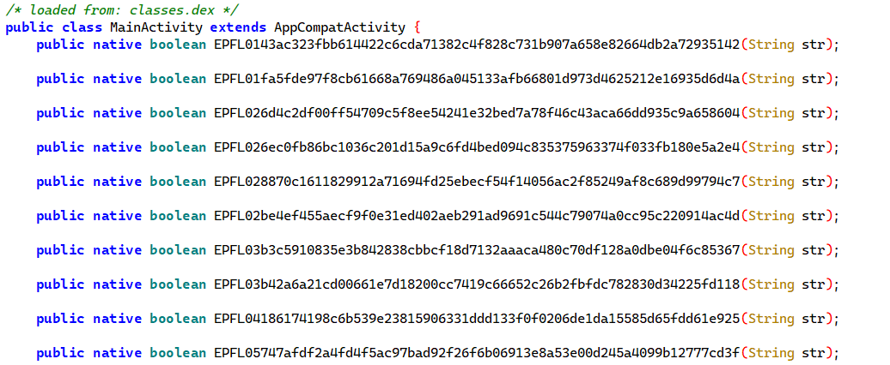

**상위 포스트 -** [Lake CTF 24-25 Quals](/2024-12/LakeCTF2024)

---

`jadx`로 디컴파일을 해 보면,

```java
    /* synthetic */ void m4lambda$onCreate$0$comlakectfMainActivity(EditText editText, TextView textView, View view) {
        String obj = editText.getText().toString();
        Log.i("LAKECTF", "flag: " + obj);
        if (obj.length() != 63) {
            textView.setText("flag is wrong...");
            return;
        }
        if (EPFL794e0d349c60e2cd18b028407c6ed39ed46025b5329af537b55ac256261b1035(obj) && EPFL4fe281842f9db50bc8ebf199c4226ac945608982855fbdfa5278479d3c5c2fc6(obj) && EPFL5777860ad7055bc1d6813df16e8d7ffbffe8407e8a2d08d7cf80a989f0498f47(obj) && EPFL77970ca6937405a0424f9c20156534494df66873f15462b658dfd07d5be4a02c(obj) && EPFL485e85b10c3768e7c2755369c714282d99cb649759825d0a2aec917c7619ba72(obj) && EPFL61f47efdd7dbd75f4d5eafa35a7355021962a11484251e7d93caa819d6bd8801(obj) && EPFLe1e758a866ef574d8ad2785f0ce652c9689687193384730c52873b1cc6c0db9a(obj) && EPFLed80c4a6f7b6dbd0b3a3915089523507a954faf8473893de252afdfe61a4bddf(obj) && EPFLbe49839af1525c1d1733bf3f33a77b7271af2821f29cbbe79ee706aaf5d1fa13(obj) && EPFLd31d275dce9bc4580e0a3f85daaa262fdf970b49de519e6db1c7e187d6bbd53d(obj) && EPFL76708dc1cdbdd6d4071b8da8ad5a3fcea5e4301e5a49502248bc3f13bf3d62ee(obj) && EPFLd93a2d01d65c62141930eeefb7f8639ab957e188008042edd0f26466119271b7(obj) && EPFLf74f61f8513597bec847127fc28647cae28726fd4cae53d7d52e78dfd87a81b0(obj) && EPFL6a00ef376babd2855f365b53a05a779322e9f52bd44a91685c7e042018c272ae(obj) && EPFL7a8ea1e982b1ca5e1e7ec4cd1d4b5318607dfd0c1ca232e4a750369af45b7a43(obj) && EPFL3045a1050882199d6ae484ed16682f0249a5f905861af56507485cfe30691a78(obj) && EPFL41368cf48b066094ad95ef592aca18010afcbebdf8e18e464ad39cf7a94234e9(obj) && EPFLc27ec3f1c17a9dcdf01d9cd14fe9ee56cc351d08a739d5e374301d2949ede418(obj) && EPFL462b95afc4326ba67ce1f28ea6794c86273ee7142de5e6fdc98892b6fbd3f591(obj) && EPFLc2ca4ff517f2db8ff9e9925dd6d937ff19a746d7489d6e82db9f41b800077377(obj) && EPFLb722972428a7c759840dbe54e9ff0e93eea3e92bd5b374e33e70965b2b6583c2(obj) && EPFL9a32852caca9b22617d842b1a8d5aa0ef519179bbdefdda69435078e023cf0e5(obj) && EPFLb024cb6b43e3325ee5d490f8384dde86675d511c971f72b0757ac2ca7eb00d9d(obj) && EPFL976579a38d6c6a314abd718739a20a92c1ade07d3498d1040a4409827a843012(obj) && EPFLc81c57e6860e727f03f3ebc76c1450ce6ab9fdd63032238228ef25efe7f0bcaf(obj) && EPFL0a7e79b0395125d73dcbdafa7e9ce71b892c24fb8e97ef4998eaa0c31b34c5ad(obj) && EPFLbff9f085f12074395cd2a85affe3b1256263a9368bbc262f57a7f9fbf5e8e488(obj) && EPFL12f5e68fd266e05e7f06463bd41aedfff56bb0e751973e5d73db78134faf0ffa(obj) && EPFL8dcd9931663dc60e2cbd089aa31d32bbf1b3ae211fd6497747e8206e7cab6f46(obj) && EPFL66ea44bc8883acb6a3a35525466f26c6024c515633286124e1b439bc23bd9978(obj) && EPFLd4f6471a590ca447d8ad50c8bf2ba713ae9715b98d3bd4f3807c887421c330db(obj) && EPFLf9d0582b3361b838c5da18f735e4d737b517cd3a63ba28f0f13fdaccbb619801(obj) && EPFL82b29a9ee86de04876b5a32a9083cd4dd572c3169e2a4260e0a529d7b5d7b56b(obj) && EPFL63c140735923bb115cbdbc352847776b18c329f868d23b25a1e661bde8db7c1b(obj) && EPFLbdd855f2640a87cee9a3905530ac83749b1029e54522868b0958ed27c69355c8(obj) && EPFLa4c3a66dec432abbe2e913e4b46f019e4a82795fbce7d30741dc2b79c8192d40(obj) && EPFLe86c2bdb2f324cf76cbc57e6df25039c73ecdd54c4b4a772f40382a66b3fbf94(obj) && EPFLfc106930bfe58eea975baac36251f63e2e93370d47ed200b41f39abf238a66be(obj) && EPFL8f2932af551f50f1864617e10cb8a4d1aa2a11192f8c5b58693d83304e6f722a(obj) && EPFLcfdf10244ad458cc26a904bc07448ae298f9eccf05a965284de33b62fb8603c9(obj) && EPFL923896ecbbd310119ed5e73727fa1ec176588a396a70c0901795ad37acd61c13(obj) && EPFL9b5996b88b0a92fe1a0e611387f295f2ad9b208cb897745a36b074e08cf5d05a(obj) && EPFLb66f5502a107aa05273894565d60cd0e09da081d33e73272fa3b0eb2aff0003f(obj) && EPFL8774f2c1ced956903cfe65489b1f21bee81fa8afc61b7c35c98339990f3d0339(obj) && EPFL9eb4b20411e585293a39850fb154885c510e045dff9cf196c8ff4878dbd71b73(obj) && EPFL559a29755f5de2b995ff1f5063ea6ab1203120d8ea84989d81c629c52696f1da(obj) && EPFLf2f1579785d5ae6530b5598ceae74fb991ce30c43d9a7c114196bf8e86630743(obj) && EPFLcfcc934446177c13c15531c925c9d9050f8036791faf18d9acd966cb3c606827(obj) && EPFL38e655cbd8c8b21551c46af32cc60029049b9fe684bc95d5204dd41e0165cb04(obj) && EPFL62776dc87a1309bd0e7dfe1fb15e3d74766cae740a2a3a4fefb4564f9e9ebd1c(obj) && EPFLae0171e35e3f3d4ee500e21f228badee621955e3c77f498bb1234a7f34ea9266(obj) && EPFLbb2d432624770b27a3b528d271cb4258a2786c3d5cc55e95540dd9b622506764(obj) && EPFL735007cfe44fc5912f857e7b0002c0f2a4be471b1dce45172e740f414bb45163(obj) && EPFL4a7bddc72a662f03758c5c21aaaa42d43ae3cf20ac32784ddfeceb4d201cd1ab(obj) && EPFL5c644b72298b6bf3b80cb8f4f8f486634bf4efaf78da09a8bacd51a01dd789b2(obj) && EPFL28a9417d6b76e6bea60748d643f384ef1c1cf33e2239492d105109c540758c87(obj) && EPFL8bb89050c89ace4b0c2f8dcec6d3acedade745471077c34d6968058b14955b74(obj) && EPFLea1e9dd30d57aae29c27b4eccb3475d852c103e02510ac64c0d07eb407c75d22(obj) && EPFL0f017c5b5d2fb03686c4e0b5b5897e8f3852a453ef71a1504ec5049cf4c461b5(obj) && EPFL82469764b3f5bb72217d6c4ed53f5fa7bec82b99b865244de2051f90fda99e75(obj) && EPFLc8d3be84ea6378a5905061826985c1da3950f44f2a2b4b1be853b84dd78743c3(obj) && EPFLd0e5f15636e0e59b1072689fe03d46cf8c1efd59a6b85a9fbb92a5adbbac5a7e(obj) && EPFLc8cf9ef9c6808eb9b61c6094dd48caf11bfb63f5936a9d7eb72a60b3c9b423ce(obj) && EPFLd474b8ea9d11584025e6fbbd1b4f3696109700c88b446b67b3c1ab413aba2a6a(obj) && EPFL16f4e0afc6735a914e8bea647b29dcb419017f9c18a8476681e72fed72c53cda(obj) && EPFL0fd78f70d424731ff157d34a467d05022ba97b45af1335fe6dcbb33478ba61c8(obj) && EPFLeb748874e0f7833d38479d1cc059a94b5b4cd5d960fbc380abbb11cd2634c7b9(obj) && EPFL5277c22546e03e1fe819e07c5aa15ba410c9f8bc2c64bcb4968c619e4e82a1cc(obj) && EPFL617e9784fcff86ad55fe0f3d29a8b5e070234f62711eabb487566d71dd704172(obj) && EPFL93dcdc034f6ca16777a57d0cd45ee35976c48108e74eac70cfb9b37dbf2c3798(obj) && EPFLdecc65edc2be5476173c0692059381fe36847fbef2f8ad9d5c1cafb2ee641a4b(obj) && EPFLc48cadf6a02839be3c095859db6a2ffc4d770cb91106ece9c4ef995c895f3058(obj) && EPFL08d9ac0630e7a1f5164a4903e53786c03dcf6b46b3260766e38ecaa5fe3ed4a0(obj) && EPFL1a52864fe89478b9089ad5eef17a92d2c5b52d855d94eff858d429c9fadb2c01(obj) && EPFL914bc97544d1dee005b370896430c324867c5ccaf2d07cc40ab04c29d1420dc9(obj) && EPFL8358274fa721c17b3f428ecbb41524a588505ebff69380d40e11a68130fc0fe1(obj) && EPFL85899a3ff0c80666d7e75f97a12dcebbb3f608f29b42667c1d25bd4fd127dd69(obj) && EPFL8b2e94f8a0b66f74ebc9f6bc40c5aab463b1e3bd5e15bdea6d1a65f3d34b3f23(obj) && EPFL88a973f82c7b106aeef7e170c9d955b0cfa975a4889e740e410eaac65bde911e(obj) && EPFLbf80335ad48e45d40147f4b1448a80c27ddc9bbd5aa7548a7dbe1d678fc53b8a(obj)) {
            textView.setText("flag is correct!");
        } else {
            textView.setText("flag is wrong...");
        }
    }
```

위와 같은 flag checking 루틴이 존재합니다.

EPFL로 시작하는 함수들의 반환 값들이 모두 True가 되도록 하는 string이 flag가 되게 됩니다.



이 함수들은 x86_64 library에 존재하는데, 이를 리버싱해주면 됩니다.

먼저 `JNI_OnLoad`를 해석하여 함수를 매칭한 뒤, 함수를 해석해 주면 됩니다.

함수들의 형태는 모두


위와 같은 형태로 z3를 이용하여 해를 구해줄 수 있습니다.

`JNI_OnLoad`를 파싱하여 함수 매칭 후 해당되는 함수를 parsing하여 z3 solver에 추가하여 해를 구해줄 겁니다.

IDA에서 `.c` 파일 추출 후 parsing 하고 z3 solver를 가동하는 스크립트를 짜주면 flag를 구할 수 있습니다.

```python
import re

unparsed = "EPFL794e0d349c60e2cd18b028407c6ed39ed46025b5329af537b55ac256261b1035(obj) && EPFL4fe281842f9db50bc8ebf199c4226ac945608982855fbdfa5278479d3c5c2fc6(obj) && EPFL5777860ad7055bc1d6813df16e8d7ffbffe8407e8a2d08d7cf80a989f0498f47(obj) && EPFL77970ca6937405a0424f9c20156534494df66873f15462b658dfd07d5be4a02c(obj) && EPFL485e85b10c3768e7c2755369c714282d99cb649759825d0a2aec917c7619ba72(obj) && EPFL61f47efdd7dbd75f4d5eafa35a7355021962a11484251e7d93caa819d6bd8801(obj) && EPFLe1e758a866ef574d8ad2785f0ce652c9689687193384730c52873b1cc6c0db9a(obj) && EPFLed80c4a6f7b6dbd0b3a3915089523507a954faf8473893de252afdfe61a4bddf(obj) && EPFLbe49839af1525c1d1733bf3f33a77b7271af2821f29cbbe79ee706aaf5d1fa13(obj) && EPFLd31d275dce9bc4580e0a3f85daaa262fdf970b49de519e6db1c7e187d6bbd53d(obj) && EPFL76708dc1cdbdd6d4071b8da8ad5a3fcea5e4301e5a49502248bc3f13bf3d62ee(obj) && EPFLd93a2d01d65c62141930eeefb7f8639ab957e188008042edd0f26466119271b7(obj) && EPFLf74f61f8513597bec847127fc28647cae28726fd4cae53d7d52e78dfd87a81b0(obj) && EPFL6a00ef376babd2855f365b53a05a779322e9f52bd44a91685c7e042018c272ae(obj) && EPFL7a8ea1e982b1ca5e1e7ec4cd1d4b5318607dfd0c1ca232e4a750369af45b7a43(obj) && EPFL3045a1050882199d6ae484ed16682f0249a5f905861af56507485cfe30691a78(obj) && EPFL41368cf48b066094ad95ef592aca18010afcbebdf8e18e464ad39cf7a94234e9(obj) && EPFLc27ec3f1c17a9dcdf01d9cd14fe9ee56cc351d08a739d5e374301d2949ede418(obj) && EPFL462b95afc4326ba67ce1f28ea6794c86273ee7142de5e6fdc98892b6fbd3f591(obj) && EPFLc2ca4ff517f2db8ff9e9925dd6d937ff19a746d7489d6e82db9f41b800077377(obj) && EPFLb722972428a7c759840dbe54e9ff0e93eea3e92bd5b374e33e70965b2b6583c2(obj) && EPFL9a32852caca9b22617d842b1a8d5aa0ef519179bbdefdda69435078e023cf0e5(obj) && EPFLb024cb6b43e3325ee5d490f8384dde86675d511c971f72b0757ac2ca7eb00d9d(obj) && EPFL976579a38d6c6a314abd718739a20a92c1ade07d3498d1040a4409827a843012(obj) && EPFLc81c57e6860e727f03f3ebc76c1450ce6ab9fdd63032238228ef25efe7f0bcaf(obj) && EPFL0a7e79b0395125d73dcbdafa7e9ce71b892c24fb8e97ef4998eaa0c31b34c5ad(obj) && EPFLbff9f085f12074395cd2a85affe3b1256263a9368bbc262f57a7f9fbf5e8e488(obj) && EPFL12f5e68fd266e05e7f06463bd41aedfff56bb0e751973e5d73db78134faf0ffa(obj) && EPFL8dcd9931663dc60e2cbd089aa31d32bbf1b3ae211fd6497747e8206e7cab6f46(obj) && EPFL66ea44bc8883acb6a3a35525466f26c6024c515633286124e1b439bc23bd9978(obj) && EPFLd4f6471a590ca447d8ad50c8bf2ba713ae9715b98d3bd4f3807c887421c330db(obj) && EPFLf9d0582b3361b838c5da18f735e4d737b517cd3a63ba28f0f13fdaccbb619801(obj) && EPFL82b29a9ee86de04876b5a32a9083cd4dd572c3169e2a4260e0a529d7b5d7b56b(obj) && EPFL63c140735923bb115cbdbc352847776b18c329f868d23b25a1e661bde8db7c1b(obj) && EPFLbdd855f2640a87cee9a3905530ac83749b1029e54522868b0958ed27c69355c8(obj) && EPFLa4c3a66dec432abbe2e913e4b46f019e4a82795fbce7d30741dc2b79c8192d40(obj) && EPFLe86c2bdb2f324cf76cbc57e6df25039c73ecdd54c4b4a772f40382a66b3fbf94(obj) && EPFLfc106930bfe58eea975baac36251f63e2e93370d47ed200b41f39abf238a66be(obj) && EPFL8f2932af551f50f1864617e10cb8a4d1aa2a11192f8c5b58693d83304e6f722a(obj) && EPFLcfdf10244ad458cc26a904bc07448ae298f9eccf05a965284de33b62fb8603c9(obj) && EPFL923896ecbbd310119ed5e73727fa1ec176588a396a70c0901795ad37acd61c13(obj) && EPFL9b5996b88b0a92fe1a0e611387f295f2ad9b208cb897745a36b074e08cf5d05a(obj) && EPFLb66f5502a107aa05273894565d60cd0e09da081d33e73272fa3b0eb2aff0003f(obj) && EPFL8774f2c1ced956903cfe65489b1f21bee81fa8afc61b7c35c98339990f3d0339(obj) && EPFL9eb4b20411e585293a39850fb154885c510e045dff9cf196c8ff4878dbd71b73(obj) && EPFL559a29755f5de2b995ff1f5063ea6ab1203120d8ea84989d81c629c52696f1da(obj) && EPFLf2f1579785d5ae6530b5598ceae74fb991ce30c43d9a7c114196bf8e86630743(obj) && EPFLcfcc934446177c13c15531c925c9d9050f8036791faf18d9acd966cb3c606827(obj) && EPFL38e655cbd8c8b21551c46af32cc60029049b9fe684bc95d5204dd41e0165cb04(obj) && EPFL62776dc87a1309bd0e7dfe1fb15e3d74766cae740a2a3a4fefb4564f9e9ebd1c(obj) && EPFLae0171e35e3f3d4ee500e21f228badee621955e3c77f498bb1234a7f34ea9266(obj) && EPFLbb2d432624770b27a3b528d271cb4258a2786c3d5cc55e95540dd9b622506764(obj) && EPFL735007cfe44fc5912f857e7b0002c0f2a4be471b1dce45172e740f414bb45163(obj) && EPFL4a7bddc72a662f03758c5c21aaaa42d43ae3cf20ac32784ddfeceb4d201cd1ab(obj) && EPFL5c644b72298b6bf3b80cb8f4f8f486634bf4efaf78da09a8bacd51a01dd789b2(obj) && EPFL28a9417d6b76e6bea60748d643f384ef1c1cf33e2239492d105109c540758c87(obj) && EPFL8bb89050c89ace4b0c2f8dcec6d3acedade745471077c34d6968058b14955b74(obj) && EPFLea1e9dd30d57aae29c27b4eccb3475d852c103e02510ac64c0d07eb407c75d22(obj) && EPFL0f017c5b5d2fb03686c4e0b5b5897e8f3852a453ef71a1504ec5049cf4c461b5(obj) && EPFL82469764b3f5bb72217d6c4ed53f5fa7bec82b99b865244de2051f90fda99e75(obj) && EPFLc8d3be84ea6378a5905061826985c1da3950f44f2a2b4b1be853b84dd78743c3(obj) && EPFLd0e5f15636e0e59b1072689fe03d46cf8c1efd59a6b85a9fbb92a5adbbac5a7e(obj) && EPFLc8cf9ef9c6808eb9b61c6094dd48caf11bfb63f5936a9d7eb72a60b3c9b423ce(obj) && EPFLd474b8ea9d11584025e6fbbd1b4f3696109700c88b446b67b3c1ab413aba2a6a(obj) && EPFL16f4e0afc6735a914e8bea647b29dcb419017f9c18a8476681e72fed72c53cda(obj) && EPFL0fd78f70d424731ff157d34a467d05022ba97b45af1335fe6dcbb33478ba61c8(obj) && EPFLeb748874e0f7833d38479d1cc059a94b5b4cd5d960fbc380abbb11cd2634c7b9(obj) && EPFL5277c22546e03e1fe819e07c5aa15ba410c9f8bc2c64bcb4968c619e4e82a1cc(obj) && EPFL617e9784fcff86ad55fe0f3d29a8b5e070234f62711eabb487566d71dd704172(obj) && EPFL93dcdc034f6ca16777a57d0cd45ee35976c48108e74eac70cfb9b37dbf2c3798(obj) && EPFLdecc65edc2be5476173c0692059381fe36847fbef2f8ad9d5c1cafb2ee641a4b(obj) && EPFLc48cadf6a02839be3c095859db6a2ffc4d770cb91106ece9c4ef995c895f3058(obj) && EPFL08d9ac0630e7a1f5164a4903e53786c03dcf6b46b3260766e38ecaa5fe3ed4a0(obj) && EPFL1a52864fe89478b9089ad5eef17a92d2c5b52d855d94eff858d429c9fadb2c01(obj) && EPFL914bc97544d1dee005b370896430c324867c5ccaf2d07cc40ab04c29d1420dc9(obj) && EPFL8358274fa721c17b3f428ecbb41524a588505ebff69380d40e11a68130fc0fe1(obj) && EPFL85899a3ff0c80666d7e75f97a12dcebbb3f608f29b42667c1d25bd4fd127dd69(obj) && EPFL8b2e94f8a0b66f74ebc9f6bc40c5aab463b1e3bd5e15bdea6d1a65f3d34b3f23(obj) && EPFL88a973f82c7b106aeef7e170c9d955b0cfa975a4889e740e410eaac65bde911e(obj) && EPFLbf80335ad48e45d40147f4b1448a80c27ddc9bbd5aa7548a7dbe1d678fc53b8a(obj)"

function_names = re.findall(r'([A-Za-z0-9_]+)\(obj\)', unparsed)

with open("a.c", "r") as f:
    source = f.read()

functions = re.findall(r'bool\s+__fastcall\s+([A-Za-z0-9_]+)\([^\)]*\)\s*{.*?return\s+([^\;]+);', source, re.DOTALL)

with open("JNILOAD.c", "r") as f:
    jni_src = f.read()

pattern = r'EPFL[0-9a-fA-F]+'
tmp = re.findall(pattern, jni_src)

funcs = []

for i in range(80):
    funcs.append({"name": tmp[2*i+1], "sym": tmp[2*i]})

from z3 import *

s = Solver()
v3 = [BitVec(f"v_{i}", 64) for i in range(64)]

for i in range(64):
    s.add(0 <= v3[i])
    s.add(v3[i] < 0x100)

def parse_and_solve(ret_expr):
    global s
    ex = re.sub(r'\(unsigned __int8\)', '', ret_expr)
    ex = re.sub(r'\*v3', 'v3[0]', ex)
    print(ex)

    s.add(eval(ex))

for func_name, ret_expr in functions:
    for elem in funcs:
        if elem["name"] in func_name:
            print(ret_expr)
            parse_and_solve(ret_expr)
            print()
            
if s.check() == sat:
    model = s.model()
    flag = ""
    for i in range(63):
        flag += chr(model[v3[i]].as_long())
    print(flag)
else:
    print("something wrong")
```

`flag: EPFL{R3g1st3r_R3g1st3r_1n_L1b4rt.s0_wh3r3_w1ll_my_JN1_C4ll_g0?}`