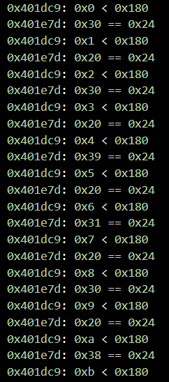

**상위 포스트 -** [Lake CTF 24-25 Quals](/2024-12/LakeCTF2024)

---

**Index**

[Get Binary from Base64](#get-binary-from-base64)

[Main Idea for Get Flag : `cmp` Hooking](#main-idea-for-get-flag--cmp-hooking)

[Stage 1 : Input Format](#stage-1--input-format)

[Stage 2 : Sudoku](#stage-1--input-format)

[Stage 3 : Input Format 완성](#stage-3--input-format-완성)

---


### Get Binary from Base64

아래와 같은 파일을 줍니다.

```
KLUv/WRQSs1DAJbpmjSw9hzCAKhV/tHuwhGqMVwB9yUQ9asvj+5/MvA45BffQuGBt+JU6O65Zq0J
X9bQNpeWbJlSiQCJAIgAfm+X+i/ef/Wh/jhuPNOoivSm3zPfm9kCsGjM6rWmLeEb6vnOUKry5/0u
MVdpzCx5P4uU92rSp6P+aplU82Ljl1n8K5BZ0gZ5P0v9uy/p5/fr9+cxQr/86pRZJJsdYtkvk+Xs
KvkIF/RHYkHT1zqqzBwZSZ75MlIjj9lpEn0+efbIbNaaJTmBGgVc92WjmocReO5rushL8Ngi9uAP
VBtTLtMD+AAhwZe/3k/9FW/cabNuWf7DcjWzhGuhXaQa9oJ355rBJ+OBNi7wUHEOayKVTFagkCra
EoPD4/j08OzNhHF5iUk2rSovX5EYi4p0Jfeq/glUzflMRpo/X4uSvtVE+TPcwJ/eO7Pbtm3rfe+c
Ozk5NBEVfWcUipjE5w2wcxPMsGGI/HbtukhH+jW+2QAHBAMCAcvkkc1cgfGtVYR74iLvW5513btn
k+u2Xguc+CWf52S2LYjv3r+0UT+M+N0svspFSGf2vQzHTE+mdzRL9bs3Erlk93GpzEnNVCKRyeXx
mESy7E4ud/LI4ZneO4cbO5eo8oyNbt6LWAHawCTjqJHR4x4IyEFBNhRZiAhHiCLb1AgBCQVNgyhy
26GMIVuZIYNYTldhSpaRFU5U4cQgILd+PVlBiALj/mclgh5Np3osnEYvoCWvq30Si+JVpH27KPRZ
N+3OOQdXTrdxYB7OrHW5mxYNdMhHtV38/3w6nWxULd/59GlLKxPryrKKemJSOlIi8pnStET/0+m2
vme5KlKDHqiCqy1JClKQSmviIoTBMJRlrZW8AfIQCqEYBsJJBGMIEJZCHLGIECJgRERkJCCZTZLW
woZg4ijiv8Vd6kXRj5U+8RLeUFr7edLySAzgxNz5nsl/qHb7/kxPUT6wTY3Qfwt583Wc9l77fPry
I5nTWq6ORxNbmIYQ9sMydZK+4ZR6l8uXZqb4dYtQfzpImREIFREpLIh3AzJYZEew4g72p3/Z07c2
O8iwAYQz3FdKh1brsANG/SuNex59I9d5w3sL/LSmn/YpGEQWGImZ68wfiP6V46Y3KiboYG1CSmHi
AO5xA7cIayReOSMAp6jW+64I4FkFlkyjyzgKAx4q9wzwmL3N3OSM+JNIU86hMWesAO88an7YnRME
/HqfdR/pP+nkU44Cnzwid0qdmla5W9VU7V5J3XevulwEC8gemtcMw3tIZrn8dWWiItDWuLdwsLs7
DmWaL1dQQsUt2evJi642M1MwKI/pVnLJmrxu1CNU0VmTGTPmUmKjpsjPYOng3BXQPAgN5OChkgqa
RfxBsN/kt03esrLkjtAuiJRozdAB8qSj3v8qQXUQp4owMM+gKa3VvZj+/PbzCw5JzUFcA9/Ht6Om
4s1zdpzKgyRcuR2cak71hbwaB3j3AMeBoFwzVntvGmXXdbKPmnJCqPDjJZwe2dSoq/mfqnQSpWkr
bvW4VNIVV56oUdTmP/oWPgU3nkjub65A4sPhEMM4WxEvHY9WRh6Vbfx+WR1+WDQJjb6wrdzRZymN
kAEe9MybJ25bMMZwQnczMaYUTd5d1USxvr6OWM21bZ/UhsUdWHTX0zBytxwg2ykeKLLlilEIeDrc
UXWA0i3rx82NiCVyaJXk1Gea8nECo806IDlYypUBrUbVjFUP9OdqvaXnaGnXOLD5y2FkOijzh+ij
ZAgZKgtmR5DyvN8IifXAtAJm4sol+PREaUKO9aEt4P0aGuJQWmrZJfxqVSeY37DskypXR/lCrNeM
kaFNa8tZ3xSWrxqKuUWuhM7y89MuVRPsSbOz2msmFQDVgxhIIdolpOfSVZsMKDbmGy9y9fe1iVM5
9CO0CLsTmJnAiQ8S9jQEfEaHzn5oxiPfYuizPPZqZMWJLefnTOW5+++sJZoRvHogdX9S0V+8P2VH
EH8SZj7LkNS+vW90fpljLEk4W4DMYAXcalAPDpoLjEnLAG0VvO/kChSii0WSNWMFt6h9SoZNv9V3
2+S5jZ18KdIJlQWalKoaSXGy+kHZeIkD91yuZ72KGfRp3MqPzJWJtO71pZprrdOXAB3mZoGn0h0U
bfvnq4ic++5hYItZ6IphwloGgLvSApExkVEt8Z4YA5WaV3ro1wn8aLFXhymm77Dbygo+OplGPu9j
S9ajAuMX/4IZVqlmTEaiA5jncZ/mCPkmLovUVIXPd7xNwi9DFmND5uvrBHlHN9cLJbzQ/5TZ3LVq
7kAStYgP4EHDYhuq/EHDEUNf9LnLi4eLJSdzbztSleVuE47xR4xw4Me9OLHxY+hIM3K2j6RoQEIA
iaOT9rhf0VsoQTmQzCrvJgeRTDliWJ4Sw5fRixJGYYpduNfqkbIaHYm65gz7Z0Km0VBiIeTfgcQM
VLl7tE6GgMwdSlRAsJoFeUyMOBxBXwUgvAKa/6UkyRycMDcKfQbbVUCsQkno4Gxr5C/OrFVNH0q8
PjfFDA1MwU+Wz+m7b7KPgtWdwRZEaTZFxoo/eGp8wnREWaiutSckpYkHqU3PrRNa11y4Ave4t57g
HWrmRmnSdCB4012umQdgWT+et8d6fd9kKSuELWth0o75oX+mW3PD4NiquSDiguuioR5e/RG3Q1vW
Zg4tKqzjAA63kCeKRtYh6R0brmh0Uzv0YB6OBrS6RfKZDneMC0SFgQjfRvYoQWVAWZMZbclI5Z45
DYV6OuLmsi5cWJgqyGWwtitBnaA6yipdKKmu94SmKKHSVvQXSsEIeYZxHMbM4gDx9J0j9+viMvCd
tJapg1Vv211ERmyctg1PVAo0H5ONicaBzXoSiWJb4xH2aMz5zJx1hhcbPCGzKr9RwUiz3PAqdn5C
jWx/pXZqh0ZLiCzuAsPenIE=

```

딱 봐도 base 64이기 때문에 decoding 해주면 zstd 압축 파일이 나오는데, 이를 또 압축 해제하면 ELF 바이너리가 튀어 나오게 됩니다.

### Main Idea for Get Flag : `cmp` Hooking

바이너리를 IDA로 까 보면 굉장히 어지럽게 난독화가 되어 있는 모습을 확인할 수 있습니다.

특히 가상화가 매우 어지럽게 되어 있는데, 무엇보다 가상화 루틴과 실제 프로세스 루틴을 구별하는 것이 매우 어려웠습니다.

이런 저런 시도들을 일단 시도해 보았지만, 문제를 풀기 위해서 가장 핵심이 되는 아이디어는 `cmp` 관련 명령어에 hooking을 거는 것이었습니다. 일단 가상화 루틴에 `cmp`가 포함되어 있지 않았으며, 실제 프로세스 동작의 분기를 결정짓기 위해서는 `cmp`를 불가피하게 거쳐야 하는 구조를 띄고 있습니다.

이를 이용하여 `cmp`쪽에 hooking하여 정답의 분기로 가기 위한 분석을 시작할 수 있었습니다.

아래는 gdb script를 이용하여 hooking하는 스크립트입니다.

```python
# gdb -q -x cmp-hook.py
import gdb

ge = gdb.execute
gp = gdb.parse_and_eval

ge("file ./dec_bin")

with open("cmp_log", "w") as f:
    f.write("")

class cmp_rdx_rsi(gdb.Breakpoint):
    def __init__(self, address):
        super(cmp_rdx_rsi, self).__init__(spec=f"*{address}")
    
    def stop(self):
        rip = int(gp("$rip"))
        rdx = int(gp("$rdx"))
        rsi = int(gp("$rsi"))
        val = int.from_bytes(bytes(gdb.selected_inferior().read_memory(rdx, 8)), "little")

        with open("cmp_log", "a") as f:
            f.write(f"{hex(rip)}: {hex(val)} == {hex(rsi)}\n")
        
        return False

class setl_rdx_rsi(gdb.Breakpoint):
    def __init__(self, address):
        super(setl_rdx_rsi, self).__init__(spec=f"*{address}")
    
    def stop(self):
        rip = int(gp("$rip"))
        rdx = int(gp("$rdx"))
        rsi = int(gp("$rsi"))
        val = int.from_bytes(bytes(gdb.selected_inferior().read_memory(rdx, 8)), "little")

        with open("cmp_log", "a") as f:
            f.write(f"{hex(rip)}: {hex(val)} < {hex(rsi)}\n")
        
        return False

class setnle_rdx_rsi(gdb.Breakpoint):
    def __init__(self, address):
        super(setnle_rdx_rsi, self).__init__(spec=f"*{address}")
    
    def stop(self):
        rip = int(gp("$rip"))
        rdx = int(gp("$rdx"))
        rsi = int(gp("$rsi"))
        val = int.from_bytes(bytes(gdb.selected_inferior().read_memory(rdx, 8)), "little")

        with open("cmp_log", "a") as f:
            f.write(f"{hex(rip)}: {hex(val)} > {hex(rsi)}\n")
        
        return False

class setnl_rdx_rsi(gdb.Breakpoint):
    def __init__(self, address):
        super(setnl_rdx_rsi, self).__init__(spec=f"*{address}")
    
    def stop(self):
        rip = int(gp("$rip"))
        rdx = int(gp("$rdx"))
        rsi = int(gp("$rsi"))
        val = int.from_bytes(bytes(gdb.selected_inferior().read_memory(rdx, 8)), "little")

        with open("cmp_log", "a") as f:
            f.write(f"{hex(rip)}: {hex(val)} >= {hex(rsi)}\n")
        
        return False

class setle_rdx_rsi(gdb.Breakpoint):
    def __init__(self, address):
        super(setle_rdx_rsi, self).__init__(spec=f"*{address}")
    
    def stop(self):
        rip = int(gp("$rip"))
        rdx = int(gp("$rdx"))
        rsi = int(gp("$rsi"))
        val = int.from_bytes(bytes(gdb.selected_inferior().read_memory(rdx, 8)), "little")

        with open("cmp_log", "a") as f:
            f.write(f"{hex(rip)}: {hex(val)} <= {hex(rsi)}\n")
        
        return False

cmp_rdx_rsi(0x0000000000401647)
cmp_rdx_rsi(0x0000000000401C38)
cmp_rdx_rsi(0x0000000000401CCC)
cmp_rdx_rsi(0x0000000000401CF6)
cmp_rdx_rsi(0x0000000000401E7D)
cmp_rdx_rsi(0x00000000004020B6)
cmp_rdx_rsi(0x0000000000402124)
cmp_rdx_rsi(0x00000000004023A3)
cmp_rdx_rsi(0x0000000000402FD9)
cmp_rdx_rsi(0x000000000040318D)
cmp_rdx_rsi(0x0000000000403426)
cmp_rdx_rsi(0x00000000004036CB)
cmp_rdx_rsi(0x0000000000403B72)

setl_rdx_rsi(0x0000000000401053)
setl_rdx_rsi(0x000000000040173D)
setl_rdx_rsi(0x0000000000401767)
setl_rdx_rsi(0x0000000000401870)
setl_rdx_rsi(0x0000000000401922)
setl_rdx_rsi(0x0000000000401DC9)
setl_rdx_rsi(0x0000000000403F12)

setnle_rdx_rsi(0x00000000004022AA)
setnle_rdx_rsi(0x0000000000403942)

setnl_rdx_rsi(0x0000000000401D3E)
setnl_rdx_rsi(0x0000000000403888)

setle_rdx_rsi(0x0000000000401D68)

ge("run < input", to_string=True)

exit()
```

`input` 파일에 입력을 넣어주고 실행하면 hooking 결과가 출력됩니다.

### Stage 1 : Input Format

input을 이리 저리 바꿔가며 분석을 하다 보면



0x180은 제 input의 길이이고, input에서 1byte씩 가져와서 0x24(`$`)와 비교하는 연산을 수행합니다.

그리고 `$`를 찾으면 비교 루틴이 끝나게 됩니다. → input의 끝을 알리는 문자로써 `$`가 사용됩니다.


그 뒤에 제 input이 `\n` 혹은  `` 인지 확인합니다.

만약 두 문자가 아닌 문자가 input으로 들어왔으면


이런 식으로 `0` ~ `9` 사이의 값인지 확인합니다.

이 검증을 통과하지 못하면 바로 프로세스는 종료되게 됩니다.

이런 검증을 통과한 뒤에 또 새로운 검증이 등장하게 되는데, 사실 제 hooking script로 원인을 정확히 규명하기는 어려웠습니다.


이런 식으로 중간 중간 `0xff == 0xff` cmp 루틴이 삽입되어 있었는데, 어떨 때는 통과되지만 어떨 때는 통과하지 못하여 상당히 헤메었습니다.

이 루틴을 추측해내기 위해서는 이후 루틴을 확인해야 합니다.

### Stage 2 : Sudoku

input을 이것 저것 넣던 중 통과하는 input을 찾아내어서 이 input 기준으로 이후 루틴들을 살펴보면


이런 식으로 `?? >= 0xa` 9개 이후 0xd4c2086과 검증하는 루틴이 존재합니다.

이런 루틴이 정확히 27개 존재하였으며,

`0xd4c2086`과 비교하는 지점의 rip(program counter)는 정확히 3가지 존재하였고,

각각 9개씩 있어서 27개가 들어맞았습니다.

0xd4c2086은 2부터 순차적으로 9개의 소수를 곱한 값입니다.

→ 스도쿠임을 추측할 수 있었습니다.

3가지의 검증 루틴은 각각 가로줄, 세로줄, 네모 박스를 검증하는 루틴이었고

각각 9개의 검증을 거치는 방식이 되겠습니다.

그리고 `>= 0xa`와 비교하는 부분이 있는데 0xff인 부분도 있고 0xff가 아닌 부분도 있는데

0xff가 아닌 부분이 sudoku에 이미 값이 채워져 있는 값, 그리고 0xff가 빈칸임을 추측할 수 있었습니다.

### Stage 3 : Input Format 완성

`0xff == 0xff` 의 의미를 비로소 이해할 수 있습니다.

0xff가 빈칸에 해당하는 값이었고, input을 정확히 빈칸에 넣는지 아니면 이미 값이 설정된 곳에 넣는지를 검증하는 형태가 되겠습니다.

그래서 sudoku에 값 하나를 얻기 위해서 숫자 3개가 들어가야 하는데

`<x 좌표> <y 좌표> <넣을 값>` 이런 구조로 input이 들어가게 됩니다. 이거는 CyKor의 자랑 `D1N0`가 찾아 주었습니다.

### Sudoku 풀기

입력을 `$` 하나만 넣으면 아무 입력이 들어가지 않은 sudoku를 얻을 수 있습니다.

이를 추출하면 다음과 같습니다.

```python
sudoku = [
    -1, -1, -1, -1, -1, -1, -1, -1, -1,
    -1, -1, -1, -1, -1,  3, -1,  8,  5,
    -1, -1,  1, -1,  2, -1, -1, -1, -1,
    -1, -1, -1,  5, -1,  7, -1, -1, -1,
    -1, -1,  4, -1, -1, -1,  1, -1, -1,
    -1,  9, -1, -1, -1, -1, -1, -1, -1,
     5, -1, -1, -1, -1, -1, -1,  7,  3,
    -1, -1,  2, -1,  1, -1, -1, -1, -1,
    -1, -1, -1, -1,  4, -1, -1, -1,  9
]
```

-1이 빈칸이 됩니다.

이를 z3로 해결하고 각 해를 input format을 맞춰서 sudoku의 적절한 위치에 놓도록 하는 솔버를 짜주겠습니다.

```python
from z3 import *

sudoku = [
    -1, -1, -1, -1, -1, -1, -1, -1, -1,
    -1, -1, -1, -1, -1,  3, -1,  8,  5,
    -1, -1,  1, -1,  2, -1, -1, -1, -1,
    -1, -1, -1,  5, -1,  7, -1, -1, -1,
    -1, -1,  4, -1, -1, -1,  1, -1, -1,
    -1,  9, -1, -1, -1, -1, -1, -1, -1,
     5, -1, -1, -1, -1, -1, -1,  7,  3,
    -1, -1,  2, -1,  1, -1, -1, -1, -1,
    -1, -1, -1, -1,  4, -1, -1, -1,  9
]

Ans = [
    [Int("Ans_{}{}".format(i, j)) for j in range(9)]
for i in range(9) ]

solver = Solver()

for i in range(9):
    for j in range(9):
        if sudoku[9 * i + j] != -1:
            print(sudoku[9*i + j])
            solver.add(Ans[i][j] == sudoku[9 * i + j])
        solver.add(And(1 <= Ans[i][j], Ans[i][j] <= 9))

for i in range(9):
    # Row
    solver.add( Distinct([Ans[i][j] for j in range(9)]) )
    # Column
    solver.add( Distinct([Ans[j][i] for j in range(9)]) )
    # Block
    solver.add( Distinct([Ans[3 * (i // 3) + j1][3 * (i % 3) + j2] for j1 in range(3) for j2 in range(3)]) )

while solver.check() == sat:
    model = solver.model()

    for i in range(9):
        s = ""
        for j in range(9):
            if sudoku[9 * i + j] == -1:
                s += f"{j} {i} "
                s += "{} ".format(model[Ans[i][j]].as_long())
        print(s)

    ex = True
    for i in range(9):
        for j in range(9):
            ex = And(ex, Ans[i][j] != model[Ans[i][j]].as_long())
    solver.add(ex)
    cnt += 1

else:
    print("NO")
```


이렇게 구한 input을 서버에게 날려 주면


flag를 얻을 수 있습니다.

flag: `EPFL{it-is-a-smol-step-for-me-but-an-even-smoler-one-for-compilers}`