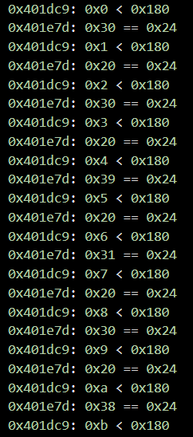

**Index**

[Get Binary from Base64](#get-binary-from-base64)

[Main Idea for Get Flag : `cmp` Hooking](#main-idea-for-get-flag--cmp-hooking)

[Stage 1 : Input Format](#stage-1--input-format)

[Stage 2 : Sudoku](#stage-1--input-format)

[Stage 3: Completing the Input Format](#stage-3-completing-the-input-format)

---


### Get Binary from Base64

The challenge provides the following file:

```
KLUv/WRQSs1DAJbpmjSw9hzCAKhV/tHuwhGqMVwB9yUQ9asvj+5/MvA45BffQuGBt+JU6O65Zq0J
X9bQNpeWbJlSiQCJAIgAfm+X+i/ef/Wh/jhuPNOoivSm3zPfm9kCsGjM6rWmLeEb6vnOUKry5/0u
MVdpzCx5P4uU92rSp6P+aplU82Ljl1n8K5BZ0gZ5P0v9uy/p5/fr9+cxQr/86pRZJJsdYtkvk+Xs
KvkIF/RHYkHT1zqqzBwZSZ75MlIjj9lpEn0+efbIbNaaJTmBGgVc92WjmocReO5rushL8Ngi9uAP
VBtTLtMD+AAhwZe/3k/9FW/cabNuWf7DcjWzhGuhXaQa9oJ355rBJ+OBNi7wUHEOayKVTFagkCra
EoPD4/j08OzNhHF5iUk2rSovX5EYi4p0Jfeq/glUzflMRpo/X4uSvtVE+TPcwJ/eO7Pbtm3rfe+c
Ozk5NBEVfWcUipjE5w2wcxPMsGGI/HbtukhH+jW+2QAHBAMCAcvkkc1cgfGtVYR74iLvW5513btn
k+u2Xguc+CWf52S2LYjv3r+0UT+M+N0svspFSGf2vQzHTE+mdzRL9bs3Erlk93GpzEnNVCKRyeXx
mESy7E4ud/LI4ZneO4cbO5eo8oyNbt6LWAHawCTjqJHR4x4IyEFBNhRZiAhHiCLb1AgBCQVNgyhy
26GMIVuZIYNYTldhSpaRFU5U4cQgILd+PVlBiALj/mclgh5Np3osnEYvoCWvq30Si+JVpH27KPRZ
N+3OOQdXTrdxYB7OrHW5mxYNdMhHtV38/3w6nWxULd/59GlLKxPryrKKemJSOlIi8pnStET/0+m2
vme5KlKDHqiCqy1JClKQSmviIoTBMJRlrZW8AfIQCqEYBsJJBGMIEJZCHLGIECJgRERkJCCZTZLW
woZg4ijiv8Vd6kXRj5U+8RLeUFr7edLySAzgxNz5nsl/qHb7/kxPUT6wTY3Qfwt583Wc9l77fPry
I5nTWq6ORxNbmIYQ9sMydZK+4ZR6l8uXZqb4dYtQfzpImREIFREpLIh3AzJYZEew4g72p3/Z07c2
O8iwAYQz3FdKh1brsANG/SuNex59I9d5w3sL/LSmn/YpGEQWGImZ68wfiP6V46Y3KiboYG1CSmHi
AO5xA7cIayReOSMAp6jW+64I4FkFlkyjyzgKAx4q9wzwmL3N3OSM+JNIU86hMWesAO88an7YnRME
/HqfdR/pP+nkU44Cnzwid0qdmla5W9VU7V5J3XevulwEC8gemtcMw3tIZrn8dWWiItDWuLdwsLs7
DmWaL1dQQsUt2evJi642M1MwKI/pVnLJmrxu1CNU0VmTGTPmUmKjpsjPYOng3BXQPAgN5OChkgqa
RfxBsN/kt03esrLkjtAuiJRozdAB8qSj3v8qQXUQp4owMM+gKa3VvZj+/PbzCw5JzUFcA9/Ht6Om
4s1zdpzKgyRcuR2cak71hbwaB3j3AMeBoFwzVntvGmXXdbKPmnJCqPDjJZwe2dSoq/mfqnQSpWkr
bvW4VNIVV56oUdTmP/oWPgU3nkjub65A4sPhEMM4WxEvHY9WRh6Vbfx+WR1+WDQJjb6wrdzRZymN
kAEe9MybJ25bMMZwQnczMaYUTd5d1USxvr6OWM21bZ/UhsUdWHTX0zBytxwg2ykeKLLlilEIeDrc
UXWA0i3rx82NiCVyaJXk1Gea8nECo806IDlYypUBrUbVjFUP9OdqvaXnaGnXOLD5y2FkOijzh+ij
ZAgZKgtmR5DyvN8IifXAtAJm4sol+PREaUKO9aEt4P0aGuJQWmrZJfxqVSeY37DskypXR/lCrNeM
kaFNa8tZ3xSWrxqKuUWuhM7y89MuVRPsSbOz2msmFQDVgxhIIdolpOfSVZsMKDbmGy9y9fe1iVM5
9CO0CLsTmJnAiQ8S9jQEfEaHzn5oxiPfYuizPPZqZMWJLefnTOW5+++sJZoRvHogdX9S0V+8P2VH
EH8SZj7LkNS+vW90fpljLEk4W4DMYAXcalAPDpoLjEnLAG0VvO/kChSii0WSNWMFt6h9SoZNv9V3
2+S5jZ18KdIJlQWalKoaSXGy+kHZeIkD91yuZ72KGfRp3MqPzJWJtO71pZprrdOXAB3mZoGn0h0U
bfvnq4ic++5hYItZ6IphwloGgLvSApExkVEt8Z4YA5WaV3ro1wn8aLFXhymm77Dbygo+OplGPu9j
S9ajAuMX/4IZVqlmTEaiA5jncZ/mCPkmLovUVIXPd7xNwi9DFmND5uvrBHlHN9cLJbzQ/5TZ3LVq
7kAStYgP4EHDYhuq/EHDEUNf9LnLi4eLJSdzbztSleVuE47xR4xw4Me9OLHxY+hIM3K2j6RoQEIA
iaOT9rhf0VsoQTmQzCrvJgeRTDliWJ4Sw5fRixJGYYpduNfqkbIaHYm65gz7Z0Km0VBiIeTfgcQM
VLl7tE6GgMwdSlRAsJoFeUyMOBxBXwUgvAKa/6UkyRycMDcKfQbbVUCsQkno4Gxr5C/OrFVNH0q8
PjfFDA1MwU+Wz+m7b7KPgtWdwRZEaTZFxoo/eGp8wnREWaiutSckpYkHqU3PrRNa11y4Ave4t57g
HWrmRmnSdCB4012umQdgWT+et8d6fd9kKSuELWth0o75oX+mW3PD4NiquSDiguuioR5e/RG3Q1vW
Zg4tKqzjAA63kCeKRtYh6R0brmh0Uzv0YB6OBrS6RfKZDneMC0SFgQjfRvYoQWVAWZMZbclI5Z45
DYV6OuLmsi5cWJgqyGWwtitBnaA6yipdKKmu94SmKKHSVvQXSsEIeYZxHMbM4gDx9J0j9+viMvCd
tJapg1Vv211ERmyctg1PVAo0H5ONicaBzXoSiWJb4xH2aMz5zJx1hhcbPCGzKr9RwUiz3PAqdn5C
jWx/pXZqh0ZLiCzuAsPenIE=

```

The data is clearly **Base64-encoded**. Decoding it produces a **Zstandard-compressed file**, and decompressing that file yields the ELF binary.

### Main Idea for Get Flag : `cmp` Hooking

Opening the binary in IDA shows that it is heavily obfuscated.

The virtualization is particularly confusing, making it difficult to distinguish the virtual-machine routines from the program's real logic.

After trying several approaches, the key idea was to **hook instructions related to `cmp`**. The virtual-machine routines did not contain `cmp`, whereas the real program logic necessarily used it to decide branches.

**Hooking `cmp`** therefore provided a starting point for tracing the branches that lead to a valid solution.

The following GDB script installs the hooks.

```python
# gdb -q -x cmp-hook.py
import gdb

ge = gdb.execute
gp = gdb.parse_and_eval

ge("file ./dec_bin")

with open("cmp_log", "w") as f:
    f.write("")

class cmp_rdx_rsi(gdb.Breakpoint):
    def __init__(self, address):
        super(cmp_rdx_rsi, self).__init__(spec=f"*{address}")
    
    def stop(self):
        rip = int(gp("$rip"))
        rdx = int(gp("$rdx"))
        rsi = int(gp("$rsi"))
        val = int.from_bytes(bytes(gdb.selected_inferior().read_memory(rdx, 8)), "little")

        with open("cmp_log", "a") as f:
            f.write(f"{hex(rip)}: {hex(val)} == {hex(rsi)}\n")
        
        return False

class setl_rdx_rsi(gdb.Breakpoint):
    def __init__(self, address):
        super(setl_rdx_rsi, self).__init__(spec=f"*{address}")
    
    def stop(self):
        rip = int(gp("$rip"))
        rdx = int(gp("$rdx"))
        rsi = int(gp("$rsi"))
        val = int.from_bytes(bytes(gdb.selected_inferior().read_memory(rdx, 8)), "little")

        with open("cmp_log", "a") as f:
            f.write(f"{hex(rip)}: {hex(val)} < {hex(rsi)}\n")
        
        return False

class setnle_rdx_rsi(gdb.Breakpoint):
    def __init__(self, address):
        super(setnle_rdx_rsi, self).__init__(spec=f"*{address}")
    
    def stop(self):
        rip = int(gp("$rip"))
        rdx = int(gp("$rdx"))
        rsi = int(gp("$rsi"))
        val = int.from_bytes(bytes(gdb.selected_inferior().read_memory(rdx, 8)), "little")

        with open("cmp_log", "a") as f:
            f.write(f"{hex(rip)}: {hex(val)} > {hex(rsi)}\n")
        
        return False

class setnl_rdx_rsi(gdb.Breakpoint):
    def __init__(self, address):
        super(setnl_rdx_rsi, self).__init__(spec=f"*{address}")
    
    def stop(self):
        rip = int(gp("$rip"))
        rdx = int(gp("$rdx"))
        rsi = int(gp("$rsi"))
        val = int.from_bytes(bytes(gdb.selected_inferior().read_memory(rdx, 8)), "little")

        with open("cmp_log", "a") as f:
            f.write(f"{hex(rip)}: {hex(val)} >= {hex(rsi)}\n")
        
        return False

class setle_rdx_rsi(gdb.Breakpoint):
    def __init__(self, address):
        super(setle_rdx_rsi, self).__init__(spec=f"*{address}")
    
    def stop(self):
        rip = int(gp("$rip"))
        rdx = int(gp("$rdx"))
        rsi = int(gp("$rsi"))
        val = int.from_bytes(bytes(gdb.selected_inferior().read_memory(rdx, 8)), "little")

        with open("cmp_log", "a") as f:
            f.write(f"{hex(rip)}: {hex(val)} <= {hex(rsi)}\n")
        
        return False

cmp_rdx_rsi(0x0000000000401647)
cmp_rdx_rsi(0x0000000000401C38)
cmp_rdx_rsi(0x0000000000401CCC)
cmp_rdx_rsi(0x0000000000401CF6)
cmp_rdx_rsi(0x0000000000401E7D)
cmp_rdx_rsi(0x00000000004020B6)
cmp_rdx_rsi(0x0000000000402124)
cmp_rdx_rsi(0x00000000004023A3)
cmp_rdx_rsi(0x0000000000402FD9)
cmp_rdx_rsi(0x000000000040318D)
cmp_rdx_rsi(0x0000000000403426)
cmp_rdx_rsi(0x00000000004036CB)
cmp_rdx_rsi(0x0000000000403B72)

setl_rdx_rsi(0x0000000000401053)
setl_rdx_rsi(0x000000000040173D)
setl_rdx_rsi(0x0000000000401767)
setl_rdx_rsi(0x0000000000401870)
setl_rdx_rsi(0x0000000000401922)
setl_rdx_rsi(0x0000000000401DC9)
setl_rdx_rsi(0x0000000000403F12)

setnle_rdx_rsi(0x00000000004022AA)
setnle_rdx_rsi(0x0000000000403942)

setnl_rdx_rsi(0x0000000000401D3E)
setnl_rdx_rsi(0x0000000000403888)

setle_rdx_rsi(0x0000000000401D68)

ge("run < input", to_string=True)

exit()
```

Put an input in the `input` file and run the script to print the hook results.

### Stage 1 : Input Format

After varying the input and observing the results,



`0x180` is the length of my input. The program reads it one byte at a time and compares each byte with `0x24` (`$`).

When it finds `$`, the comparison routine ends. In other words, **`$` is used as the input terminator**.


It then checks whether the next byte is `\n` or a null byte.

If the byte is neither of those characters,


the program checks whether it is a digit from `0` to `9`.

The process exits immediately if this validation fails.

After this validation, another check appears. Its purpose was difficult to determine precisely from the hook output alone.


The program intermittently inserted `0xff == 0xff` comparison routines. Some inputs passed them while others did not, which was initially confusing.

The later logic is needed to infer what these checks mean.

### Stage 2 : Sudoku

After finding an input that passed and examining the subsequent logic,


there is a routine that performs nine `?? >= 0xa` checks and then compares a value with `0xd4c2086`.

There are exactly 27 such routines.

There are exactly three program-counter locations at which the value is compared with `0xd4c2086`,

with nine checks at each location, giving 27 in total.

`0xd4c2086` is the product of the first nine primes, starting from 2.

This strongly suggests that the challenge is a **Sudoku puzzle**.

The three kinds of validation routines check rows, columns, and 3×3 blocks,

with nine checks for each kind.

There are also `>= 0xa` comparisons, some involving `0xff` and others not.

This indicates that **non-`0xff` values are pre-filled Sudoku cells**, while **`0xff` represents an empty cell**.

### Stage 3: Completing the Input Format

We can now understand the meaning of `0xff == 0xff`.

Because `0xff` represents an empty cell, this check verifies that input is supplied for an empty cell rather than a pre-filled one.

Each Sudoku entry therefore requires **three numbers**:

**`<x coordinate> <y coordinate> <value>`**. CyKor's `D1N0` identified this format.

### Solving the Sudoku

Submitting only `$` reveals the Sudoku board with no values entered.

Extracting it gives the following board:

```python
sudoku = [
    -1, -1, -1, -1, -1, -1, -1, -1, -1,
    -1, -1, -1, -1, -1,  3, -1,  8,  5,
    -1, -1,  1, -1,  2, -1, -1, -1, -1,
    -1, -1, -1,  5, -1,  7, -1, -1, -1,
    -1, -1,  4, -1, -1, -1,  1, -1, -1,
    -1,  9, -1, -1, -1, -1, -1, -1, -1,
     5, -1, -1, -1, -1, -1, -1,  7,  3,
    -1, -1,  2, -1,  1, -1, -1, -1, -1,
    -1, -1, -1, -1,  4, -1, -1, -1,  9
]
```

`-1` denotes an empty cell.

The following Z3 solver solves the board and emits each value in the required input format for its corresponding cell.

```python
from z3 import *

sudoku = [
    -1, -1, -1, -1, -1, -1, -1, -1, -1,
    -1, -1, -1, -1, -1,  3, -1,  8,  5,
    -1, -1,  1, -1,  2, -1, -1, -1, -1,
    -1, -1, -1,  5, -1,  7, -1, -1, -1,
    -1, -1,  4, -1, -1, -1,  1, -1, -1,
    -1,  9, -1, -1, -1, -1, -1, -1, -1,
     5, -1, -1, -1, -1, -1, -1,  7,  3,
    -1, -1,  2, -1,  1, -1, -1, -1, -1,
    -1, -1, -1, -1,  4, -1, -1, -1,  9
]

Ans = [
    [Int("Ans_{}{}".format(i, j)) for j in range(9)]
for i in range(9) ]

solver = Solver()

for i in range(9):
    for j in range(9):
        if sudoku[9 * i + j] != -1:
            print(sudoku[9*i + j])
            solver.add(Ans[i][j] == sudoku[9 * i + j])
        solver.add(And(1 <= Ans[i][j], Ans[i][j] <= 9))

for i in range(9):
    # Row
    solver.add( Distinct([Ans[i][j] for j in range(9)]) )
    # Column
    solver.add( Distinct([Ans[j][i] for j in range(9)]) )
    # Block
    solver.add( Distinct([Ans[3 * (i // 3) + j1][3 * (i % 3) + j2] for j1 in range(3) for j2 in range(3)]) )

while solver.check() == sat:
    model = solver.model()

    for i in range(9):
        s = ""
        for j in range(9):
            if sudoku[9 * i + j] == -1:
                s += f"{j} {i} "
                s += "{} ".format(model[Ans[i][j]].as_long())
        print(s)

    ex = True
    for i in range(9):
        for j in range(9):
            ex = And(ex, Ans[i][j] != model[Ans[i][j]].as_long())
    solver.add(ex)
    cnt += 1

else:
    print("NO")
```


Sending the resulting input to the server


returns the flag.

**Flag:** `EPFL{it-is-a-smol-step-for-me-but-an-even-smoler-one-for-compilers}`
