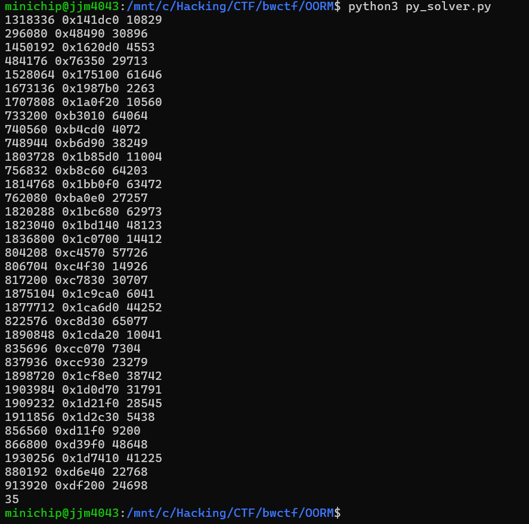

**상위 포스트 -** [Blue Water CTF 2024](/2024-10/bwctf_2024)

---

[main.zip](main.zip)

## Table of Content

[Overall Control Flow](#overall-control-flow)

[Deobfuscation - Control Flow Flattening](#deobfuscation---control-flow-flattening)

[Idea for Get Flag](#idea-for-get-flag)

[Parsing](#parse-code)

[Solver and Get Flag](#solver-and-get-flag)

## Overall Control Flow

If I initially put in a 100-digit hex input, it will convert to binary and store a 400-bit value.

```c
  do
  {
    for ( i = 0LL; i != 3200; i += 8LL )
    {
      v17 = *(_QWORD *)((char *)&xmmword_2135E0 + i);
      if ( v17 )
      {
        ++v15;
        (*(void (__fastcall **)(__int64, _QWORD, _QWORD *, _QWORD *, char *))((char *)&off_211CA0 + i))(
          v17,
          *(_QWORD *)((char *)&input_bit_data0 + i),
          ptr_data1,
          ptr_data0,
          ptr_inp_end);
        *(_QWORD *)((char *)&xmmword_2135E0 + i) = 0LL;
      }
      v18 = qword_212960[i / 8];
      if ( v18 )
      {
        ++v15;
        (*(void (__fastcall **)(__int64, _QWORD, _QWORD *, _QWORD *, char *))((char *)&off_211020 + i))(
          v18,
          *(_QWORD *)((char *)&input_bit_data1 + i),
          ptr_data1,
          ptr_data0,
          ptr_inp_end);
        qword_212960[i / 8] = 0LL;
      }
    }
  }
  while ( v15 <= 799 );
```

Then there is a routine that runs 800 functions.

Of these 800 functions, there are 40 validation functions, all of which must pass.

If you look at the format of the functions, the first and second arguments are global variable values and input values, and the result of the function execution is stored back into the global variables.

Since 40 of these functions are validation functions, they don't store their results in global variables, so the 40 values that are lacking in the global variables are initialized in the function in `.init_array.`

The arrays `&off_211CA0` and `&off_211020` contain 400 functions and 20 verification functions, respectively. By analyzing the relationship between the data in each function and the verification routine, we can see that the 400 bits of input are computed in the form 20 * 20.

The `&off_211CA0` array performs and verifies operations on vertical lines and the `&off_211020` array on horizontal lines.

First, if we look at the routine to execute the 800 functions described above, there is no guarantee that the functions will be executed in the order of the array. For this, I wrote a gdb script to get the control flow.

```c
# gdb -q -x get_cf.py
import gdb

func_list = [(A list containing the virtual addresses of 800 functions.
								Omitted for cleaner write-up)]

ge = gdb.execute
gp = gdb.parse_and_eval

ge("file ./main")

image_base = 0x0000555555554000

for func in func_list:
    bp_addr = image_base + func
    gdb.Breakpoint(f"*{bp_addr}")

inp = "1" * 100

with open("input", "w") as f:
    f.write(inp)

ge("run < input" , to_string=True)

f = open("control_flow_log", "w")
f.write("")
f.close()

def write_line(line):
    with open("control_flow_log", "a") as f:
        f.write(line + "\n")

for i in range(800):
    pc = int(gp("$rip"))
    print(i, hex(pc - image_base))
    write_line(hex(pc - image_base))
    ge("continue", to_string=True)
```

When I ran it, it was kind enough to notice that the function was still executing in the order of the array. Of course, it could change depending on the input, but it's hard to change the order of the function's execution(I found this out with static analysis).

## Deobfuscation - Control Flow Flattening

Now it's time to analyze the 800 functions that are expressed in a complex way. It's full of complex, hard-to-understand code, but if you look carefully, you'll notice that there are some patterns and the control flow is flattened.

Analyzing the pattern and porting the flattened control flow to python by expressing it as a simple loop looks like this

```python
def A(num):
    multiplier = 0xFFFF0000FFFF0001
    return ((multiplier * num) >> 64) & 0xFFFFFFFFFFFF0000

def B(num):
    divider = 0x10001
    return (num - (num // divider + A(num))) & 0xFFFFFFFFFFFFFFFF

def Main(input1, input2, inp, mul_const):
    result1 = (B(input1) + mul_const * input2) & 0xFFFFFFFFFFFFFFFF
    result2 = B(input2 * inp)
    return result1, result2

def func_routine(inp1, inp2, const0, const1, mul_const_list):
    inp = inp2 | (2 * inp1)

    result1 = (const0 * inp + const1) & 0xFFFFFFFFFFFFFFFF
    result2 = B(inp * inp)

    for mul_const in mul_const_list:
        result1, result2 = Main(result1, result2, inp, mul_const)
        print(hex(result1), hex(result2))

    return B(result1)

const_list = [
    0xD623, 0x208C, 0x7509, 0x4834, 0xD48D,
    0xE6B9, 0x6C44, 0xCA2D, 0x9777, 0x2EAF,
    0xFCCC, 0x9B4C, 0x673E, 0x2085, 0xAC3C,
    0x8643, 0xF379, 0xF41D, 0xF2DD, 0xDE30,
    0x6CD8, 0x521C, 0xF509, 0xA222, 0xF8FF,
    0x88BB, 0xB3EC, 0xECCB, 0x2EF5, 0xCEB,
    0xB031, 0xF34A, 0x57DA, 0xD2A7, 0xAC2B,
    0x5422, 0xAE24, 0xF87F, 0xEA5A, 0x4F37
]

res = func_routine(0x25AC, 1, 0x829B, 0xF5FE, const_list)

print(hex(res))
```

I ported one specific function to target, and through debugging, I  found that both the input and output values matched. (not a critical discovery, but a closer look at the python code above showed that the behavior of the function `B` was the same as `% 0x10001`).

## Idea for get flag

With the main function, and the behavior of the 800 functions, all outlined, it was time to think of a scenario to get the flags. I wondered if mathematical obfuscation was some kind of fun form of metamorphic code, but after realizing that only 20 bits of input are used per verification, I decided to just brute-force it. I figured that after brute-forcing to get individual solutions for each verification, I could use the z3 solver to get one solution that would pass all the verifications simultaneously.

I had to port all the routines in the binary to do the brute-force. The constant values used in the computations were not stored neatly in a table, but were hard-coded inside the code. So I parsed it, pulled out the constant table, ported the routines in binary to C, and did the brute-force, which solved the problem in a reasonable amount of time.

This idea came to me as I was nearing the end of parsing, but there are ways to skip parsing and do brute-force. The idea is to use the binary as it is, and the first idea was to use a debugging script like gdb script to put in input and pull out the corresponding output. However, for debugging, even if I automate it by writing a script, I think it would be quite time-consuming when there are as many as 20 bits of debugging signals. So my second thought was to use a tool like Frida and script it so that I can inject code that pulls out the output corresponding to a specific input and brute-force it. In particular, with an input of 20 * 20, I can brute-force 20 rows simultaneously in a single process run because rows don't interfere with each other and columns don't interfere with each other (and vice versa). Using this, I believe we can get individual solutions for each verification with a brute-force of size 20bit * 2. This means that we could get the answer in 2^21 process runs, which is a reasonable enough range. However, this is just one of the scenarios I think is possible. I parsed the code to get the flags, pulled out the constant values, and wrote my own code for the brute-force.

## Parse code

Let me just say up front that this was a very painful process. It would have been great if it compiled cleanly, but it didn't, and many of the multiplication operations were replaced by left shift, which made parsing very difficult. I wrote a parsing script as best I could, but it only succeeded in parsing about 680 of the 800 functions, and the remaining about 120 functions were parsed by hand.

Before I encountered multiplication expressed as shift, I tried parsing using the disassembled result.

```python
import subprocess
import re

func_list = [(A list containing the virtual addresses of 800 functions.
								Omitted for cleaner write-up)]

func_list = func_list[400:] + func_list[:400]

func_list.append(0x000000000209E07)

def disassemble_binary(binary_file, start_address, stop_address):
    command = [
        'objdump',
        '-D',
        '--start-address={}'.format(start_address),
        '--stop-address={}'.format(stop_address),
        binary_file
    ]

    result = subprocess.run(command, stdout=subprocess.PIPE, stderr=subprocess.PIPE, text=True)

    if result.returncode != 0:
        print("Error:", result.stderr)
    else:
        return result.stdout

def filter_shl_lines(assembly_text):
    filtered_lines = [line for line in assembly_text.splitlines() if "shl" in line]
    return "\n".join(filtered_lines)

def filter_imul_lines(assembly_text):
    filtered_lines = [line for line in assembly_text.splitlines() if "imul" in line]
    return "\n".join(filtered_lines)

def filter_add_lines(assembly_text):
    filtered_lines = [line for line in assembly_text.splitlines() if "add" in line]
    return "\n".join(filtered_lines)

def extract_hex_from_assembly(text):
    hex_values = re.findall(r'\$(0x[0-9a-fA-F]+|[0-9a-fA-F]+)', text)
    for elem in hex_values:
        if int(elem, 16) <= 15:
            print(elem)
    return hex_values

def extract_first(text):
    match = re.search(r'\$(0x[0-9a-fA-F]+|[0-9a-fA-F]+)', text)
    if match:
        return match.group(1)
    return None

binary_file = "./main"

f = open("parsed0", "w")
f.write("")

from tqdm import tqdm

cnt = 0

for i in tqdm(range(len(func_list) - 1)):
    full_asm = disassemble_binary(binary_file, func_list[i], func_list[i+1])
    imul_asm = filter_imul_lines(full_asm)
    add_asm = filter_add_lines(full_asm)
    hex_values = extract_hex_from_assembly(imul_asm)
    mul_const = hex_values.pop(0)
    add_const = extract_first(add_asm)
    mul_list = hex_values
    shl_asm = filter_shl_lines(full_asm)
    if shl_asm != "":
        cnt += 1

    parsed = ""
    parsed += str(func_list[i]) + "\n"
    parsed += f"{mul_const} {add_const}\n"
    for elem in mul_list:
        parsed += f"{elem} "
    parsed += "\n\n"
    
    f.write(parsed)

f.close()

print(cnt)
```

However, it failed to parse about 1/4 of the functions, so to improve it, I tried parsing based on the decompiled code.

First, I extracted it into a `.c` file using the IDA's functions and then parsed it. The `.c` file is very large, so I won't attach it.

Below is the parsing script. I wouldn't recommend looking closely at the code below, it's quite messy and still an incomplete script that doesn't parse about 1/8 of whole functions.

```python
f = open("main.c", "r")
data = f.read()

import re

func_text = re.findall(r'\{(.*?)\}', data, re.DOTALL)

func_list = [(A list containing the virtual addresses of 800 functions.
								Omitted for cleaner write-up)]

matches = re.findall(r"sub_([0-9a-fA-F]+)", data)
new_func_list = [int(elem, 16) for elem in matches]

func_list = func_list[400:] + func_list[:400]

fix_func = set()
def parse_one_func(text, idx):
    filter = "v2 = a2 | (2 * a1);"
    new_text = "\n".join([line for line in text.splitlines() if filter not in line])
    matches = re.findall(r'(?<!\S)(\d+|0x[0-9a-fA-F]+)(?!\S)', new_text)
    
    res = []
    for elem in matches:
        if elem == "0x10001":
            continue
        val = eval(elem)
        if val <= 16:
            val = 2 ** val
            fix_func.add(func_list[idx])
        res.append(val)
    
    return res

verify_list = func_list[400-20:400]
for i in range(20):
    verify_list.append(func_list[400 + 20 * (i + 1) - 1])

f = open("parsed", "w")

for idx, val in enumerate(func_list):
    parsed = parse_one_func(func_text[idx], idx)

    if val in verify_list:
        parsed = parsed[:-2]
    
    txt = ""
    txt += str(val) + "\n"
    txt += hex(parsed[1]) + " " + hex(parsed[2]) + "\n"
    for idx in range(len(parsed) - 2):
        if idx == 0:
            txt += hex(parsed[0]) + " "
        else:
            txt += hex(parsed[idx + 2]) + " "
    txt += "\n\n"
    f.write(txt)

f.close()
```

I thought about how to improve the parsing, but in the end I decided to manually parse the functions that failed to parse.

The biggest problem with manual parsing is human error, and even worse, it's very resource intensive to figure out where I made a mistake. To avoid this, I wrote code to verify that the parsing is correct.

I wrote code to pull out the output corresponding to the specific input of each function via gdb script, and then calculate the output corresponding to the input again based on the parsing results and compare them.

First, below is the script to extract the output corresponding to the specific input of each function.

```python
# gdb -x -q verify.py
import gdb

ge = gdb.execute
gp = gdb.parse_and_eval

ge("file ./main")

image_base = 0x555555554000

gdb.Breakpoint(f"*{image_base + 0x000000000000649C}")
gdb.Breakpoint(f"*{image_base + 0x0000000000006477}")

def A(num):
    multiplier = 0xFFFF0000FFFF0001
    return ((multiplier * num) >> 64) & 0xFFFFFFFFFFFF0000

def B(num):
    divider = 0x10001
    return (num - (num // divider + A(num))) & 0xFFFFFFFFFFFFFFFF

def Main(input1, input2, inp, mul_const):
    result1 = (B(input1) + mul_const * input2) & 0xFFFFFFFFFFFFFFFF
    result2 = B(input2 * inp)
    return result1, result2

def func_routine(inp1, inp2, const0, const1, mul_const_list):
    inp = inp2 | (2 * inp1)

    result1 = (const0 * inp + const1) & 0xFFFFFFFFFFFFFFFF
    result2 = B(inp * inp)

    for mul_const in mul_const_list:
        result1, result2 = Main(result1, result2, inp, mul_const)
        #print(hex(result1), hex(result2))
    return B(result1)

ge("run < input", to_string=True)

verify_list = []
for i in range(20):
    verify_list.append(2 * (380 + i))

for i in range(20):
    verify_list.append(2 * (20 * i + 19) + 1)

print(verify_list)

f = open("result", "w")
f.write("")

for i in range(800):
    rdi = int(gp("$rdi"))
    rsi = int(gp("$rsi"))
    ge("si", to_string=True)
    rip = int(gp("$rip"))
    func = rip - image_base
    ge("finish", to_string=True)
    if i in verify_list:
        res = int(gp("$rax"))
    else:
        res = int(gp("$rdi"))
    
    w = f"{func} {rdi} {rsi} {res}"
    f.write(w + "\n")
    ge("c", to_string=True)

f.close()
```

Then, below is the code to validate my parsing results.

```python
f = open("parsed", "r")

func_list = []
const_struct = []

for i in range(800):
    func_list.append(int(f.readline().rstrip("\n")))
    mul_add = f.readline().split()
    mul_list = f.readline().split()
    try:
        mul_add[0] = int(mul_add[0], 16)
        mul_add[1] = int(mul_add[1], 16)
        res_list = []
        for elem in mul_list:
            res_list.append(int(elem, 16))
        const_struct.append([mul_add, res_list])
    except:
        print(mul_add, mul_list, func_list[-1], i)
        exit()

    f.readline()

f.close()

def A(num):
    multiplier = 0xFFFF0000FFFF0001
    return ((multiplier * num) >> 64) & 0xFFFFFFFFFFFF0000

def B(num):
    divider = 0x10001
    return (num - (num // divider + A(num))) & 0xFFFFFFFFFFFFFFFF

def Main(input1, input2, inp, mul_const):
    result1 = (B(input1) + mul_const * input2) & 0xFFFFFFFFFFFFFFFF
    result2 = B(input2 * inp)
    return result1, result2

def func_routine(inp1, inp2, const0, const1, mul_const_list):
    inp = inp2 | (2 * inp1)

    result1 = (const0 * inp + const1) & 0xFFFFFFFFFFFFFFFF
    result2 = B(inp * inp)

    for mul_const in mul_const_list:
        result1, result2 = Main(result1, result2, inp, mul_const)
        #print(hex(result1), hex(result2))
    return B(result1)

f = open("result", "r")

cnt = 0
for line in f.read().splitlines():
    res = line.split()
    func = res[0]
    inp1 = res[1]
    inp2 = res[2]

    for i in range(800):
        if eval(func) == func_list[i]:
            my_res = func_routine(eval(inp1), eval(inp2), const_struct[i][0][0], const_struct[i][0][1], const_struct[i][1])
            break
    if my_res != eval(res[-1]):
        cnt+=1
        print(func, hex(eval(func)), my_res)

print(cnt)
```



When you run it, it prints out which functions failed to parse, as shown above, and it also prints out the number of functions that failed to parse. This validation script allowed me to perform the painstaking parsing process without giving up.

## Solver and get flag

Once parsed, it's not hard to get the flags now. The routines in the binary were already implemented and it was simple to brute force them. The existing python script took about 15-20 minutes to get the solution for one verification routine, and I decided that doing all 40 in python would be too much work, so I implemented them in C.

I didn't want to bother implementing file input/output, so I just wrote the parsing results inside the C code. This made the C file very large, and I don't think it's polite to omit parts of the solver code, so I'm attaching it as a file.

[solver.c](solver.c)

When run, it prints the individual solutions for the 40 verifications, which I copied and saved to `solved.txt.`

[solved.txt](solved.txt)

I then wrote a z3 solver script to combine all the solutions.

```python
from z3 import *
import re

def parse_file_to_nested_list(file_path):
    nested_list = []
    current_block = []

    type_pattern = re.compile(r"type - \d+ \d+")

    with open(file_path, 'r') as file:
        for line in file:
            line = line.strip()

            if type_pattern.match(line):
                if current_block:
                    nested_list.append(current_block)
                    current_block = []
            else:
                current_block.append(line)

        if current_block:
            nested_list.append(current_block)

    return nested_list

result = parse_file_to_nested_list("./solved.txt")

s = Solver()

x = [
    [BitVec(f"x_{i}_{j}", 1) for j in range(20)] for i in range(20)
]

# type 0
for i in range(20):
    solved_list = result[i]

    ex = False
    for root in solved_list:
        if root != "":
            tmp = eval(root)
            tmp_ex = True
            for j in range(20):
                tmp0 = (tmp >> j) & 1
                tmp_ex = And(tmp_ex, (x[i][j] == tmp0))
            ex = Or(ex, tmp_ex)
    s.add(ex)

for i in range(20):
    solved_list = result[20 + i]

    ex = False
    for root in solved_list:
        if root != "":
            tmp = eval(root)
            tmp_ex = True
            for j in range(20):
                tmp0 = (tmp >> j) & 1
                tmp_ex = And(tmp_ex, (x[j][i] == tmp0))
            ex = Or(ex, tmp_ex)
    s.add(ex)

if s.check() == sat:
    model = s.model()

    for i in range(20):
        printer = 0
        for j in range(5):
            printer = 0
            for k in range(4):
                printer |= model[x[i][4*j + k]].as_long() << k
            print(hex(printer)[2:], end='')
    print()
else:
    print("Error")
```


flag: `bwctf{9039493453200612fad583a67656efb0ca6df164e0bc82a29599a71b8019bafb}`