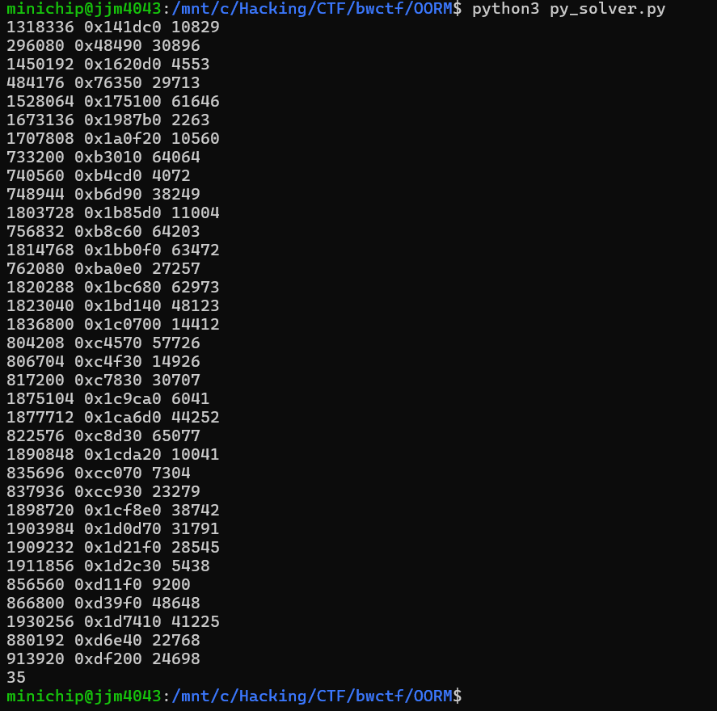

[main.zip](main.zip)

## Table of Content

[Overall Control Flow](#overall-control-flow)

[Deobfuscation: Loop Unrolling](#deobfuscation-loop-unrolling)

[Strategy for Recovering the Flag](#strategy-for-recovering-the-flag)

[Parsing the Code](#parsing-the-code)

[Solving and Recovering the Flag](#solving-and-recovering-the-flag)

## Overall Control Flow

The program first converts a 100-digit hexadecimal input to binary and stores it as 400 bits.

```c
  do
  {
    for ( i = 0LL; i != 3200; i += 8LL )
    {
      v17 = *(_QWORD *)((char *)&xmmword_2135E0 + i);
      if ( v17 )
      {
        ++v15;
        (*(void (__fastcall **)(__int64, _QWORD, _QWORD *, _QWORD *, char *))((char *)&off_211CA0 + i))(
          v17,
          *(_QWORD *)((char *)&input_bit_data0 + i),
          ptr_data1,
          ptr_data0,
          ptr_inp_end);
        *(_QWORD *)((char *)&xmmword_2135E0 + i) = 0LL;
      }
      v18 = qword_212960[i / 8];
      if ( v18 )
      {
        ++v15;
        (*(void (__fastcall **)(__int64, _QWORD, _QWORD *, _QWORD *, char *))((char *)&off_211020 + i))(
          v18,
          *(_QWORD *)((char *)&input_bit_data1 + i),
          ptr_data1,
          ptr_data0,
          ptr_inp_end);
        qword_212960[i / 8] = 0LL;
      }
    }
  }
  while ( v15 <= 799 );
```

It then executes 800 functions.

Forty of those functions are validation routines, and all of them must pass.

The functions take a global value and an input value as their first two arguments, then store their result back in the global state.

The 40 validation routines do not write results to global variables. Their missing global values are instead initialized by functions in `.init_array`.

The arrays `&off_211CA0` and `&off_211020` each contain 400 functions, including 20 validation functions. Examining the data flow between these functions and the validation routines shows that the 400 input bits are arranged as a 20 × 20 grid.

`&off_211CA0` processes and validates columns, while `&off_211020` does the same for rows.

The dispatcher does not obviously guarantee that functions execute in array order, so I wrote a GDB script to trace the control flow.

```c
# gdb -q -x get_cf.py
import gdb

func_list = [(A list containing the virtual addresses of 800 functions.
								Omitted for cleaner write-up)]

ge = gdb.execute
gp = gdb.parse_and_eval

ge("file ./main")

image_base = 0x0000555555554000

for func in func_list:
    bp_addr = image_base + func
    gdb.Breakpoint(f"*{bp_addr}")

inp = "1" * 100

with open("input", "w") as f:
    f.write(inp)

ge("run < input" , to_string=True)

f = open("control_flow_log", "w")
f.write("")
f.close()

def write_line(line):
    with open("control_flow_log", "a") as f:
        f.write(line + "\n")

for i in range(800):
    pc = int(gp("$rip"))
    print(i, hex(pc - image_base))
    write_line(hex(pc - image_base))
    ge("continue", to_string=True)
```

The trace showed that the functions execute in array order. Although this might appear input-dependent, static analysis showed that the execution order is not easily changed.

## Deobfuscation: Loop Unrolling

The 800 functions initially look complex, but their structure is repetitive. This is not control-flow flattening: the code is primarily a loop-unrolled sequence of repeated arithmetic operations.

After identifying the repeated pattern, I expressed the unrolled sequence as a regular loop and ported it to Python:

```python
def A(num):
    multiplier = 0xFFFF0000FFFF0001
    return ((multiplier * num) >> 64) & 0xFFFFFFFFFFFF0000

def B(num):
    divider = 0x10001
    return (num - (num // divider + A(num))) & 0xFFFFFFFFFFFFFFFF

def Main(input1, input2, inp, mul_const):
    result1 = (B(input1) + mul_const * input2) & 0xFFFFFFFFFFFFFFFF
    result2 = B(input2 * inp)
    return result1, result2

def func_routine(inp1, inp2, const0, const1, mul_const_list):
    inp = inp2 | (2 * inp1)

    result1 = (const0 * inp + const1) & 0xFFFFFFFFFFFFFFFF
    result2 = B(inp * inp)

    for mul_const in mul_const_list:
        result1, result2 = Main(result1, result2, inp, mul_const)
        print(hex(result1), hex(result2))

    return B(result1)

const_list = [
    0xD623, 0x208C, 0x7509, 0x4834, 0xD48D,
    0xE6B9, 0x6C44, 0xCA2D, 0x9777, 0x2EAF,
    0xFCCC, 0x9B4C, 0x673E, 0x2085, 0xAC3C,
    0x8643, 0xF379, 0xF41D, 0xF2DD, 0xDE30,
    0x6CD8, 0x521C, 0xF509, 0xA222, 0xF8FF,
    0x88BB, 0xB3EC, 0xECCB, 0x2EF5, 0xCEB,
    0xB031, 0xF34A, 0x57DA, 0xD2A7, 0xAC2B,
    0x5422, 0xAE24, 0xF87F, 0xEA5A, 0x4F37
]

res = func_routine(0x25AC, 1, 0x829B, 0xF5FE, const_list)

print(hex(res))
```

I ported one representative function and verified through debugging that its inputs and outputs matched the original. A closer look also showed that `B` behaves like `% 0x10001`.

## Strategy for Recovering the Flag

With the main function and the behavior of all 800 routines understood, the remaining task was to recover an input that passed every check. After noticing that each validation uses only 20 input bits, I chose brute force. I could brute-force an individual solution for each validation routine and then use Z3 to combine them into a single input that satisfies every constraint.

To do this, I ported all routines from the binary. Their constants were hard-coded rather than stored in a table, so I parsed the code, extracted the constants, ported the routines to C, and brute-forced the individual checks in a reasonable amount of time.

I arrived at this strategy near the end of parsing, but brute force could also avoid parsing entirely. One option is to use a debugger to provide inputs and collect the corresponding outputs, though automating that for 20-bit signals would likely be slow. A better option would be to use Frida to instrument the binary and extract outputs for chosen inputs. Because the 20 rows are independent of one another (as are the columns), a single process run could brute-force 20 rows in parallel. This reduces the search to roughly 2^21 process runs for individual solutions. I ultimately used the parsed code, extracted the constants, and wrote a dedicated brute-force implementation.

## Parsing the Code

Parsing was difficult because the decompiled output did not compile cleanly and many multiplication operations had been replaced with left shifts. My parser handled about 680 of the 800 functions; I parsed the remaining roughly 120 by hand.

Before encountering multiplications expressed as shifts, I first tried parsing the disassembly.

```python
import subprocess
import re

func_list = [(A list containing the virtual addresses of 800 functions.
								Omitted for cleaner write-up)]

func_list = func_list[400:] + func_list[:400]

func_list.append(0x000000000209E07)

def disassemble_binary(binary_file, start_address, stop_address):
    command = [
        'objdump',
        '-D',
        '--start-address={}'.format(start_address),
        '--stop-address={}'.format(stop_address),
        binary_file
    ]

    result = subprocess.run(command, stdout=subprocess.PIPE, stderr=subprocess.PIPE, text=True)

    if result.returncode != 0:
        print("Error:", result.stderr)
    else:
        return result.stdout

def filter_shl_lines(assembly_text):
    filtered_lines = [line for line in assembly_text.splitlines() if "shl" in line]
    return "\n".join(filtered_lines)

def filter_imul_lines(assembly_text):
    filtered_lines = [line for line in assembly_text.splitlines() if "imul" in line]
    return "\n".join(filtered_lines)

def filter_add_lines(assembly_text):
    filtered_lines = [line for line in assembly_text.splitlines() if "add" in line]
    return "\n".join(filtered_lines)

def extract_hex_from_assembly(text):
    hex_values = re.findall(r'\$(0x[0-9a-fA-F]+|[0-9a-fA-F]+)', text)
    for elem in hex_values:
        if int(elem, 16) <= 15:
            print(elem)
    return hex_values

def extract_first(text):
    match = re.search(r'\$(0x[0-9a-fA-F]+|[0-9a-fA-F]+)', text)
    if match:
        return match.group(1)
    return None

binary_file = "./main"

f = open("parsed0", "w")
f.write("")

from tqdm import tqdm

cnt = 0

for i in tqdm(range(len(func_list) - 1)):
    full_asm = disassemble_binary(binary_file, func_list[i], func_list[i+1])
    imul_asm = filter_imul_lines(full_asm)
    add_asm = filter_add_lines(full_asm)
    hex_values = extract_hex_from_assembly(imul_asm)
    mul_const = hex_values.pop(0)
    add_const = extract_first(add_asm)
    mul_list = hex_values
    shl_asm = filter_shl_lines(full_asm)
    if shl_asm != "":
        cnt += 1

    parsed = ""
    parsed += str(func_list[i]) + "\n"
    parsed += f"{mul_const} {add_const}\n"
    for elem in mul_list:
        parsed += f"{elem} "
    parsed += "\n\n"
    
    f.write(parsed)

f.close()

print(cnt)
```

This failed for about one quarter of the functions, so I next tried parsing the decompiled output.

I first used IDA to extract the decompilation into a `.c` file, then parsed that file. The file is too large to include here.

The script below is still incomplete and does not parse about one eighth of the functions, but it provided a useful starting point.

```python
f = open("main.c", "r")
data = f.read()

import re

func_text = re.findall(r'\{(.*?)\}', data, re.DOTALL)

func_list = [(A list containing the virtual addresses of 800 functions.
								Omitted for cleaner write-up)]

matches = re.findall(r"sub_([0-9a-fA-F]+)", data)
new_func_list = [int(elem, 16) for elem in matches]

func_list = func_list[400:] + func_list[:400]

fix_func = set()
def parse_one_func(text, idx):
    filter = "v2 = a2 | (2 * a1);"
    new_text = "\n".join([line for line in text.splitlines() if filter not in line])
    matches = re.findall(r'(?<!\S)(\d+|0x[0-9a-fA-F]+)(?!\S)', new_text)
    
    res = []
    for elem in matches:
        if elem == "0x10001":
            continue
        val = eval(elem)
        if val <= 16:
            val = 2 ** val
            fix_func.add(func_list[idx])
        res.append(val)
    
    return res

verify_list = func_list[400-20:400]
for i in range(20):
    verify_list.append(func_list[400 + 20 * (i + 1) - 1])

f = open("parsed", "w")

for idx, val in enumerate(func_list):
    parsed = parse_one_func(func_text[idx], idx)

    if val in verify_list:
        parsed = parsed[:-2]
    
    txt = ""
    txt += str(val) + "\n"
    txt += hex(parsed[1]) + " " + hex(parsed[2]) + "\n"
    for idx in range(len(parsed) - 2):
        if idx == 0:
            txt += hex(parsed[0]) + " "
        else:
            txt += hex(parsed[idx + 2]) + " "
    txt += "\n\n"
    f.write(txt)

f.close()
```

Rather than continue refining the parser, I manually analyzed the functions it could not handle.

The main risk of manual parsing is human error, and locating an error is expensive. To address that, I wrote a verification script.

The script collects each function's output for a given input through GDB, recomputes that output from the parsed representation, and compares the two.

First, this script extracts each function's output for a chosen input.

```python
# gdb -x -q verify.py
import gdb

ge = gdb.execute
gp = gdb.parse_and_eval

ge("file ./main")

image_base = 0x555555554000

gdb.Breakpoint(f"*{image_base + 0x000000000000649C}")
gdb.Breakpoint(f"*{image_base + 0x0000000000006477}")

def A(num):
    multiplier = 0xFFFF0000FFFF0001
    return ((multiplier * num) >> 64) & 0xFFFFFFFFFFFF0000

def B(num):
    divider = 0x10001
    return (num - (num // divider + A(num))) & 0xFFFFFFFFFFFFFFFF

def Main(input1, input2, inp, mul_const):
    result1 = (B(input1) + mul_const * input2) & 0xFFFFFFFFFFFFFFFF
    result2 = B(input2 * inp)
    return result1, result2

def func_routine(inp1, inp2, const0, const1, mul_const_list):
    inp = inp2 | (2 * inp1)

    result1 = (const0 * inp + const1) & 0xFFFFFFFFFFFFFFFF
    result2 = B(inp * inp)

    for mul_const in mul_const_list:
        result1, result2 = Main(result1, result2, inp, mul_const)
        #print(hex(result1), hex(result2))
    return B(result1)

ge("run < input", to_string=True)

verify_list = []
for i in range(20):
    verify_list.append(2 * (380 + i))

for i in range(20):
    verify_list.append(2 * (20 * i + 19) + 1)

print(verify_list)

f = open("result", "w")
f.write("")

for i in range(800):
    rdi = int(gp("$rdi"))
    rsi = int(gp("$rsi"))
    ge("si", to_string=True)
    rip = int(gp("$rip"))
    func = rip - image_base
    ge("finish", to_string=True)
    if i in verify_list:
        res = int(gp("$rax"))
    else:
        res = int(gp("$rdi"))
    
    w = f"{func} {rdi} {rsi} {res}"
    f.write(w + "\n")
    ge("c", to_string=True)

f.close()
```

The following code validates the parsed results.

```python
f = open("parsed", "r")

func_list = []
const_struct = []

for i in range(800):
    func_list.append(int(f.readline().rstrip("\n")))
    mul_add = f.readline().split()
    mul_list = f.readline().split()
    try:
        mul_add[0] = int(mul_add[0], 16)
        mul_add[1] = int(mul_add[1], 16)
        res_list = []
        for elem in mul_list:
            res_list.append(int(elem, 16))
        const_struct.append([mul_add, res_list])
    except:
        print(mul_add, mul_list, func_list[-1], i)
        exit()

    f.readline()

f.close()

def A(num):
    multiplier = 0xFFFF0000FFFF0001
    return ((multiplier * num) >> 64) & 0xFFFFFFFFFFFF0000

def B(num):
    divider = 0x10001
    return (num - (num // divider + A(num))) & 0xFFFFFFFFFFFFFFFF

def Main(input1, input2, inp, mul_const):
    result1 = (B(input1) + mul_const * input2) & 0xFFFFFFFFFFFFFFFF
    result2 = B(input2 * inp)
    return result1, result2

def func_routine(inp1, inp2, const0, const1, mul_const_list):
    inp = inp2 | (2 * inp1)

    result1 = (const0 * inp + const1) & 0xFFFFFFFFFFFFFFFF
    result2 = B(inp * inp)

    for mul_const in mul_const_list:
        result1, result2 = Main(result1, result2, inp, mul_const)
        #print(hex(result1), hex(result2))
    return B(result1)

f = open("result", "r")

cnt = 0
for line in f.read().splitlines():
    res = line.split()
    func = res[0]
    inp1 = res[1]
    inp2 = res[2]

    for i in range(800):
        if eval(func) == func_list[i]:
            my_res = func_routine(eval(inp1), eval(inp2), const_struct[i][0][0], const_struct[i][0][1], const_struct[i][1])
            break
    if my_res != eval(res[-1]):
        cnt+=1
        print(func, hex(eval(func)), my_res)

print(cnt)
```



When run, it lists the functions whose parsed behavior does not match the binary and prints their total count. This made the manual parsing process manageable.

## Solving and Recovering the Flag

Once the routines were parsed, brute-forcing them was straightforward. The Python implementation took 15–20 minutes for one validation routine, so I reimplemented it in C rather than run all 40 checks in Python.

To avoid implementing file I/O, I embedded the parsed results directly in the C source. The result is large, so the complete solver is attached as a file.

[solver.c](solver.c)

It prints the individual solutions for all 40 validations, which I saved to `solved.txt`.

[solved.txt](solved.txt)

I then wrote a Z3 script to combine those solutions.

```python
from z3 import *
import re

def parse_file_to_nested_list(file_path):
    nested_list = []
    current_block = []

    type_pattern = re.compile(r"type - \d+ \d+")

    with open(file_path, 'r') as file:
        for line in file:
            line = line.strip()

            if type_pattern.match(line):
                if current_block:
                    nested_list.append(current_block)
                    current_block = []
            else:
                current_block.append(line)

        if current_block:
            nested_list.append(current_block)

    return nested_list

result = parse_file_to_nested_list("./solved.txt")

s = Solver()

x = [
    [BitVec(f"x_{i}_{j}", 1) for j in range(20)] for i in range(20)
]

# type 0
for i in range(20):
    solved_list = result[i]

    ex = False
    for root in solved_list:
        if root != "":
            tmp = eval(root)
            tmp_ex = True
            for j in range(20):
                tmp0 = (tmp >> j) & 1
                tmp_ex = And(tmp_ex, (x[i][j] == tmp0))
            ex = Or(ex, tmp_ex)
    s.add(ex)

for i in range(20):
    solved_list = result[20 + i]

    ex = False
    for root in solved_list:
        if root != "":
            tmp = eval(root)
            tmp_ex = True
            for j in range(20):
                tmp0 = (tmp >> j) & 1
                tmp_ex = And(tmp_ex, (x[j][i] == tmp0))
            ex = Or(ex, tmp_ex)
    s.add(ex)

if s.check() == sat:
    model = s.model()

    for i in range(20):
        printer = 0
        for j in range(5):
            printer = 0
            for k in range(4):
                printer |= model[x[i][4*j + k]].as_long() << k
            print(hex(printer)[2:], end='')
    print()
else:
    print("Error")
```


flag: `bwctf{9039493453200612fad583a67656efb0ca6df164e0bc82a29599a71b8019bafb}`
