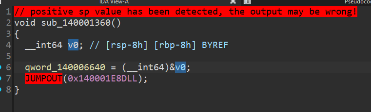

## Overview

This challenge required dealing with obfuscation techniques designed to hinder decompilation. In particular, the method used to conceal conditional branches by hiding the state of the **EFLAGS** register was quite fascinating. Even though many players manged to solve it, it’s still very interesting. Let’s get into the write-up.

## Make the Function Decompilable

First, the decompiled result of the `main()` is shown below. It’s very simple, and it looks like we can easily recover the correct input by  analyzing `sub_1360()`.

```cpp
int __fastcall main(int argc, const char **argv, const char **envp)
{
  __int64 v3; // rax
  __int64 v4; // rax
  __int64 v5; // rax
  __int64 v6; // rax
  std::ostream *v7; // rcx
  std::ostream *v8; // rax
  __int64 v9; // rax
  __int64 v10; // rax
  const char *v11; // rdx
  __int64 v13; // [rsp+20h] [rbp-38h] BYREF
  __int64 v14; // [rsp+28h] [rbp-30h] BYREF
  __int64 v15; // [rsp+30h] [rbp-28h] BYREF
  __int64 v16; // [rsp+38h] [rbp-20h] BYREF

  std::operator<<<std::char_traits<char>>(std::cout, "> ");
  v3 = std::istream::operator>>(std::cin, &v13);
  v4 = std::istream::operator>>(v3, &v15);
  v5 = std::istream::operator>>(v4, &v14);
  std::istream::operator>>(v5, &v16);
  v6 = sub_1360(v13, v15, v14, v16);
  v7 = std::cout;
  if ( v6 )
  {
    v13 ^= v15;
    v14 ^= v16;
    v8 = std::operator<<<std::char_traits<char>>(std::cout, "Congratulations, the flag is n1ctf{");
    v9 = std::ostream::operator<<(v8, sub_1000);
    v10 = std::ostream::operator<<(v9, v13);
    v7 = (std::ostream *)std::ostream::operator<<(v10, v14);
    v11 = (const char *)&unk_32A4;
  }
  else
  {
    v11 = "Wrong\n";
  }
  std::operator<<<std::char_traits<char>>(v7, v11);
  return 0;
}
```

However, once we decompile `sub_1360()`, things start to look quite suspicious.

```cpp
// positive sp value has been detected, the output may be wrong!
void sub_140001360()
{
  __int64 v0; // [rsp-8h] [rbp-8h] BYREF

  qword_140006640 = (__int64)&v0;
  JUMPOUT(0x140001E8DLL);
}
```

 Let’s take a look at the assembly.

```nasm
.text:0000000140001360 sub_140001360   proc near               ; CODE XREF: main+76↑p
.text:0000000140001360                 mov     cs:qword_140006640, rsp
.text:0000000140001367                 lea     rsp, unk_1400066C0
.text:000000014000136E                 push    r15
.text:0000000140001370                 push    r14
.text:0000000140001372                 push    r13
.text:0000000140001374                 push    r12
.text:0000000140001376                 push    r11
.text:0000000140001378                 push    r10
.text:000000014000137A                 push    r9
.text:000000014000137C                 push    r8
.text:000000014000137E                 push    rbp
.text:000000014000137F                 push    rdi
.text:0000000140001380                 push    rsi
.text:0000000140001381                 push    rdx
.text:0000000140001382                 push    rcx
.text:0000000140001383                 push    rbx
.text:0000000140001384                 push    rax
.text:0000000140001385                 lea     rcx, unk_1400066D0
.text:000000014000138C                 lea     r8, qword_140006640
.text:0000000140001393                 mov     rsp, cs:qword_140006640
.text:000000014000139A                 lea     r14, loc_140001E8D
.text:00000001400013A1                 push    r14
.text:00000001400013A3                 retn
```

Look at the end of the assembly, we can see that it pushes the address of the next code region onto the stack and then executes a `return`. This doesn’t represent a real function return; it’s an obfuscation trick that replaces a direct `jmp` with a `ret`, effectively achieving an **indirect jump-like obfuscation** effect.

Other blocks were obfuscated the same way — `lea <reg>, label; push <reg>; retn` — and replacing that pattern with a `jmp <imm>` seems to strip away the obfuscation easily.

Below is a comparison showing the result of manually patching a single occurrence of this pattern.



Before Patch


After Patch

If I patch all of those patterns the decompiler should produce much cleaner output — but there’s one more obfuscation left.

Take a look at the assembly below.

```nasm
.text:0000000140001D32 sub_140001D32   proc near               ; DATA XREF: sub_140001D46+15↓o
.text:0000000140001D32                 push    qword ptr [r8+80h]
.text:0000000140001D39                 popfq
.text:0000000140001D3A                 ja      short loc_140001CDB
.text:0000000140001D3C                 lea     r15, loc_140001A46
.text:0000000140001D43                 push    r15
.text:0000000140001D45                 retn
.text:0000000140001D45 sub_140001D32   endp ; sp-analysis failed
.text:0000000140001D45
.text:0000000140001D46
.text:0000000140001D46 ; =============== S U B R O U T I N E =======================================
.text:0000000140001D46
.text:0000000140001D46
.text:0000000140001D46 sub_140001D46   proc near               ; DATA XREF: sub_1400015E2+42C↑o
.text:0000000140001D46                 mov     r12, [r8+8]
.text:0000000140001D4A                 cmp     r12, 1770h
.text:0000000140001D51                 pushfq
.text:0000000140001D52                 pop     r12
.text:0000000140001D54                 mov     [r8+80h], r12
.text:0000000140001D5B                 lea     r9, sub_140001D32
.text:0000000140001D62                 push    r9
.text:0000000140001D64                 retn
```

In addition to the jump-related obfuscation we saw, the code briefly saves the EFLAGS using `pushfq`, then — after the flags have been tampered with — restores them with `popfq`. IDA decompiler does not track `pushfq` / `popfq` , so if we leave those instructions unpatched the decompiler will generate a local variables corresponding to the ZF flag in the branch condition — but the variable appears uninitialized in the decompiler output.

From what I verified, there is always a `ret`-style obfuscation sequence between the `pushfq` and `popfq` — and there’s no meaningful code between them besides obfuscation.

So the plan is: patch the `ret`-based obfuscation as described earlier, and then, for the entire range between `pushfq` and `popfq`, replacing every instruction with `nop` **except** the `jmp <imm>` we inject to replace the `ret` pattern. By doing this the saved EFLAGS value (from `pushfq`) will be restored unchanged until `popfq`, which preserves the branch condition even in the decompiler output.

The full deobfuscation script is below.

```python
from capstone import Cs, CsInsn, CS_ARCH_X86, CS_MODE_64
from capstone import CS_GRP_RET, CS_GRP_JUMP
from capstone.x86_const import *
from keystone import Ks, KS_ARCH_X86, KS_MODE_64
import lief

class Deobf:
    def __init__(self, bin_path: str):
        self.bin: lief.PE.Binary = lief.parse(bin_path)
        self.md = Cs(CS_ARCH_X86, CS_MODE_64)
        self.md.detail = True

        self.to_patch = []
        self.to_patch_nop = []
    
    def is_pattern(self, lea_insn: CsInsn, push_insn: CsInsn):
        if lea_insn.id == X86_INS_LEA and push_insn.id == X86_INS_PUSH:
            l_op = lea_insn.operands
            p_op = push_insn.operands[0]

            l_reg = l_op[0].reg
            p_reg = p_op.reg
            if l_reg != p_reg:
                return False

            label = push_insn.address + l_op[1].mem.disp
            return True, lea_insn.address, label
        elif lea_insn.id == X86_INS_MOV and push_insn.id == X86_INS_PUSH:
            m_op = lea_insn.operands
            p_op = push_insn.operands[0]

            m_reg = m_op[0].reg
            p_reg = p_op.reg
            if m_reg != p_reg:
                return False, None, None
            
            label = m_op[1].imm
            return True, lea_insn.address, label
        else:
            return False, None, None

    def scan(self, sa: int):
        
        text = None
        for sec in self.bin.sections:
            if sec.name == ".text":
                text = sec
                break
        
        code = self.bin.get_content_from_virtual_address(text.virtual_address, text.virtual_size)
        
        base = text.virtual_address
        basic_block_queue = [sa]
        end_block = []
        while True:
            insn_queue = []
            if len(basic_block_queue) > 0:
                ptr = basic_block_queue.pop(0)
                end_block.append(ptr)
                push_fq = 0
                for insn in self.md.disasm(code[ptr-base:], ptr):
                    insn_queue.append(insn)
                    if len(insn_queue) > 5:
                        insn_queue.pop(0)
                    if insn.id == X86_INS_PUSHFQ:
                        push_fq = insn.address
                    if insn.id == X86_INS_POPFQ:
                        self.to_patch_nop.append((insn.address-7, 8))
                    if insn.group(CS_GRP_JUMP):
                        if insn.id == X86_INS_JMP:
                            target = insn.operands[0].imm
                            if target not in basic_block_queue and target not in end_block:
                                basic_block_queue.append(target)
                            break
                        else:
                            target = insn.operands[0].imm
                            if target not in basic_block_queue and target not in end_block:
                                basic_block_queue.append(target)
                    if insn.group(CS_GRP_RET):
                        lea_insn = insn_queue[-3]
                        push_insn = insn_queue[-2]

                        res, addr, target = self.is_pattern(lea_insn, push_insn)

                        if res == True:
                            self.to_patch.append((addr, target))
                            if push_fq != 0:
                                self.to_patch_nop.append((push_fq, addr - push_fq))
                            if target not in basic_block_queue and target not in end_block:
                                basic_block_queue.append(target)
                            break
                        else:
                            break
            else:
                break
        return
    
    def patch(self):
        ks = Ks(KS_ARCH_X86, KS_MODE_64)

        for addr, label in self.to_patch:
            asm = f"jmp {hex(label)}"
            encoding, _ = ks.asm(asm, addr)

            self.bin.patch_address(addr, encoding)
        for addr, size in self.to_patch_nop:
            seq = [0x90 for _ in range(size)]
            self.bin.patch_address(addr, seq)
        
        builder = lief.PE.Builder(self.bin)
        builder.build()
        builder.write("patched.exe")
        return
                
                
if __name__ == "__main__":
    deobf = Deobf("problem.exe")
    deobf.scan(0x1360)
    deobf.patch()

```

After removing the obfuscation, the decompiled output looks like this. You can see that the obfuscation has been cleanly undone — the output is much clearer now.

```python
// positive sp value has been detected, the output may be wrong!
void __fastcall sub_140001360()
{
  __int16 v0; // r10
  _QWORD *v1; // r13
  _QWORD *v2; // r11
  __int64 v3; // rsi
  __int64 v4; // r11
  __int64 v5; // r12
  __int64 v6; // rdx
  __int64 v7; // rdx
  __int64 v8; // r15
  __int64 v9; // r13
  _QWORD *v10; // r9
  char v11; // al
  unsigned __int64 v12; // r12
  __int64 v13; // r9
  __int64 v14; // rbx
  __int64 v15; // rbp
  __int64 v16; // [rsp-78h] [rbp-78h] BYREF
  _QWORD v17[14]; // [rsp-70h] [rbp-70h] BYREF

  REG[0] = (__int64)&v16;
  v15 = (__int64)v17;
  v17[0] = REG[2];
  v17[1] = REG[6];
  REG[10] = 0LL;
  REG[6] = (__int64)&unk_140005840 - 15040;
  v1 = (_QWORD *)REG[10];
  REG[1] = (__int64)v1;
  REG[2] = REG[10];
  REG[11] = REG[10];
  do
  {
    if ( (REG[3] & 1) != 0 )
    {
      REG[1] += *(_QWORD *)(REG[6] + REG[11] + 15040);
      v1 = (_QWORD *)(REG[6] + REG[11] + 12992);
      v15 = 653LL;
      REG[2] += *v1;
      if ( (unsigned __int64)REG[1] > 0x1770 )
        goto FAIL;
    }
    v15 += 292LL;
    REG[3] = (unsigned __int64)REG[3] >> 1;
    v7 = REG[11] + 8;
    v0 = v0 & 0x235 ^ 0x31D;
    REG[11] = v7;
    v12 = REG[11];
  }
  while ( v12 < 0x200 );
  REG[3] = REG[10];
  do
  {
    if ( (REG[4] & 1) != 0 )
    {
      v1 = (_QWORD *)REG[6];
      REG[1] += *(_QWORD *)((char *)v1 + REG[3] + 15552);
      v5 = REG[6];
      v6 = REG[2];
      v15 = *(_QWORD *)(v5 + REG[3] + 13504) + v6;
      v7 = v5 ^ v6;
      REG[2] = v15;
      v12 = REG[1];
      if ( v12 > 0x1770 )
        goto FAIL;
    }
    v12 *= 2LL;
    REG[4] = (unsigned __int64)REG[4] >> 1;
    v14 = REG[3] + 8;
    v15 -= v7;
    REG[3] = v14;
  }
  while ( (unsigned __int64)REG[3] < 0x200 );
  v4 = REG[10];
  REG[3] = v4;
  do
  {
    if ( (REG[8] & 1) != 0 )
    {
      REG[1] += *(_QWORD *)(REG[6] + REG[3] + 16064);
      v13 = REG[3] + 14016;
      v1 = (_QWORD *)(*(_QWORD *)(REG[6] + v13) + REG[2]);
      v14 = 2LL * (((unsigned __int16)v13 ^ (unsigned __int16)REG[6]) & 0x292);
      REG[2] = (__int64)v1;
      if ( (unsigned __int64)REG[1] > 0x1770 )
        goto FAIL;
    }
    REG[8] = (unsigned __int64)REG[8] >> 1;
    v11 = (_BYTE)v1 - 28;
    v1 = (_QWORD *)(REG[3] + 8);
    v4 -= 882LL;
    REG[3] = (__int64)v1;
  }
  while ( (unsigned __int64)REG[3] < 0x200 );
  do
  {
    if ( (REG[9] & 1) != 0 )
    {
      v8 = REG[1];
      v9 = REG[6];
      v10 = (_QWORD *)(v9 + REG[10] + 0x40C0);
      v11 = v9 | (v9 + LOBYTE(REG[10]) - 0x40) ^ ((((-79 - ((v8 | 0x88) - (LOBYTE(REG[10]) - 0x40))) ^ v8 & (v11 | 0xE2)) & 0x79)
                                                + 35
                                                - (LOBYTE(REG[10])
                                                 - 0x40));
      REG[1] = *v10 + v8;
      v2 = (_QWORD *)(REG[6] + REG[10] + 14528);
      v3 = *v2 + REG[2];
      v14 = (REG[2] - (_QWORD)v2) & 0x3A1 & (((((unsigned __int16)v10 & 0x29A) + 573LL) ^ (v14 - v9) ^ 0x1CB) - v3);
      REG[2] = v3;
      if ( (unsigned __int64)REG[1] > 0x1770 )
        goto FAIL;
    }
    REG[9] = (unsigned __int64)REG[9] >> 1;
    REG[10] += 8LL;
  }
  while ( (unsigned __int64)REG[10] < 0x200 );
  if ( (unsigned __int64)REG[2] >= 0x7B82 )
  {
    REG[2] = *(_QWORD *)(REG[0] + 8);
    REG[1] = 1LL;
    REG[6] = *(_QWORD *)(REG[0] + 16);
  }
  else
  {
FAIL:
    REG[1] = 0LL;
    REG[2] = *(_QWORD *)(REG[0] + 8);
    REG[6] = *(_QWORD *)(REG[0] + 16);
  }
  JUMPOUT(0x1400015BFLL);
}
```

## Get the Flag

The input validation performs a simple running-sum check. To find an input that satisfies all the constraints, I had GPT implement a dynamic-programming–based solver for me.

```python
# solver_global_strict.py
from table import table

LIMIT0 = 0x1770   # 6000
NEED1  = 0x7B82   # 31618

def parse_table():
    rcx_sum0 = table[256:256+64]
    rcx_sum1 = table[0:64]

    rdx_sum0 = table[256+64:256+128]
    rdx_sum1 = table[64:128]

    r8_sum0  = table[256+128:256+192]
    r8_sum1  = table[128:192]

    r9_sum0  = table[256+192:256+256]
    r9_sum1  = table[192:256]

    return [
        (list(map(int, rcx_sum0)), list(map(int, rcx_sum1))),
        (list(map(int, rdx_sum0)), list(map(int, rdx_sum1))),
        (list(map(int, r8_sum0)),  list(map(int, r8_sum1))),
        (list(map(int, r9_sum0)),  list(map(int, r9_sum1))),
    ]

def build_items():
    """items[j] = (pass_idx, bit_idx, w=sum0, v=sum1) 총 256개"""
    tabs = parse_table()
    items = []
    for p,(s0,s1) in enumerate(tabs):
        for b in range(64):
            items.append((p, b, s0[b], s1[b]))
    return items

def solve_global_strict():
    items = build_items()
    n = len(items)  # 256
    C = LIMIT0
    NEG = -10**18

    # dp[j][c]를 1차원 롤링으로 유지, 선택여부는 take[j][c]에 저장
    dp_prev = [0] + [NEG]*C
    # take는 (n+1) x (C+1) 비트메모리 (True면 j번째 아이템을 채택)
    take = [bytearray(C+1) for _ in range(n+1)]

    for j,(p,b,w,v) in enumerate(items, start=1):
        dp_cur = dp_prev[:]  # not-take 기본 반영
        if w <= C:
            # 0/1 knapsack 역순 갱신
            for c in range(C, w-1, -1):
                cand = dp_prev[c - w] + v
                if cand > dp_cur[c]:
                    dp_cur[c] = cand
                    take[j][c] = 1  # j번째 아이템을 선택해서 c에 도달
                # not-take의 경우엔 기본값(dp_prev에서 복사)이므로 0 유지
        # w > C면 아무 것도 못 넣음 → not-take만 유지
        dp_prev = dp_cur

    # 최적 용량 찾기
    best_c = max(range(C+1), key=lambda c: dp_prev[c])
    best_v = dp_prev[best_c]

    # 복원
    masks = [0,0,0,0]
    c = best_c
    for j in range(n, 0, -1):
        if take[j][c]:
            p,b, w,v = items[j-1]
            masks[p] |= (1<<b)
            c -= w  # 사용한 무게만큼 되돌림
    # c는 0이어야 정상
    # 재합산(교차검증)
    tabs = parse_table()
    used_sum0 = [0,0,0,0]
    used_sum1 = [0,0,0,0]
    for p,(s0,s1) in enumerate(tabs):
        m = masks[p]
        for b in range(64):
            if (m>>b) & 1:
                used_sum0[p] += s0[b]
                used_sum1[p] += s1[b]
    total0 = sum(used_sum0)
    total1 = sum(used_sum1)

    # 정확성 체크: DP값과 재합산값이 반드시 같아야 함
    assert best_v == total1, f"Recalc mismatch: dp={best_v} vs recalc={total1}"

    return {
        "rcx": masks[0] & ((1<<64)-1),
        "rdx": masks[1] & ((1<<64)-1),
        "r8":  masks[2] & ((1<<64)-1),
        "r9":  masks[3] & ((1<<64)-1),
        "pass_sum0_used": used_sum0,
        "pass_sum1_gain": used_sum1,
        "total_sum0": total0,
        "limit_sum0": LIMIT0,
        "total_sum1": total1,
        "threshold_sum1": NEED1,
        "ok": (total0 <= LIMIT0) and (total1 >= NEED1),
    }

if __name__ == "__main__":
    res = solve_global_strict()
    print("RCX=0x%016X  RDX=0x%016X  R8=0x%016X  R9=0x%016X" % (res["rcx"],res["rdx"],res["r8"],res["r9"]))
    print("sum0 per pass:", [hex(x) for x in res["pass_sum0_used"]], " total:", hex(res["total_sum0"]), "/", hex(res["limit_sum0"]))
    print("sum1 per pass:", [hex(x) for x in res["pass_sum1_gain"]])
    print("total sum1 = 0x%X (need ≥ 0x%X) -> %s" %
          (res["total_sum1"], res["threshold_sum1"], "OK" if res["ok"] else "FAIL"))

```

Flag: `n1ctf{2c61982082d1af5052664054030285cd}`
