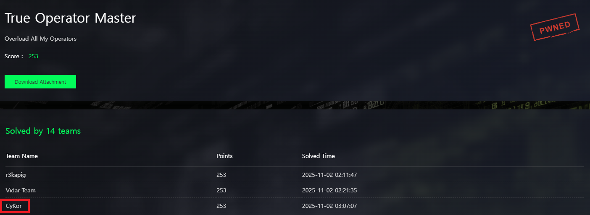

**상위 포스트 -** [N1CTF 2025](/2025-11/N1CTF_2025)

---

## Overview



This challenge offered a variety of obfuscation techniques — just enough to be interesting without becoming frustrating. The overall solving process wasn’t too painful, though I wouldn’t call it an easy problem either. It was actually the first challenge I tackled in the competition, and I was happy to grab the **third blood** on it.

## Deobfuscate the Layout Obfuscation

The binary was packed with UPX, so the first step was to unpack it. Below is the decompiled output of `main()` after unpacking. It looks fairly simple, and by analyzing `sub_14003D5AC()` I expected to be able to recover the correct input.

```cpp
// bad sp value at call has been detected, the output may be wrong!
// positive sp value has been detected, the output may be wrong!
void __noreturn sub_14006EDD7()
{
  int v0; // [rsp+28h] [rbp-C8h] BYREF
  int v1; // [rsp+2Ch] [rbp-C4h]
  int v2[4]; // [rsp+30h] [rbp-C0h] BYREF
  int v3[12]; // [rsp+40h] [rbp-B0h] BYREF
  char v4[64]; // [rsp+70h] [rbp-80h] BYREF
  char Str[56]; // [rsp+B0h] [rbp-40h] BYREF
  int j; // [rsp+E8h] [rbp-8h]
  int i; // [rsp+ECh] [rbp-4h]

  sub_14006F040();
  puts("Input your flag: ");
  v2[0] = -1263316434;
  v2[1] = 601749298;
  v2[2] = 348273441;
  v2[3] = -202134348;
  scan_f("%48s");
  if ( strlen(Str) != 48 )
  {
    puts("Wrong length!");
    exit_func(0);
  }
  sub_14003D3E8((__int64)Str, (__int64)v3, 48);
  for ( i = 0; i <= 11; i += 2 )
  {
    v0 = v3[i];
    v1 = v3[i + 1];
    ((void (__fastcall *)(int *, int *))sub_14003D5AC)(&v0, v2);
    v3[i] = v0;
    v3[i + 1] = v1;
  }
  ((void (__fastcall *)(int *, char *, __int64))sub_14003D4B5)(v3, v4, 48LL);
  for ( j = 0; j <= 47; ++j )
  {
    if ( v4[j] != byte_140071000[j] )
    {
      puts("Wrong flag!");
      exit_func(0);
    }
  }
  puts("Right flag!");
  exit_func(0);
}
```

However, this function cannot be decompiled, and upon inspection, it turns out to be a very typical case of **layout obfuscation**. Let’s take a look at the assembly.

```nasm
.text:000000014003E5DD loc_14003E5DD:                          ; CODE XREF: sub_14003D5AC+D76↑j
.text:000000014003E5DD                 xor     eax, eax
.text:000000014003E5DF                 jz      short loc_14003E5E2
.text:000000014003E5DF ; ---------------------------------------------------------------------------
.text:000000014003E5E1                 db 0E8h
.text:000000014003E5E2 ; ---------------------------------------------------------------------------
.text:000000014003E5E2
.text:000000014003E5E2 loc_14003E5E2:                          ; CODE XREF: sub_14003D5AC+1033↑j
.text:000000014003E5E2                 jz      short loc_14003E5E5
.text:000000014003E5E2 ; ---------------------------------------------------------------------------
.text:000000014003E5E4                 db 0E8h
.text:000000014003E5E5 ; ---------------------------------------------------------------------------
.text:000000014003E5E5
.text:000000014003E5E5 loc_14003E5E5:                          ; CODE XREF: sub_14003D5AC:loc_14003E5E2↑j
.text:000000014003E5E5                 mov     eax, [rbp+160h+var_20]
.text:000000014003E5EB                 mov     edx, 7
.text:000000014003E5F0                 mov     ecx, eax
```

This disassembly is the result of me fixing the layout manually. I corrected it in IDA by using the `u` (undefine) and `c` (create code) commands until instructions disassembled at the correct addresses.

Looking at the corrected assembly, it’s a classic case of layout obfuscation with a small twist. The code uses `xor eax, eax` to set EFLAGS and then `jz` to implement opaque predicates; the branch that’s never taken (the dead branch) is arranged so that it deliberately breaks the disassembly layout if you follow it. The twist I mentioned is that the EFLAGS value is preserved after the first `jz`, so the author chains another `jz` that reuses the same flag state — effectively implementing multiple opaque predicates from a single initial flags setup.

To handle all of these cases and remove the layout obfuscation globally, I wrote the following deobfuscation script:

```python
from capstone import Cs, CsInsn, CS_ARCH_X86, CS_MODE_64
from capstone.x86_const import *
from keystone import Ks, KS_ARCH_X86, KS_MODE_64
import lief

class Deobf:
    def __init__(self):
        self.bin: lief.PE.Binary = lief.parse("unpacked.exe")

        self.md = Cs(CS_ARCH_X86, CS_MODE_64)
        self.md.detail = True

        self.to_patch = []

    def is_xor_eax_eax(self, insn: CsInsn):
        if insn.id == X86_INS_XOR:
            operands = insn.operands
            if operands[0].type == X86_OP_REG and operands[1].type == X86_OP_REG:
                if operands[0].reg == operands[1].reg:
                    return True
        return False

    def deobf(self, sa: int, ea: int):
        bin = bytes(self.bin.get_content_from_virtual_address(sa, ea-sa))

        ptr = sa
        is_pattern = False
        while (ptr < ea):
            # print(hex(ptr))
            if is_pattern == False:
                for insn in self.md.disasm(bin[ptr-sa:ptr-sa+0x20], ptr, 1):
                    if self.is_xor_eax_eax(insn):
                        is_pattern = True
                    ptr += insn.size
            else:
                for insn in self.md.disasm(bin[ptr-sa:ptr-sa+0x20], ptr, 1):
                    if insn.id == X86_INS_JE:
                        operand = insn.operands[0]
                        assert operand.type == X86_OP_IMM
                        target = operand.imm
                        # print(hex(ptr), hex(target), hex(operand.imm))
                        self.to_patch.append((ptr, target))
                        ptr = target
                    else:
                        is_pattern = False
                        ptr += insn.size
        
        for a, b in self.to_patch:
            assert a < b
            new = [0x90 for _ in range(b - a)]
            try:
                self.bin.patch_address(a, new)
            except:
                print(a, b)
        
        builder = lief.PE.Builder(self.bin)
        builder.build()
        builder.write("patched.exe")
        return

if __name__ == "__main__":
    sa = 0x3D5AC
    ea = 0x6EDD7
    d = Deobf()
    d.deobf(sa, ea)
```

Decompiled output is below.

```cpp
_DWORD *__fastcall core(unsigned int *a1, unsigned int *a2)
{
[collapsed]

  v112 = *a1;
  v111 = a1[1];
  v110 = 0x12345679;
  v109 = 0;
  v108 = 0;
  v107 = 0;
  v106 = 0;
  v105 = 0;
  v104 = -1231451644;
  do
  {
    switch ( v104 )
    {
      case -139939:
        v52 = -960510134;
        do
        {
          switch ( v52 )
          {
            case -20981782:
              v108 = sub_6F8F(v108, a2[1]);
              v52 = 1756845032;
              break;
            case -310511782:
              v108 = sub_1B08(v105, 7LL);
              v52 = 249028469;
              break;
            case -617548323:
              v109 = sub_EE64(v105, 1427525925LL);
              v52 = -868387008;
              break;
            case -779668621:
              v111 = sub_2B003(v111, v108);
              v52 = 1526755485;
              break;
            case -868387008:
              v110 = sub_17D1A(v110, v109);
              v52 = -310511782;
              break;
            case -960510134:
              v107 = sub_1E508(v112, v107);
              v52 = -20981782;
              break;
            case -1668731517:
              v112 = sub_32BAC(v112, v108);
              v52 = 291803975;
              break;
            case -2074593288:
              v108 = sub_257A4(v111, v108);
              v52 = 555093502;
              break;
            case 1756845032:
              v107 = sub_376B7(v107, a2[2]);
              v52 = 1219973864;
              break;
            case 1526755485:
              v105 = sub_1F1EC(v105, 1LL);
              v52 = -617548323;
              break;
            case 1219973864:
              v106 = sub_39873(v112, v110);
              v52 = 135552651;
              break;
            case 1053496279:
              v108 = sub_14BF4(v108, a2[1]);
              v52 = 873140885;
              break;
            case 873140885:
              v107 = sub_1579(v107, a2[2]);
              v52 = 58209392;
              break;
            case 555093502:
              v106 = sub_3875B(v111, v110);
              v52 = 39649535;
              break;
            case 291803975:
              v108 = sub_2791D(v105, 5LL);
              v52 = 275026434;
              break;
            case 275026434:
              v107 = sub_23504(v105, 6LL);
              v52 = 21155879;
              break;
            case 249028469:
              v107 = sub_20187(v105, 4LL);
              v52 = -2074593288;
              break;
            case 206439738:
              v108 = sub_1F8C6(v108, a2[3]);
              v52 = 67765258;
              break;
            case 135552651:
              v107 = sub_2A32B(v107, v106);
              v52 = 134217731;
              break;
            case 134217731:
              v108 = sub_23BA3(v108, v107);
              v52 = -779668621;
              break;
            case 67765258:
              v107 = sub_18A4F(v107, v106);
              v52 = 4235328;
              break;
            case 39649535:
              v107 = sub_3CB1D(v111, v107);
              v52 = 34406623;
              break;
            case 34406623:
              v107 = sub_134F0(v107, *a2);
              v52 = 206439738;
              break;
            case 21155879:
              v108 = sub_1BED1(v112, v108);
              v52 = 53253;
              break;
            case 53253:
              v107 = sub_36648(v112, v107);
              v52 = 1053496279;
              break;
            default:
              v108 = sub_C7C4(v108, v107);
              v52 = -1668731517;
              break;
          }
        }
        while ( v52 != 58209392 );
        v104 = -1464710007;
        break;
      case -33949737:
        v97 = 1689049887;
        do
        {
          switch ( v97 )
          {
            case -394916:
              v105 = sub_2D4F8(v105, 1LL);
              v97 = 1078161005;
              break;
            case -2508716:
              v111 = sub_15921(v111, v108);
              v97 = -394916;
              break;
            case -325497250:
              v107 = sub_2AF4B(v111, v107);
              v97 = 992367511;
              break;
            case -672993638:
              v107 = sub_1B549(v107, a2[2]);
              v97 = 55266;
              break;
            case -711873532:
              v108 = sub_10229(v108, v107);
              v97 = 735599636;
              break;
            case -823178885:
              v110 = sub_61C8(v110, v109);
              v97 = -325497250;
              break;
            case -877275268:
              v107 = sub_51BD(v105, 4LL);
              v97 = 534720903;
              break;
            case -1115307712:
              v108 = sub_2D037(v105, 5LL);
              v97 = -1618084853;
              break;
            case -1618084853:
              v107 = sub_2EC3E(v105, 6LL);
              v97 = 268466186;
              break;
            case -2052065663:
              v108 = sub_BC96(v108, v107);
              v97 = -1343225913;
              break;
            case 2147304454:
              v108 = sub_126CA(v108, v107);
              v97 = -2508716;
              break;
            case 1878453561:
              v106 = sub_3C7D(v111, v110);
              v97 = 29350836;
              break;
            case 1689049887:
              v106 = sub_4365(v112, v110);
              v97 = 337809977;
              break;
            case 1078161005:
              v109 = sub_29C32(v105, 313856162LL);
              v97 = -877275268;
              break;
            case 992367511:
              v108 = sub_13BCE(v108, a2[3]);
              v97 = 62022969;
              break;
            case 735599636:
              v112 = sub_3CA65(v112, v108);
              v97 = -1115307712;
              break;
            case 604568336:
              v108 = sub_2AE38(v111, v108);
              v97 = -823178885;
              break;
            case 534720903:
              v108 = sub_A502(v105, 7LL);
              v97 = 604568336;
              break;
            case 337809977:
              v107 = sub_224FA(v107, v106);
              v97 = 2147304454;
              break;
            case 268466186:
              v108 = sub_10F4F(v112, v108);
              v97 = 44744364;
              break;
            case 62022969:
              v107 = sub_F5C8(v107, *a2);
              v97 = 1878453561;
              break;
            case 44744364:
              v107 = sub_130F4(v112, v107);
              v97 = 2796522;
              break;
            case 29350836:
              v107 = sub_ABCE(v107, v106);
              v97 = -711873532;
              break;
            case 28296192:
              v107 = sub_EF78(v107, v106);
              v97 = -2052065663;
              break;
            case 55266:
              v106 = sub_23AED(v112, v110);
              v97 = 28296192;
              break;
            default:
              v108 = sub_18C25(v108, a2[1]);
              v97 = -672993638;
              break;
          }
        }
        while ( v97 != -1343225913 );
        v104 = -271597896;
        break;
      case -35881473:
        v12 = -697154032;
        do
        {
          switch ( v12 )
          {
            case -17100262:
              v112 = sub_17EE3(v112, v108);
              v12 = -1404042728;
              break;
            case -67379218:
              v107 = sub_148A9(v112, v107);
              v12 = 325199082;
              break;
            case -134742800:
              v106 = sub_1FD8E(v111, v110);
              v12 = -1600429228;
              break;
            case -604790874:
              v108 = sub_1FA9F(v112, v108);
              v12 = -67379218;
              break;
            case -697154032:
              v108 = sub_24458(v108, a2[1]);
              v12 = 899453316;
              break;
            case -742638033:
              v111 = sub_4D40(v111, v108);
              v12 = -608305489;
              break;
            case -899546413:
              v110 = sub_383B9(v110, v109);
              v12 = 308674625;
              break;
            case -998146690:
              v108 = sub_1388E(v108, a2[3]);
              v12 = 100005888;
              break;
```

From the decompiled result, we can see that **Control Flow Flattening (CFF)** has been implemented.

The decompilation was successful, but there’s still a lot of work left to do.

## CFF Analysis - Hook the Handler Functions

In the CFF-protected code the function calls a large number of small functions; each of those functions simply performs a basic binary operation on its arguments (`+`, `-`, `^`, etc.) and returns the result — you can think of them as VM handlers. Our analysis goal is to determine what sequence of operations is applied to the input. In the decompiled output all computation is done by these VM handlers, so tracking them will reveal a lot about the function’s logic.

That raises a few questions: in what order are the VM handlers invoked? Is that order fixed, or does it depend on the input?

Fortunately, although the author used CFF to hide control flow, there are in fact no real control-flow decisions to be found. I could not locate any routine in the CFF that conditionally sets the “next block id.” In other words, if you removed the CFF, the whole function would collapse to one giant basic block in the CFG.

That makes recovering the hidden control flow very easy: whatever control flow you observe while running the binary on some input is the true CFF control flow for any input. So by instrumenting (hooking) every VM handler and recording the order in which they’re called, you can reconstruct the function’s control flow.

Here is hooking script.


```py
# hook.py
# usage:
#   python hook.py <process-name-or-pid> [module_name]
#
# examples:
#   python hook.py target.exe
#   python hook.py 12345 target.exe

import sys, json, frida, os
from pathlib import Path
from datetime import datetime

def load_targets():
    data = json.loads(Path("out/hook_targets.json").read_text(encoding="utf-8"))
    # data: [{ "call_target_rva": "0xfae5", "call_sites_rva": ["0x3e5f2", ...] }, ...]
    # 정수화
    targets = []
    for t in data:
        trg = {
            "call_target_rva": int(t["call_target_rva"], 16),
            "call_sites_rva": sorted({int(x, 16) for x in t.get("call_sites_rva", [])})
        }
        targets.append(trg)
    return targets

def make_agent_js(targets, module_name=None):
    """
    targets: [{call_target_rva:int, call_sites_rva: [int,...]}, ...]
    module_name: if None, use Process.enumerateModules()[0].name (main module)
    """
    # JS에 그대로 주입할 수 있도록 문자열 생성
    targets_js = json.dumps(targets)

    js = f"""
'use strict';

const TARGETS = {targets_js};
const MODULE_NAME = {json.dumps(module_name) if module_name else "null"};

function hex(v) {{
  try {{
    return ptr(v).toString();
  }} catch (_) {{
    if (typeof v === 'number') return '0x' + v.toString(16);
    return String(v);
  }}
}}

function findBase() {{
  if (MODULE_NAME) {{
    const b = Module.findBaseAddress(MODULE_NAME);
    if (!b) throw new Error('Module not found: ' + MODULE_NAME);
    return b;
  }}
  // fallback: first module (usually main exe)
  const m = Process.enumerateModules()[0];
  if (!m) throw new Error('No modules found');
  return m.base;
}}

const base = findBase();
send({{type:'info', payload: {{msg: '[+] Base=' + base}}}});

let seq = 0;

// RVA lookup for call-sites to label
// For quick membership tests, build a Set per target
for (const t of TARGETS) {{
  t.callSitesSet = new Set(t.call_sites_rva);
}}

function inferCallSiteRva(retaddr) {{
  // call rel32 is 5 bytes; return address = call_site + 5
  const retRva = ptr(retaddr).sub(base).toUInt32();
  const callRva = (retRva - 5) >>> 0;
  return callRva;
}}

for (const t of TARGETS) {{
  const addr = base.add(ptr(t.call_target_rva));
  try {{
    Interceptor.attach(addr, {{
      onEnter(args) {{
        // Windows x64: args[0]=RCX, args[1]=RDX
        const tid = Process.getCurrentThreadId();
        const ra = this.context.rsp.readPointer();
        const callSite = inferCallSiteRva(ra);

        // label: target RVA / call-site RVA (if known)
        const isKnownSite = t.callSitesSet.has(callSite);

        const rec = {{
          seq: ++seq,
          tid: tid,
          target_rva: t.call_target_rva >>> 0,
          call_site_rva: callSite,
          known_call_site: isKnownSite,
          rcx: args[0],   // raw pointer values; print on host
          rdx: args[1],
          // timestamp-ish
          time_ms: Date.now()
        }};
        send({{type:'hit', payload: rec}});
      }},
      onLeave(retval) {{
        // If you also want return values sequence, uncomment next lines:
        // send({{type:'ret', payload: {{seq: seq, target_rva: t.call_target_rva >>> 0, ret: retval}}}});
      }},
    }});
    send({{type:'info', payload: {{msg: '[+] Hook ' + hex(addr) + ' (rva=0x' + t.call_target_rva.toString(16) + ')'}}}});
  }} catch (e) {{
    send({{type:'warn', payload: {{msg: '[-] Failed to hook target rva=0x' + t.call_target_rva.toString(16), error: String(e)}}}});
  }}
}}
"""
    return js

TRACE_DIR = Path("out")
TRACE_DIR.mkdir(parents=True, exist_ok=True)

# CLI: python hook.py <pid|name|exe-path> [module_name] [out_path]
def parse_args():
    target = sys.argv[1] if len(sys.argv) >= 2 else None
    module_name = sys.argv[2] if len(sys.argv) >= 3 else None
    out_path = sys.argv[3] if len(sys.argv) >= 4 else str(TRACE_DIR / "trace.jsonl")
    return target, module_name, out_path

# 전역 버퍼 (종료 시 JSON 배열로도 저장)
TRACE_BUFFER = []

# JSONL writer (즉시 기록 + flush)
class JsonlWriter:
    def __init__(self, path):
        self.path = Path(path)
        self.path.parent.mkdir(parents=True, exist_ok=True)
        # append 모드
        self.fp = self.path.open("a", encoding="utf-8")
    def write(self, obj):
        self.fp.write(json.dumps(obj, ensure_ascii=False) + "\n")
        self.fp.flush()
        os.fsync(self.fp.fileno())
    def close(self):
        try: self.fp.close()
        except: pass

jsonl_writer = None  # init in main()

def on_message(message, data):
    t = message.get("type")
    if t == "send":
        payload = message.get("payload", {})
        ptype = payload.get("type")
        p = payload.get("payload", {})
        if ptype == "hit":
            # rcx/rdx는 NativePointer; 문자열로 직렬화
            rec = {
                "seq": p["seq"],
                "tid": p["tid"],
                "target_rva": f"0x{p['target_rva']:x}",
                "call_site_rva": f"0x{p['call_site_rva']:x}",
                "known_call_site": bool(p["known_call_site"]),
                "rcx": str(p["rcx"]),
                "rdx": str(p["rdx"]),
                "time_ms": int(p["time_ms"]),
            }
            TRACE_BUFFER.append(rec)
            jsonl_writer.write(rec)  # 즉시 파일 반영
        elif ptype in ("info", "warn"):
            # 필요하면 로깅
            print(p.get("msg"), p.get("error", ""))
        else:
            # 기타 메시지는 무시 또는 로그
            pass
    elif t == "error":
        print("[!] agent error:", message.get("stack", message))

def attach_or_spawn(target: str):
    """
    target이 숫자면 PID로 attach.
    파일 경로이면 spawn 후 attach.
    그 외에는 프로세스 이름으로 attach (완전/부분 일치).
    반환: (session, module_name, spawned_pid or None)
    """
    dev = frida.get_local_device()

    # 1) PID로 attach 시도
    try:
        pid = int(target)
        session = frida.attach(pid)
        # module_name은 JS가 Process.enumerateModules()[0]로 자동 결정하므로 None으로 둔다
        return session, None, None
    except ValueError:
        pass
    except frida.ProcessNotFoundError:
        print(f"[-] PID {target} not found")

    # 2) 경로면 spawn
    p = Path(target)
    if p.exists() and p.is_file():
        pid = frida.spawn([str(p)])
        session = frida.attach(pid)
        # 필요하면 p.name을 module_name으로 쓸 수 있지만 JS가 자동으로 찾으니 None으로 둠
        return session, None, pid

    # 3) 이름으로 attach (완전/부분 일치)
    name = target.lower()
    procs = dev.enumerate_processes()

    exact = [pr for pr in procs if pr.name.lower() == name or pr.name.lower() == (name + ".exe")]
    if exact:
        session = frida.attach(exact[0].pid)
        return session, exact[0].name, None

    partial = [pr for pr in procs if name in pr.name.lower()]
    if partial:
        session = frida.attach(partial[0].pid)
        return session, partial[0].name, None

    raise frida.ProcessNotFoundError(f"unable to find process by name or path: {target}")

def main():
    global jsonl_writer
    if len(sys.argv) < 2:
        print("usage: python hook.py <pid|process-name|exe-path> [module_name] [out_path]")
        return

    target, forced_module, out_path = parse_args()
    targets = load_targets()
    if not targets:
        print("[-] out/hook_targets.json is empty")
        return

    session, module_name, spawned_pid = attach_or_spawn(target)
    if forced_module:
        module_name = forced_module

    # JSONL writer 준비
    jsonl_writer = JsonlWriter(out_path)
    print(f"[+] writing JSONL to: {out_path}")

    script_src = make_agent_js(targets, module_name)
    script = session.create_script(script_src)
    script.on("message", on_message)
    script.load()

    if spawned_pid is not None:
        frida.resume(spawned_pid)

    print("[+] attached. hooks installed. Ctrl+C to quit.")
    try:
        sys.stdin.read()
    except KeyboardInterrupt:
        pass
    finally:
        # 종료 시 배열 형태의 trace.json도 생성 (동일 디렉토리)
        try:
            json_path = Path(out_path).with_suffix(".json")
            json_path.write_text(json.dumps(TRACE_BUFFER, ensure_ascii=False, indent=2), encoding="utf-8")
            print(f"[+] saved JSON array: {json_path}")
        except Exception as e:
            print("[-] failed to save JSON array:", e)
        if jsonl_writer:
            jsonl_writer.close()
        session.detach()

if __name__ == "__main__":
    main()

```


This script logs the execution details of multiple VM handlers and, in particular, records the **order** in which those functions are executed.

## Data Flow Analysis - Call Assembly Pattern Matching

Now that we’ve figured out the order in which the VM handlers are executed, we need to track **what arguments** are passed to those handlers and **where their results are stored**.

From what I can tell, the call sites for these VM handlers were generated automatically. There are clearly hundreds of calls — no one wrote that by hand. If you look at the assembly around each call site, you can see the pattern is strikingly consistent. Here are a few of those patterns.

```cpp
.text:0000000140058CCA                 mov     edx, [rbp+160h+var_1C]
.text:0000000140058CD0                 mov     eax, [rbp+160h+var_18]
.text:0000000140058CD6                 mov     ecx, eax
.text:0000000140058CD8                 call    sub_14002B16F
.text:0000000140058CDD                 mov     [rbp+160h+var_18], eax
```

```cpp
.text:0000000140058800                 mov     rax, [rbp+160h+arg_8]
.text:0000000140058807                 add     rax, 0Ch
.text:000000014005880B                 mov     edx, [rax]
.text:000000014005880D                 mov     eax, [rbp+160h+var_14]
.text:0000000140058813                 mov     ecx, eax
.text:0000000140058815                 call    sub_14001F8C6
.text:000000014005881A                 mov     [rbp+160h+var_14], eax
```

```cpp
.text:000000014003E614                 mov     eax, [rbp+160h+var_20]
.text:000000014003E61A                 mov     edx, 0CB497BEBh
.text:000000014003E61F                 mov     ecx, eax
.text:000000014003E621                 call    sub_1400337D8
.text:000000014003E626                 mov     [rbp+160h+var_10], eax
```

Thanks to the clear, repetitive pattern, I was able to track the data flow just by scraping the assembly and doing simple pattern matching. Below is the script that records the data flow based on those patterns.

```python
# get_data_flow.py
# - PE RVA 기준으로 Capstone 디스어셈블
# - call imm32 사이트를 찾고, call 직전 백워드 스캔으로 RCX/EDX 근원을 수집
# - EDX가 [rax(+disp)] 형태일 때, rax가 [rbp+arg_8]에서 올라온 뒤 add/sub/lea로 이동한 누적 오프셋을 반영
# - call 직후 ret 저장 mov [rbp+disp], eax/rax 를 찾아 ret_store로 기록
# - 결과를 out/call_sites.json, out/hook_targets.json(RVA만)으로 저장

from __future__ import annotations
import json
from pathlib import Path
from typing import Any, Dict, List, Optional, Tuple

import lief
from capstone import Cs, CS_ARCH_X86, CS_MODE_64
from capstone.x86_const import *

# ========== 유틸 ==========
def hx(n: int) -> str:
    return f"0x{n:x}"

def is_call_imm(insn) -> bool:
    return insn.id == X86_INS_CALL and insn.operands and insn.operands[0].type == X86_OP_IMM

def get_mem_rbp_disp(op) -> Optional[int]:
    if op.type != X86_OP_MEM:
        return None
    m = op.mem
    if m.base == X86_REG_RBP and m.index == X86_REG_INVALID:
        return m.disp
    return None

def is_mov_reg_mem(insn, dst_reg) -> Optional[int]:
    # mov dst_reg, [rbp+disp]
    if insn.id != X86_INS_MOV or len(insn.operands) != 2:
        return None
    dst, src = insn.operands
    if dst.type == X86_OP_REG and dst.reg == dst_reg:
        disp = get_mem_rbp_disp(src)
        if disp is not None:
            return disp
    return None

def is_mov_reg_reg(insn, dst_reg, src_regs: Tuple[int, ...]) -> bool:
    if insn.id != X86_INS_MOV or len(insn.operands) != 2:
        return False
    dst, src = insn.operands
    return dst.type == X86_OP_REG and dst.reg == dst_reg and src.type == X86_OP_REG and src.reg in src_regs

def is_mov_reg_imm(insn, dst_reg) -> Optional[int]:
    if insn.id != X86_INS_MOV or len(insn.operands) != 2:
        return None
    dst, src = insn.operands
    if dst.type == X86_OP_REG and dst.reg == dst_reg and src.type == X86_OP_IMM:
        return src.imm
    return None

def is_add_reg_imm(insn, reg) -> Optional[int]:
    if insn.id != X86_INS_ADD or len(insn.operands) != 2:
        return None
    dst, src = insn.operands
    if dst.type == X86_OP_REG and dst.reg == reg and src.type == X86_OP_IMM:
        return src.imm
    return None

def is_sub_reg_imm(insn, reg) -> Optional[int]:
    if insn.id != X86_INS_SUB or len(insn.operands) != 2:
        return None
    dst, src = insn.operands
    if dst.type == X86_OP_REG and dst.reg == reg and src.type == X86_OP_IMM:
        return src.imm
    return None

def is_lea_rax_rax_plus_imm(insn) -> Optional[int]:
    # lea rax, [rax+imm]
    if insn.id != X86_INS_LEA or len(insn.operands) != 2:
        return None
    dst, src = insn.operands
    if dst.type == X86_OP_REG and dst.reg == X86_REG_RAX and src.type == X86_OP_MEM:
        m = src.mem
        if m.base == X86_REG_RAX and m.index == X86_REG_INVALID:
            return m.disp
    return None

def is_mov_mem_eax_or_rax(insn) -> Optional[int]:
    # mov [rbp+disp], eax/rax
    if insn.id != X86_INS_MOV or len(insn.operands) != 2:
        return None
    dst, src = insn.operands
    disp = get_mem_rbp_disp(dst)
    if disp is not None and src.type == X86_OP_REG and src.reg in (X86_REG_EAX, X86_REG_RAX):
        return disp
    return None

def is_mov_edx_from_rax_mem(insn) -> Optional[int]:
    # mov edx, [rax + disp]   (disp 0 포함)
    if insn.id != X86_INS_MOV or len(insn.operands) != 2:
        return None
    dst, src = insn.operands
    if not (dst.type == X86_OP_REG and dst.reg == X86_REG_EDX):
        return None
    if src.type != X86_OP_MEM:
        return None
    m = src.mem
    if m.base != X86_REG_RAX or m.index != X86_REG_INVALID:
        return None
    return m.disp

# ========== 파서 ==========
class Parser:
    def __init__(self, bin_path: str):
        self.bin: lief.PE.Binary = lief.parse(bin_path)
        self.imgbase: int = int(self.bin.optional_header.imagebase)
        self.md = Cs(CS_ARCH_X86, CS_MODE_64)
        self.md.detail = True

    def parse(self, sa_rva: int, ea_rva: int) -> List[Dict[str, Any]]:
        """[sa_rva, ea_rva) 범위를 RVA 기준으로 디스어셈블하여 call 사이트 수집"""
        code = bytes(self.bin.get_content_from_virtual_address(sa_rva, ea_rva - sa_rva))
        # Capstone 기준주소 = RVA (VA 사용하지 않음)
        insns = list(self.md.disasm(code, sa_rva))
        results: List[Dict[str, Any]] = []

        n = len(insns)
        BACK_WINDOW = 8  # 여유 있게

        i = 0
        while i < n:
            insn = insns[i]
            if not is_call_imm(insn):
                i += 1
                continue

            call_rva = insn.address            # RVA
            target_rva = insn.operands[0].imm  # RVA (Capstone가 기준에 맞춰 계산해줌)

            # call 직후 한 명령: mov [rbp+disp], eax/rax → ret_store
            ret_store_disp: Optional[int] = None
            if i + 1 < n:
                ret_store_disp = is_mov_mem_eax_or_rax(insns[i + 1])

            # ----- 백워드 데이터 플로우 -----
            rcx_src: Optional[str] = None
            rdx_src: Optional[str] = None

            # RAX 오프셋 선누적용
            last_rax_kind: Optional[str] = None  # "arg8" 등 (mov rax,[rbp+...])
            last_rax_add: int = 0                # add/sub/lea 누적

            # RCX가 EAX에 의존하는지 표시
            pending_rcx_from_eax = False
            last_eax_from_mem_disp: Optional[int] = None

            # ★ RDX 지연 확정용 버퍼
            rdx_from_rax_disp: Optional[int] = None   # mov edx,[rax+disp]에서의 disp를 보관

            j = i - 1
            steps = 0
            while j >= 0 and steps < BACK_WINDOW and (rcx_src is None or rdx_src is None or rdx_from_rax_disp is not None):
                pj = insns[j]

                # (1) RAX에 대한 add/sub/lea는 선누적
                add_imm = is_add_reg_imm(pj, X86_REG_RAX)
                if add_imm is not None:
                    last_rax_add += add_imm
                else:
                    sub_imm = is_sub_reg_imm(pj, X86_REG_RAX)
                    if sub_imm is not None:
                        last_rax_add -= sub_imm
                    else:
                        lea_off = is_lea_rax_rax_plus_imm(pj)
                        if lea_off is not None:
                            last_rax_add += lea_off
                        else:
                            # (2) RAX 베이스 정의: mov rax, [rbp+disp]
                            disp_arg8 = is_mov_reg_mem(pj, X86_REG_RAX)
                            if disp_arg8 is not None:
                                last_rax_kind = "arg8"

                # (3) RDX 근원 (즉시 확정하지 말고 의존성만 기록)
                if rdx_src is None:
                    imm = is_mov_reg_imm(pj, X86_REG_EDX)
                    if imm is not None:
                        rdx_src = f"imm:{imm & 0xFFFFFFFF:#x}"
                    else:
                        disp_edx = is_mov_reg_mem(pj, X86_REG_EDX)
                        if disp_edx is not None:
                            rdx_src = f"[rbp{disp_edx:+#x}]"
                        else:
                            disp_from_rax = is_mov_edx_from_rax_mem(pj)
                            if disp_from_rax is not None:
                                # ★ 여기서는 문자열 만들지 말고 DISP만 저장
                                rdx_from_rax_disp = disp_from_rax

                # (4) RCX 근원 (기존 로직 그대로)
                if rcx_src is None:
                    disp_ecx = is_mov_reg_mem(pj, X86_REG_ECX)
                    if disp_ecx is not None:
                        rcx_src = f"[rbp{disp_ecx:+#x}]"
                        pending_rcx_from_eax = False
                    else:
                        if is_mov_reg_reg(pj, X86_REG_ECX, (X86_REG_EAX, X86_REG_RAX)):
                            if last_eax_from_mem_disp is not None:
                                rcx_src = f"[rbp{last_eax_from_mem_disp:+#x}]"
                            else:
                                pending_rcx_from_eax = True
                        else:
                            disp_eax = is_mov_reg_mem(pj, X86_REG_EAX)
                            if disp_eax is not None:
                                last_eax_from_mem_disp = disp_eax
                                if pending_rcx_from_eax and rcx_src is None:
                                    rcx_src = f"[rbp{disp_eax:+#x}]"
                                    pending_rcx_from_eax = False

                j -= 1
                steps += 1

            # ★★★ 루프가 끝난 뒤, RDX를 최종 확정 ★★★
            if rdx_src is None and rdx_from_rax_disp is not None:
                if last_rax_kind == "arg8":
                    total = last_rax_add + rdx_from_rax_disp
                    rdx_src = f"[[rbp+arg_8] + {total:#x}]"
                else:
                    rdx_src = f"[rax{rdx_from_rax_disp:+#x}]"

            entry = {
                "pattern": "GEN" if (rcx_src and rdx_src and ret_store_disp is not None) else None,
                "call_insn_rva": hx(call_rva),
                "call_target_rva": hx(target_rva),
                "args": {"rcx": rcx_src, "rdx": rdx_src},
                "ret_store": f"[rbp{ret_store_disp:+#x}]" if ret_store_disp is not None else None,
            }
            results.append(entry)
            i += 1

        return results

    def save_json(self, results: List[Dict[str, Any]], outdir: str = "out"):
        out = Path(outdir)
        out.mkdir(parents=True, exist_ok=True)

        # 1) call_sites.json — 모든 콜 사이트
        (out / "call_sites.json").write_text(json.dumps(results, indent=2), encoding="utf-8")

        # 2) hook_targets.json — 고유 타깃 + 해당 콜 사이트 rva
        targets: Dict[str, Dict[str, Any]] = {}
        for r in results:
            trva = r["call_target_rva"]
            if trva is None:
                continue
            if trva not in targets:
                targets[trva] = {"call_target_rva": trva, "call_sites_rva": []}
            targets[trva]["call_sites_rva"].append(r["call_insn_rva"])

        # 중복 제거 + 정렬
        for t in targets.values():
            s = sorted(set(t["call_sites_rva"]), key=lambda x: int(x, 16))
            t["call_sites_rva"] = s

        (out / "hook_targets.json").write_text(json.dumps(list(targets.values()), indent=2), encoding="utf-8")

# ========== 단독 실행 예시 ==========
if __name__ == "__main__":
    BIN = "patched.exe"
    SA  = 0x3D5AC
    EA  = 0x6EDD7

    P = Parser(BIN)
    res = P.parse(SA, EA)
    P.save_json(res, outdir="out")
    print("[+] saved: out/call_sites.json, out/hook_targets.json (RVA only)")

```

## VM Handler Analysis - Handler Assembly Pattern Matching

The last thing we need to figure out is: **what operation does each VM handler actually perform?**

Since these were also generated automatically, they follow very clear patterns as well. Let’s take a look.

```nasm
.text:0000000000017BAE sub_17BAE       proc near               ; CODE XREF: core+2A935↓p
.text:0000000000017BAE                                         ; DATA XREF: .pdata:0000000000075E68↓o ...
.text:0000000000017BAE                 push    rbp
.text:0000000000017BAF                 mov     rbp, rsp
.text:0000000000017BB2                 sub     rsp, 10h
.text:0000000000017BB6                 push    rax
.text:0000000000017BB7                 push    rbx
.text:0000000000017BB8                 push    rcx
.text:0000000000017BB9                 push    rdx
.text:0000000000017BBA                 push    r8
.text:0000000000017BBC                 mov     rax, rcx
.text:0000000000017BBF                 xor     rbx, rbx
.text:0000000000017BC2                 xor     rbx, 1
.text:0000000000017BC6                 call    $+5
.text:0000000000017BCB                 xor     rbx, 1
.text:0000000000017BCF                 cmp     rbx, 1
.text:0000000000017BD3                 jz      short loc_17BD9
.text:0000000000017BD5                 add     rax, rdx
.text:0000000000017BD8                 retn
.text:0000000000017BD9 ; ---------------------------------------------------------------------------
.text:0000000000017BD9
.text:0000000000017BD9 loc_17BD9:                              ; CODE XREF: sub_17BAE+25↑j
.text:0000000000017BD9                 mov     eax, 30h ; '0'
.text:0000000000017BDE                 mov     rax, gs:[rax]
.text:0000000000017BE2                 mov     rax, [rax+60h]
.text:0000000000017BE6                 movzx   eax, byte ptr [rax+2]
.text:0000000000017BEA                 cmp     eax, 0
.text:0000000000017BED                 pop     r8
.text:0000000000017BEF                 pop     rdx
.text:0000000000017BF0                 pop     rcx
.text:0000000000017BF1                 pop     rbx
.text:0000000000017BF2                 pop     rax
.text:0000000000017BF3                 mov     rax, rcx
.text:0000000000017BF6                 jnz     short loc_17BFD
.text:0000000000017BF8                 xor     rax, rdx
.text:0000000000017BFB                 jmp     short loc_17C00
.text:0000000000017BFD ; ---------------------------------------------------------------------------
.text:0000000000017BFD
.text:0000000000017BFD loc_17BFD:                              ; CODE XREF: sub_17BAE+48↑j
.text:0000000000017BFD                 add     rax, rdx
.text:0000000000017C00
.text:0000000000017C00 loc_17C00:                              ; CODE XREF: sub_17BAE+4D↑j
.text:0000000000017C00                 add     rsp, 10h
.text:0000000000017C04                 pop     rbp
.text:0000000000017C05                 retn
```

In this handler, the only instruction that actually executes in the “real” path is the `xor` at `0x17BF8`. The rest is an opaque-predicate style check that detects whether the process is being debugged and, if so, executes an `add` instead.

Aside from this “debug-only” path and the actual operation itself, the assembly was identical — down to the exact instructions. The only part that varied was the portion corresponding to the operation (e.g. `xor`, `add`, etc.), so I only needed to focus on that region when doing pattern matching.

Once you collect all of this information, you basically have a full description of the VM’s behavior. I also wrote a script that, in addition to the pattern matching, aggregates the analyzed data and emits a human-readable, assembly-like representation of what the VM is doing.

```python
import json
from pathlib import Path
from typing import Dict, List

def get_func_call():
    TRACE_PATH = Path("out/trace.json")
    REPEAT_N = 6  # 반복 가설

    def _to_int(x):
        if isinstance(x, int):
            return x
        s = str(x).strip().lower()
        if s.startswith("0x"):
            return int(s, 16)
        # 혹시 "fae5" 같은 순수 hex 문자열이면:
        try:
            return int(s, 16)
        except ValueError:
            return int(s)  # 마지막 방어: 10진

    data = json.loads(TRACE_PATH.read_text(encoding="utf-8"))

    # seq 기준 정렬 후 target_rva만 int로 추출
    seq_targets: list[int] = [_to_int(r["target_rva"]) for r in sorted(data, key=lambda r: int(r["seq"]))]

    # 12등분 반복 여부 검사
    n = len(seq_targets)
    is_repeated = (n % REPEAT_N == 0)
    seq_targets_dedup: list[int] | None = None

    if is_repeated:
        chunk = n // REPEAT_N
        first = seq_targets[:chunk]
        is_repeated = all(seq_targets[i*chunk:(i+1)*chunk] == first for i in range(REPEAT_N))
        if is_repeated:
            seq_targets_dedup = first

    print(f"[info] total calls = {n}, divisible by {REPEAT_N}: {n % REPEAT_N == 0}")
    print(f"[info] exact {REPEAT_N}x repetition: {is_repeated}")
    if is_repeated:
        print(f"[info] dedup length = {len(seq_targets_dedup)}")
    
    return seq_targets

from capstone import Cs, CsInsn, CS_ARCH_X86, CS_MODE_64
from capstone.x86_const import *
import lief

def parse_handler(hook_targets):
    bin: lief.PE.Binary = lief.parse("patched.exe")
    md = Cs(CS_ARCH_X86, CS_MODE_64)
    md.detail = True

    for target in hook_targets:
        target_addr = int(target["call_target_rva"], 0)
        code = bytes(bin.get_content_from_virtual_address(target_addr, 0x100))

        for insn in md.disasm(code[0x25:], target_addr+0x25, count=1):
            assert insn.id == X86_INS_JE
            operand = insn.operands[0]
            next = operand.imm + 0x1f

        for insn in md.disasm(code[next-target_addr:], next, count=1):
            asm_str = insn.mnemonic + " " + insn.op_str
            if asm_str == "and rax, rdx":
                target["op"] = "&"
            elif asm_str == "xor rax, rdx":
                target["op"] = "^"
            elif asm_str == "mov r8, rdx":
                target["op"] = "*"
            elif asm_str == "add rax, rdx":
                target["op"] = "+"
            elif asm_str == "or rax, rdx":
                target["op"] = "|"
            elif asm_str == "mov cl, dl":
                if code[next-target_addr + 0xB - 0x7] == 0xE0:
                    target["op"] = "<<"
                elif code[next-target_addr + 0x2B - 0x27] == 0xE8:
                    target["op"] = ">>"
                else:
                    print(hex(insn.address), code[next-target_addr + 0xB - 0x7])
            elif asm_str == "sub rax, rdx":
                target["op"] = "-"
            elif asm_str == "mov rbx, rdx":
                target["op"] = "%"
            else:
                print(hex(insn.address))
    return

def parse_src(a):
    if "[" in a:
        mem = a[1:4]
        if mem == "rbp":
            offset = int(a[5:-1], 0)
            return f"D[{(0x160 - offset) // 4}]"
        elif mem == "rax":
            offset = int(a[7:-1], 0)
            return f"a[{offset // 4}]"
        else:
            print(a)
            exit()
    elif "imm:" in a:
        return a[4:]
    else:
        print(a)
        exit()

def parse_dst(a):
    if "[" in a:
        offset = int(a[5:-1], 0)
        mem = a[1:4]
        if mem == "rbp":
            return f"D[{(0x160 - offset) // 4}]"
        else:
            print("dst", a)
            exit()
    else:
        print("dst", a)
        exit()

def main():
    HOOK_PATH = Path("out/call_sites.json")

    handlers: List[dict] = json.loads(HOOK_PATH.read_text(encoding="utf-8"))

    parse_handler(handlers)

    with open("code.txt", "w") as f:
        f.write("")

    seq_targets = get_func_call()
    for idx, seq in enumerate(seq_targets):
        if idx >= len(seq_targets) // 6:
            break
        item = next(d for d in handlers if d.get("call_target_rva") == hex(seq))
        src1, src2 = parse_src(item["args"]["rcx"]), parse_src(item["args"]["rdx"])
        dst = parse_dst(item["ret_store"])
        op = item["op"]

        code = " ".join([dst, "=", src1, op, src2])
        with open("code.txt", "a") as f:
            f.write(code + "\n")
        

if __name__ == "__main__":
    main()
```

When you run the script above, it generates a file called `code.txt`, which contains the VM’s behavior recorded in pseudocode.

## VM Bytecode Analysis

Now it’s time to interpret the VM code. Since each VM handler was designed to be executed only once, the VM bytecode looks almost like a fully unrolled loop. Let’s look at a portion of the VM code.

```python
D[5] = D[8] % 0x7
D[4] = D[8] * 0xcb497beb
D[3] = D[3] - D[4]
D[6] = D[8] % 0x4
D[5] = D[2] << D[5]
D[6] = D[2] >> D[6]
D[5] = D[5] ^ a[3]
D[6] = D[6] ^ a[0]
D[7] = D[2] & D[3]
D[6] = D[6] ^ D[7]
D[5] = D[5] ^ D[6]
D[1] = D[1] - D[5]
D[5] = D[8] % 0x5
D[6] = D[8] % 0x6
D[5] = D[1] >> D[5]
D[6] = D[1] << D[6]
D[5] = D[5] ^ a[1]
D[6] = D[6] ^ a[2]
D[7] = D[1] | D[3]
D[6] = D[6] ^ D[7]
D[5] = D[5] ^ D[6]
D[2] = D[2] + D[5]
D[8] = D[8] + 0x1
D[6] = D[8] % 0x4
D[4] = D[8] * 0x522e687e
D[5] = D[8] % 0x7
D[3] = D[3] - D[4]
D[5] = D[2] << D[5]
D[6] = D[2] >> D[6]
D[5] = D[5] ^ a[3]
D[6] = D[6] ^ a[0]
D[7] = D[2] & D[3]
D[6] = D[6] ^ D[7]
D[5] = D[5] ^ D[6]
D[1] = D[1] - D[5]
D[5] = D[8] % 0x5
D[6] = D[8] % 0x6
D[5] = D[1] >> D[5]
D[6] = D[1] << D[6]
D[5] = D[5] ^ a[1]
D[6] = D[6] ^ a[2]
D[7] = D[1] | D[3]
D[6] = D[6] ^ D[7]
D[5] = D[5] ^ D[6]
D[2] = D[2] + D[5]
D[8] = D[8] + 0x1
D[4] = D[8] * 0x2abd81bc
D[6] = D[8] % 0x4
D[5] = D[8] % 0x7
D[3] = D[3] - D[4]
D[5] = D[2] << D[5]
D[6] = D[2] >> D[6]
D[5] = D[5] ^ a[3]
D[6] = D[6] ^ a[0]
D[7] = D[2] & D[3]
D[6] = D[6] ^ D[7]
D[5] = D[5] ^ D[6]
...
```

As you read through it, you can see that every group of 23 instructions forms a single **Feistel** round.

There is a slight twist, though: instructions that are commutative or order-independent are sometimes shuffled between rounds. Just like `a + b` and `b + a` are equivalent, the author seems to have permuted such instructions per round to make straightforward parsing of round constants a bit more annoying.

Still, the only things we really need to extract are which values are used from the **`a` constant table**

and what the **round constants** are.

By matching everything with regular expressions and slicing the results in order, I was able to recover the constants for each round.

Below is the final solver, which combines regex-based constant extraction with the Feistel decryption logic to recover the flag.

```python
# decrypt_from_code_txt.py
import re
from typing import List, Tuple

MASK64 = (1 << 32) - 1

def u64(x: int) -> int:
    return x & MASK64

# ---------- 파서 ----------

ROUND_LINES = 23

K_RE   = re.compile(r"D\[\s*4\s*\]\s*=\s*D\[\s*8\s*\]\s*\*\s*(0x[0-9a-fA-F]+)")
MASK_RE = re.compile(r"a\[\s*(\d+)\s*\]")

def parse_rounds_from_code(path: str):
    """
    code.txt를 읽어 23줄씩 끊어 라운드별로
    - K (int)
    - masks (F_left, F_right, G_left, G_right) as tuple[int,int]
      * 라운드 내 등장하는 a[·] 4개를 순서대로 매핑
    를 리스트로 반환.
    """
    with open(path, "r", encoding="utf-8") as f:
        lines = [ln.rstrip("\n") for ln in f]

    if len(lines) % ROUND_LINES != 0:
        raise ValueError(f"총 줄수({len(lines)})가 23의 배수가 아님. 라운드 경계가 어긋났을 수 있습니다.")

    rounds = []
    for r in range(0, len(lines), ROUND_LINES):
        block = lines[r:r+ROUND_LINES]

        # 1) K 추출 (D[4] = D[8] * 0x........)
        K_vals = []
        for ln in block:
            m = K_RE.search(ln)
            if m:
                K_vals.append(int(m.group(1), 16))
        if len(K_vals) != 1:
            raise ValueError(f"{r//ROUND_LINES}번째 라운드: K 상수 발견 수 = {len(K_vals)} (기대: 1).")
        K = K_vals[0]

        # 2) 마스크 4개 추출 (등장 순서 그대로)
        mask_idxs = [int(s) for s in MASK_RE.findall("\n".join(block))]
        if len(mask_idxs) != 4:
            raise ValueError(f"{r//ROUND_LINES}번째 라운드: a[·] 마스크 등장 수 = {len(mask_idxs)} (기대: 4).")
        F_left, F_right, G_left, G_right = mask_idxs

        rounds.append({
            "K": K,
            "masks": (F_left, F_right, G_left, G_right),
        })
    return rounds

# ---------- 라운드 수학 ----------

def inverse_one_round(
    D: List[int],
    a_vals: List[int],
    i: int,
    K: int,
    masks: Tuple[int, int, int, int],
):
    """
    한 라운드를 '역방향'으로 되돌린다.
    - 현재 상태는 라운드 i가 끝난 시점(즉, 정방향으로 i를 막 수행한 직후)이라고 가정
    - 수행 후 상태는 라운드 i 시작 직전 상태로 바뀜

    라운드 규칙(정방향 요약):
      D3 -= i*K
      F = (D2 << (i%7)) ^ (D2 >> (i%4)) ^ (D2 & D3) , 단 중간에 a마스크가 좌/우에 섞여 반영됨
      D1 -= F
      G = (D1 >> (i%5)) ^ (D1 << (i%6)) ^ (D1 | D3) , 단 중간에 a마스크가 좌/우에 섞여 반영됨
      D2 += G
      D8 = i+1
    역방향 절차(현재 D8 == i+1 상태에서 시작):
      1) D2 = D2 - G
      2) D1 = D1 + F
      3) D3 = D3 + i*K
      4) D8 = i
    """
    # 시프트 상수
    r7 = i % 7
    r4 = i % 4
    r5 = i % 5
    r6 = i % 6

    F_L, F_R, G_L, G_R = masks

    # --- Step 1: D2 -= G ---
    # U1 = (D1 >> r5) ^ a[G_L]
    # U2 = (D1 << r6) ^ a[G_R];  U2 ^= (D1 | D3)
    U1 = u64(D[1] >> r5) ^ u64(a_vals[G_L])
    U2 = u64(D[1] << r6) ^ u64(a_vals[G_R])
    U2 ^= (D[1] | D[3]) & MASK64
    G  = U1 ^ U2
    D[2] = u64(D[2] - G)

    # --- Step 2: D1 += F ---
    # T1 = (D2 << r7) ^ a[F_L]
    # T2 = (D2 >> r4) ^ a[F_R];  T2 ^= (D2 & D3)
    T1 = u64(D[2] << r7) ^ u64(a_vals[F_L])
    T2 = u64(D[2] >> r4) ^ u64(a_vals[F_R])
    T2 ^= (D[2] & D[3]) & MASK64
    F  = T1 ^ T2
    D[1] = u64(D[1] + F)

    # --- Step 3: D3 += i*K ---
    D[3] = u64(D[3] + u64(i * (K & MASK64)))

    # --- Step 4: D8 = i ---
    D[8] = u64(i)

def compute_terminal_D3_D8(
    D3_init: int,
    D8_init: int,
    round_info: List[dict],
) -> Tuple[int, int]:
    """
    초기 D3,D8과 라운드 K들을 알고 있을 때,
    정방향으로 모두 돈 '종료 시점'의 (D3_final, D8_final)을 계산한다.
    (메시지/데이터와 무관)
    """
    D3 = u64(D3_init)
    i = u64(D8_init)
    for r in range(len(round_info)):
        K = round_info[r]["K"]
        D3 = u64(D3 - u64(i * (K & MASK64)))
        i  = u64(i + 1)
    return D3, i  # (D3_final, D8_final)

def decrypt_with_code(
    code_path: str,
    a_vals: List[int],     # 예: [a0, a1]
    D_init: dict,          # {"D1":final, "D2":final, "D3":init, "D8":init}  + (원하면 D3~D8 전부)
) -> List[int]:
    """
    code.txt를 파싱해 역산으로 평문(D1,D2)을 복원한다.
    인자:
      - code_path: code.txt 경로
      - a_vals: a 배열 실제 값들 (최소 2개: a[0], a[1])
      - D_init:
          필수: D1(최종), D2(최종), D3(초기), D8(초기)
          선택: D4,D5,D6,D7(초기)도 넣을 수 있으나 없어도 됨(0으로 채움)
    반환: 최종 복호 결과의 D 배열(0..8)
    """
    rounds = parse_rounds_from_code(code_path)
    N = len(rounds)

    # D 배열 준비
    D = [0] * 9
    # 최종 암문 상태에서 시작하므로 D1,D2는 '최종값'을 사용
    D[1] = u64(D_init.get("D1", 0))
    D[2] = u64(D_init.get("D2", 0))

    # D3..D8 초기값 입력
    D[3] = u64(D_init.get("D3", 0))
    D[4] = u64(D_init.get("D4", 0))
    D[5] = u64(D_init.get("D5", 0))
    D[6] = u64(D_init.get("D6", 0))
    D[7] = u64(D_init.get("D7", 0))
    D[8] = u64(D_init.get("D8", 0))

    # 정방향을 모두 수행했을 때의 (D3_final, D8_final)을 계산해서
    # 역산 시작 직전의 D3,D8으로 세팅
    D3_final, D8_final = compute_terminal_D3_D8(D[3], D[8], rounds)
    D[3] = D3_final
    D[8] = D8_final

    # 뒤에서 앞으로 역라운드
    # 라운드 인덱스 i는 D8-1, D8-2, ..., D8-N 순으로
    for r in range(N-1, -1, -1):
        i = u64(D[8] - 1)        # 현재는 (i+1)이 저장되어 있으므로 하나 내린 값이 라운드 인덱스
        K = rounds[r]["K"]
        F_L, F_R, G_L, G_R = rounds[r]["masks"]
        inverse_one_round(D, a_vals, i, K, (F_L, F_R, G_L, G_R))
        # 이제 D8은 i로 바뀐 상태

    # 여기서 D1,D2가 복호 결과(평문) 상태
    return D

MASK32 = (1 << 32) - 1

def _swap16_in_32(x: int) -> int:
    """32비트 값에서 상/하위 16비트를 맞바꿈: [b0,b1,b2,b3] -> [b2,b3,b0,b1]."""
    x &= MASK32
    return ((x << 16) | (x >> 16)) & MASK32  # ROR/ROL 16과 동치

def shuffle32_list(vals: List[int]) -> List[int]:
    """
    입력: [v0, v1, ...] 각 vi는 4바이트(0..0xFFFFFFFF) 정수
    출력: 각 vi에 대해 [b0,b1,b2,b3] -> [b2,b3,b0,b1] 셔플 적용
    """
    return [_swap16_in_32(v) for v in vals]

def unshuffle32_list(vals: List[int]) -> List[int]:
    """
    역산: 본 셔플은 자기 자신의 역연산(두 번 적용하면 원복)
    """
    return [_swap16_in_32(v) for v in vals]

# ---------- 예시 실행 ----------
if __name__ == "__main__":
    # 경로

    d = [0xEC6185B2, 0xD47844B8, 0x00EB9EE7, 0x17C6A398, 0xF6CF87F7, 0x04AE0512, 0xA7F53F10, 0x6A1A83DB, 0x9F52BFEF, 0xC933183C, 0x9830FD51, 0xAB852172]
    d = unshuffle32_list(d)
    print(d)

    CODE_PATH = "code.txt"  # 필요 시 수정

    # a 배열 값 예시 (사용자가 실제 값을 입력)
    a_vals = [
        0xB4B3522E,  # a[0]
        0x23DDF732,  # a[1]
        0x14C23B21,
        0xF3F3ACB4
    ]

    # 초기 D3..D8, 그리고 최종 D1,D2(암문 상태) 입력 예시
    # (사용자 환경에 맞게 수정)
    flag = []
    f = b""
    for i in range(6):
        D_init = {
            "D1": d[2*i],   # 최종 D1 (암문 상태)
            "D2": d[2*i+1],   # 최종 D2 (암문 상태)
            "D3": 0x12345679,   # 초기 D3
            "D4": 0,                    # 초기 스크래치는 0으로 두어도 무방
            "D5": 0,
            "D6": 0,
            "D7": 0,
            "D8": 0,                    # 초기 라운드 인덱스
        }

        D_out = decrypt_with_code(CODE_PATH, a_vals, D_init)

        flag.append(D_out[1])
        flag.append(D_out[2])
        f += D_out[1].to_bytes(4, "little") + D_out[2].to_bytes(4, "little")
        # print("[*] Decrypt done.")
        # print(f"D1 (plain?) = 0x{D_out[1]:016X}")
        # print(f"D2 (plain?) = 0x{D_out[2]:016X}")
        # print(f"D3          = 0x{D_out[3]:016X}")
        # print(f"D8          = 0x{D_out[8]:016X}")
    
    print(flag)
    a = b""
    for e in flag:
        a += e.to_bytes(4, "little")
    print(a)
    flag = shuffle32_list(flag)
    print(flag)
    a = b""
    for e in flag:
        a += e.to_bytes(4, "little")
    print(a)
    # flag = unshuffle32_list(flag)
    print(f)

```

Flag: `flag{C_L4nGu4g3_1Nt_c14s5_0P3r4t0r_Ov3r1o4D1nG?}`