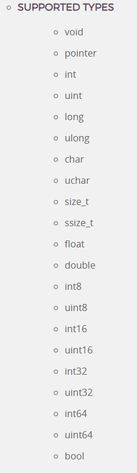

**상위 포스트 -** [Frida](/2024-12/Frida)

---

**Index**

[Data Type](#data-type)

[&emsp;Int64, UInt64](#int64-uint64)

[&emsp;NativePointer](#nativepointer)

[&emsp;NativeFunction](#nativefunction)

[&emsp;NativeCallback](#nativecallback)

[Process](#process)

[Module](#module)

[Memory](#memory)

[CModule](#cmodule)

[Interceptor](#interceptor)

## Data Type

### Int64, Uint64

- `new Int64(v)` , `new UInt64(v)`: string 혹은 숫자인 `v`를 넣어서 object 생성

### NativePointer

- `new NativePointer(s)` : 주소에 해당하는 `s`값을 넣어서 object 생성. 간단한게 `ptr(s)`로도 가능
- `isNull()` : `NativePointer`가 `Null`인지 아닌지 판별해줌
- `toInt32()` : `NativePointer`를 signed 32-bit Integer로 캐스팅함
- `toString([radix = 16])` : string으로 변환 (radix는 default로 16)
- Read 관련
    - `readPointer()` : 해당 주소에서 `NativePointer`를 읽어옴
    - `readS8()` , `readU8()`, `readS16()`, `readU16()` , `readS32()`, `readU32()`, `readShort()`, `readUShort()` , `readInt()`, `readUInt()`, `readFloat()`, `readDouble()`, `readS64()`, `readU64()` , `readLong()`, `readULong()`
    - `readByteArray(length)` : length에 해당하는 byte 수만큼 읽어와서 `ArrayBuffer` 반환
    - `readCString([size = -1])`, `readUtf8String([size = -1])`, `readUtf16String([length = -1])`, `readAnsiString([size = -1])` : 각각에 맞는 format으로 string 읽어옴. option으로 string size를 인자로 넣을 수 있음. `readAnsiString()`은 window에서만 가
- Write 관련
    - `WritePointer()`
    - `writeS8()`, `writeU8()`, `writeS16()`, `writeU16()`, `writeS32()`, `writeU32()`, `writeShort()`, `writeUShort()`, `writeInt()`, `writeUInt()`, `writeFloat()`, `writeDouble()`, `writeS64()`, `writeU64()`, `writeLong()`, `writeULong()`
    - `writeByteArray(bytes)` : `bytes`는 `ArrayBuffer`거나 각 element가 0~255 사이인 일반 array
    - `writeUtf8String(str)`, `writeUtf16String(str)`, `writeAnsiString(str)` : JavaScript string 넣으면 알아서 encoding해서 메모리에 값 써줌

### NativeFunction

- `new NativeFunction(address, returnType, argTypes[, abi])` : `NativePointer` 객체인 `address`에 함수를 만듦. `returnType`은 말 그대로 반환 type, `argTypes`는 인자들의 type인데 array형태로
    
    
    

### NativeCallback

• `new NativeCallback(func, returnType, argTypes[, abi])`: create a new NativeCallback implemented by the JavaScript function `func`, where `returnType` specifies the return type, and the `argTypes` array specifies the argument types. You may also specify the abi if not system default. See [`NativeFunction`](https://frida.re/docs/javascript-api/#nativefunction) for details about supported types and abis. Note that the returned object is also a [`NativePointer`](https://frida.re/docs/javascript-api/#nativepointer), and can thus be passed to [`Interceptor#replace`](https://frida.re/docs/javascript-api/#interceptor-replace). When using the resulting callback with [**Interceptor.replace()**](https://frida.re/docs/javascript-api/#interceptor-replace), `func` will be invoked with `this` bound to an object with some useful properties, just like the one in [**Interceptor.attach()**](https://frida.re/docs/javascript-api/#interceptor-attach).

---

## Process

- `P[rocess.id](http://process.id)` : PID 값을 숫자로써 갖고 있음
- `Process.arch` : `ia32`, `x64`, `arm`, `arm64` 등의 아키텍처를 string으로 갖고 있음
- `Process.platform` : `windows`, `darwin`, `linux`, `qnx` 등의 platform을 string으로 갖고 있음
- `Process.mainModule` : 프로세스의 main excutable을 `Module` class로 갖고 있음
- `Process.getCurrentDir()` : 현재 작업 중인 directory의 path를 string으로 갖고 있음
- `Process.isDebuggerAttached()` : debugger가 현재 attached되어 있는 지 여부를 bool로 갖고 있음
- `Process.getCurrentThreadId()` : OS-specific thread id를 숫자로 갖고 있음
- `Process.enumerateThreads()` : 모든 thread들에 대하여 다음 property를 가진 array를 갖고 있음
    - `id` : OS-specific id
    - `state` : `running`, `stopped`, `waiting`, `uniterruptible`, `halted` 중 하나를 string으로 갖고 있음
    - `context` : thread의 context를 담고 있음. 아키텍쳐에 따라 레지스터 값 등에 접근 가능
- `Process.findModuleByAddress(address)`, `Process.findModuleByName(name)` : 인자에 대응하는 `Module`을 반환. 찾지 못할 경우 null 반환
- `Process.getModuleByAddress(address)`, `Process.getModuleByName(name)` : 인자에 대응하는 `Module`을 반환. 찾지 못하면 exception 발생.
- `Process.enumerateModules()` : 로드된 모듈들을 array로 반환.
- `Process.setExceptionHandler(callback)` : hosting process보다 먼저 exception을 handling할 exception handler callback을 설정할 수 있다.

---

## Module

`Process`처럼 global하게 사용할 수 있는 것은 아니고, `Module.load()` 혹은 `Process.enumerateModules()`로 반환 되어 사용된다.

- `name` : 모듈 이름을 string으로 반환
- `base` : base address를 `NativePointer`로 반환
- `size` : size in bytes
- `path` : 해당 module의 full filesystem path를 string으로 반환
- `enumerateImports()` : module에서 import한 것들을 array로 반환한다. 여기서 반환된 element는 다음의 property를 가지고 있다.
    - `type` : `function` 혹은 `variable`이라는 string을 가지고 있다.
    - `name` : import name을 string으로 가지고 있다.
    - `module` : module name을 string으로 가지고 있다
    - `address` : 절대 주소를 `NativePointer`로 가지고 있다
    - `slot` : import가 저장되어 있는 memory 위치이다. `NativePointer`
- `enumerateExports()` : module에서 export하는 것을 array로 반환한다. 다음의 property를 가지고 있다.
    - `type` : `function` 혹은 `variable` 이라는 string
    - `name` : export name을 string으로 가지고 있음
    - `address` : 절대 주소를 `NativePointer`로 가지고 있다
- `enumerateSymbols()` : module에서 symbol들을 array로 반환한다. 다음의 property를 가지고 있다.
    - `isGlobal`  : global하게 사용될 수 있는지 boolean으로 가지고 있다.
    - `type` : type을 string으로 갖고 있다. 종류가 많은데, ELF만 살펴보면 `unknown` , `section`, `object`, `function`, `file`, `common`, `tls`
    - `name` : symbol name을 string으로 가지고 있다.
    - `address` : 절대 주소를 `NativePointer`로 가지고 있다.
- `enumerateSections()` : module에서 section들을 array로 반환한다. 다음의 property를 가지고 있다.
    - `name` : section name이 string으로 있다.
    - `address` : `NativePointer`
    - `size`
- `findExpolrtByName(exportName)`, `getExportByName(exportName)` : export name에 대한 address 반환한다. find-prefix는 못 찾을 경우 null을 반환하고, get-prefix는 error를 던진다.
- `Module.load(path)` : path에 있는 모듈을 load헤서 `Module` 객체로 반환한다. 못 찾으면 exception이 난다.
- `Module.findBaseAddress(name)`, `Module.getBaseAddress(name)` : `name`을 가지고 Module의 base address를 반환한다.
- `Module.findExportByName(moduleName|null, exportName)`, `Module.getExportByName(moduleName|null, exportName)` : moduleName과 exportName을 가지고 주소를 반환한다. moduleName을 잘 모르면 null을 넣어도 된다.

---

## Memory

- `Memory.scan(address, size, pattern, callbacks)`: `pattern`을 가진 메모리를 스캔함.
    - `pattern`: “13 37 ?? ff” 이런 식으로 작성해야 함. bit 단위의 `pattern`을 설정하고 싶다면 bit mask를 씌우면 된다. “13 37 13 37 : 1f ff ff f1” 이런 식으로 `:` 뒤에 mask를 붙이면 됨
    - `callbacks`
        - `onMatch(address, size)` : `pattern`이 발생한 주소에 대한 `NativePointer`와 `size`가 인자로 전달된 채로 call된다. 이걸로 하고 싶은 작업 할 수 있음. `stop`이라는 string을 반환하면 일찍 scan을 멈출 수 있다.
        - `onError(reason)` : error에 대한 핸들러 느낌
        - `onComplete()` : 주어진 range에 대한 scan이 다 끝나면 호출된다.
- `Memory.scanSync(address, size, pattern)` : `Memory.scan()`을 한 번에 해서 array로 반환하는 버전이라고 보면 된다. 반환하는 array에 있는 객체는 다음의 property를 가진다.
    - `address`: `NativePointer`의 주소
    - `size`
- `Memory.alloc(size[, options])` : size에 해당하는 메모리를 `heap`에 할당함. 만약 size가 OS의 1개 page 단위를 넘어가면, 해당 메모리를 OS가 직접 관리하는 듯??
    - `option`을 선택적으로 사용할 수 있는데, `{near: address, maxDistance: distanceInBytes}` 이런 식으로 원하는 곳에서 가까운 주소에 할당할 수 있다. `page granularity`를 사용할 때 필요할 수 있다고 하는데, 정확히는 잘 모르겠다.
    
    이렇게 해서 `NativePointer` 객체를 반환한다.
    
- `Memory.copy(dst, src, n)`: `memcpy()` 와 동일한 동작 `dst`와 `src` 는 `NativePointer`. 반환값 없음
- `Memory.dup(address, size)` : `copy()` 한 것을 새로 `alloc`해서 반환함
- `Memory.protect(address, size, protection)` : `protection`을 바꿔줌.
    - `protection`: `rwx` string으로 주어져야 한다. `rw-` 이 경우 최소 read write 권한이라는 의미
- `Memory.patchCode(address, size, apply)` : `NativePointer` 객체인 `address`에서부터 `size`만큼 `apply`에 해당하는 byte로 패치함.
    - `apply` : writable pointer와 함께 호출됨.
    
    ```jsx
    const getLivesLeft = Module.getExportByName('game-engine.so', 'get_lives_left');
    const maxPatchSize = 64; // Do not write out of bounds, may be a temporary buffer!
    Memory.patchCode(getLivesLeft, maxPatchSize, code => {
      const cw = new X86Writer(code, { pc: getLivesLeft });
      cw.putMovRegU32('eax', 9000);
      cw.putRet();
      cw.flush();
    });
    ```
    
    - `X86Writer`의 경우 아래에 자세한 spec이 있음
        - https://frida.re/docs/javascript-api/#x86writer

---

## CModule

`new CModule(code[, symbols, options])`

`code` 로부터 새로운 c module을 생성함. 런타임에 C code를 컴파일하고 실행할 수 있도록 지원하는 기능.

예시)

```jsx
const cm = new CModule(`
#include <stdio.h>

void hello(void) {
  printf("Hello World from CModule\\n");
}
`);

console.log(JSON.stringify(cm));

const hello = new NativeFunction(cm.hello, 'void', []);
hello();
```

---

## Interceptor

- `Interceptor.attach(target, callbacks[, data])` : `target`에 위치한 함수의 call을 가로챈다.
    - `target` : call을 가로챌 `NativePointer`이다.
    - `callbacks`
        - `onEnter(args)` : 함수가 호출되기 전에 실행될 코드이다. 여기서 `args`는 `NativePointer`로 이루어진 인자들의 array이고, 이 인자들은 read, write 권한이 있다
        - `onLeave(retval)` : 함수가 반환될 때 실행되는 코드이다. 여기서 `retval` 역시 `NativePointer` 객체이다. 이 `retval`은 `retval.replace(1337)`, `retval.replace(ptr("0x1234"))` 이런 식으로 값을 바꿀 수 있다.
    - `call` 뿐만 아니라 임의의 instruction을 intercept하는 것도 가능하다. 이 경우에 `onEnter`는 기존 `call`에 대한 intercept와 동일한 signature를 갖지만, `args` 의 경우에는 intercept한 instruction이 함수의 초기 단계에 있어서 아직 레지스터에 유효한 `args`값이 있는 경우에만 합당한 결과를 얻을 수 있음.
    - `this` object가 유용하게 사용될 수 있다.
        - `returnAddress` : return address가 `NativePointer`로 반환된다
        - `context` : 레지스터 값들을 얻을 수 있다. `eax`, `rax` 등등으로 접근하면 얻을 수 있다.
- `Interceptor.detachAll()` : 이전에 attach한 callback을 모두 detach
- `Interceptor.replace(target, replacement[, data])` : `target`에 위치한 function을 다른 `replacement`에 있는 구현체로 대체함. JavaScript에서는 `NativeCallback`을 이용하면 `replacement` 를 구현할 수 있음.
- `Interceptor.revert(target)` : 이전 `implementation`으로 되돌려 놓음

---