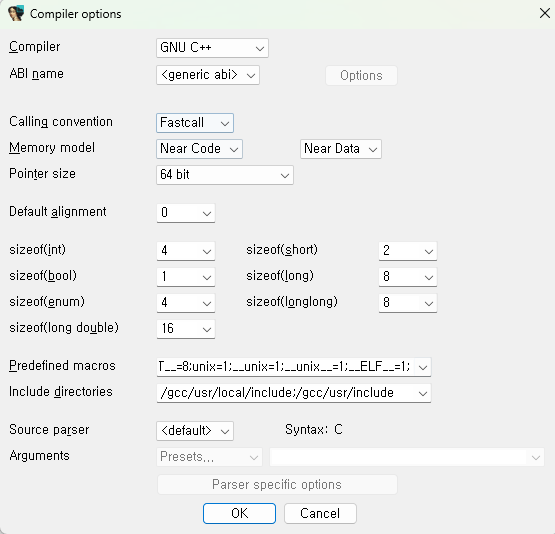

**상위 포스트 -** [IDA 고급](/2024-12/IDA_고급)

IDA 기본 내장 Header Parser도 있다. 하지만 복잡한 헤더 파일을 파싱하기에는 성능이 많이 부족하다.

대신에, IDA는 IDAClang이라는 plugin을 내장하여 제공한다. 복잡한 헤더 파일도 파싱할 수 있 타사 라이브러리에 아웃소싱하는 방식이다.

예를 들어서 아래의 구조체를 파싱하려고 시도해보자.

```cpp
#include <string>
#include <vector>
#include <map>
#include <set>

struct stl_example_t {
    std::string str;
    std::vector<int> vec;
    std::map<std::string, int> map;
    std::set<char> set;
};
```

일단 기본 IDA에는 std::string, std::vector, std::map 등의 STL 구조체가 내장되어 있지 않다. 물론 저런 type을 가진 type library들을 내장시켜주는 plugin들이 존재하는 것으로 아는데, 본인은 안 써봄.

어찌 되었든 위 형태의 복잡한 구조체를 파싱해서 IDA에 들고 올 수 있다. 뿐만 아니라, #include를 하면서 그것 외에도 많은 type들이 포함되기에 std::string 등의 구조체로 set_type을 할 수 있게 된다.

이제 하는 방법을 알아 보자.

1. 헤더 파싱을 해주는 Compiler를 IDA 내장 컴파일러에서 IDAClang으로 변경

`Option > Compiler` 메뉴로 들어가면 이를 설정할 수 있는 창이 뜬다.



여기서 `Source parser`를 default가 아닌 IDAClang으로 설정한다.


이때 Arguments에는 상황에 따라 넣어주는 값이 달라진다. IDA에서 기본적으로 Window, Mac, Linux 이렇게 3개의 프리셋이 제공되는데, 대체적으로 C++ 헤더를 파싱하는 것이 목적으로 설정하는 argument이다.

윈도우에서 IDA를 사용하고 있다면 window 프리셋으로만 설정해주면 문제가 없다.

Mac이나 Linux에서 IDA를 구동 중인 경우 IDA가 헤더의 path를 자동으로 찾지 못하는 이유로 C++ 헤더가 들어 있는 경로를 arguments에 추가해 주어야 한다.

Mac이나 Linux 자세한 건 

[https://docs.hex-rays.com/user-guide/type-libraries/idaclang_tutorial](https://docs.hex-rays.com/user-guide/type-libraries/idaclang_tutorial)

여기 참고

1. 헤더 파일 작성


그 다음에는 이런 식으로 헤더를 작성해 준다.

딱히 저런 구조체가 아니고 `std::string`이라던지 `std::vector<int>`  이러한 type만 필요한 경우에는 그냥 필요한 헤더를 include하는 헤더 파일로도 충분하다. 직접 해보지는 않았지만 헤더 파일 경로를 직접 찾아서 그걸 써도 될 것 같긴 한데 그게 더 번거로울 것 같다.

1. 헤더 파일을 IDA에 로드

`File > Load File > Parse C header file` 로 들어가서 작성한 헤더 파일을 선택하면 된다.


성공하였으면 아래와 같이 Local types 창에서(구 버전의 IDA는 structure subview) 구조체가 추가된 것을 확인할 수 있다.


** Window에서 IDA를 구동 중이지만 Linux 기반 헤더를 분석하고 싶을 때는 compiler 옵션 창의 header parser argument에 `-I` flag 사용하여 WSL의 헤더 경로들을 추가해주자.

[https://docs.hex-rays.com/user-guide/type-libraries/idaclang_tutorial](https://docs.hex-rays.com/user-guide/type-libraries/idaclang_tutorial)

여기에 Linux용 `-I` 플래그 설정하는 방법이 나오는데, WSL에서 `-I`플래그를 위한 경로 찾은 뒤 window 경로로 바꿔서 넣어주면 됨.

일반적인 C++ 헤더 정도가 필요할 대는 그냥 window에 내장된 헤더로 충분하지만, 간혹 이런 기능이 필요할 때가 있는 것 같음.