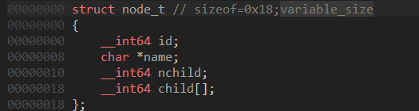

**상위 포스트 -** [IDA 고급](/2024-12/IDA_고급)

[Local Types](#local-types)

[Structure](#structure)

[Enum](#enum)

## Local Types

IDA Pro의 버전이 8로 넘어오면서 Local Types 창에서 구조체들을 관리할 수 있다.

물론 예전에도 가능은 했는데, 이제는 그냥 structure subview가 필요 없어진 느낌.

구조체 등을 추가할 때 C syntax도 제공하기에 C 문법으로 구조체나 열거형 등을 작성해서 IDA type으로 추가할 수 있다.

## Structure

구조체를 작성하는 방법은 이미 아실 거라고 생각한다.

가변 길이 구조체에 대해서도 설명한다.

```c
struct node_t
{
  long id;
  char *name;
  long nchild;                  // number of children
  long child[];                 // children
};

node_t n0 = { 0, "first",  2, { 1, 2 } };
node_t n1 = { 1, "second", 1, { 3 }    };
node_t n2 = { 2, "third",  1, { 4 }    };
node_t n3 = { 3, "fourth", 0,          };
node_t n4 = { 4, "fifth",  0,          };
```

위의 경우 마지막 `child` 변수는 가변 길이이다.



그냥 IDA에서 C syntax로 똑같이 작성해 주면 된다.

before


after


## Enum

상수에 의미를 부여하고 싶을 때 선언하면 된다.

이 때, bitfield를 정의할 수도 있는데,


Local Types에서 Enum type을 추가할 때 `Bitmask`에 체크하고 추가해준다.

그리고 그 뒤에 멤버 변수를 추가하는 방법은 예를 보면서 살펴보자.

```c
 #define OOF_SIGNMASK    0x0003
 #define   OOFS_IFSIGN   0x0000
 #define   OOFS_NOSIGN   0x0001
 #define   OOFS_NEEDSIGN 0x0002
 #define OOF_SIGNED      0x0004
 #define OOF_NUMBER      0x0008
 #define OOF_WIDTHMASK   0x0030
 #define   OOFW_IMM      0x0000
 #define   OOFW_16       0x0010
 #define   OOFW_32       0x0020
 #define   OOFW_8        0x0030
 #define OOF_ADDR        0x0040
 #define OOF_OUTER       0x0080
 #define OOF_ZSTROFF     0x0100
```

이렇게 되면 최대 7개의 oring으로 상수를 표현하고자 하는 것인데,

`OOF_SIGNMASK`와 `OOF_WIDTHMASK`의 경우 각각 3개와 4개의 값 중 하나가 사용된다는 의미가 되겠다.

이런 경우 아래와 같이 추가해 주면 된다.

```c
   name           value    mask   maskname

   OOFS_IFSIGN   0x0000   0x0003 OOF_SIGNMASK
   OOFS_NOSIGN   0x0001   0x0003 OOF_SIGNMASK
   OOFS_NEEDSIGN 0x0002   0x0003 OOF_SIGNMASK
 OOF_SIGNED      0x0004   0x0004
 OOF_NUMBER      0x0008   0x0008
   OOFW_IMM      0x0000   0x0030 OOF_WIDTHMASK
   OOFW_16       0x0010   0x0030 OOF_WIDTHMASK
   OOFW_32       0x0020   0x0030 OOF_WIDTHMASK
   OOFW_8        0x0030   0x0030 OOF_WIDTHMASK
 OOF_ADDR        0x0040   0x0040
 OOF_OUTER       0x0080   0x0080
 OOF_ZSTROFF     0x0100   0x0100
```

그러면 상수의 값을

 `mov     ax, 70h` →  `mov     ax, OOFS_IFSIGN | OOFW_8 | OOF_ADDR`

이런 식으로 바꿀 수 있다.