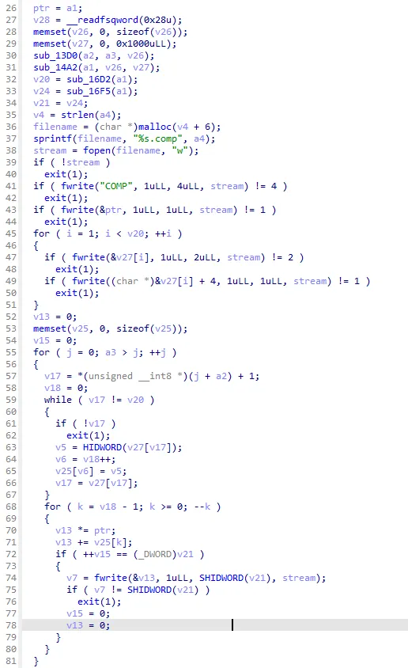

**상위 포스트 -** [IDA 고급](/2024-12/IDA_고급)


**Index**

[Basic](#basic)

[Interactive Operation](#interactive-operation)

[&emsp;Rename](#rename--n)

[&emsp;Set Type](#set-type--y)

[&emsp;Set number representation](#set-number-representation)

[&emsp;Edit comment](#edit-comment---ins)

[&emsp;Hide/Unhide C statements](#hideunhide-c-statements)

[&emsp;가변 인자 추가/삭제](#가변-인자-추가삭제)

[&emsp;Cross Reference](#cross-reference-x)

[&emsp;Cast 숨기기](#cast-숨기기-)

[&emsp;Split variable](#split-variable-shift-s)

[&emsp;변수 mapping](#변수-mapping-)

[기타](#기타)


## Basic

기본적으로 `F5`를 누르면 선택된 함수를 decompile할 수 있습니다.

하지만 아래와 같이 대다수의 경우 decompile된 코드가 말은 되지만 이쁘게 보이지는 않습니다.



가장 큰 이유는 type casting이 깔끔하지 않기 때문입니다.

기본적으로 `y`를 누르면 type casting을 원하는 type으로 수행할 수가 있습니다.

또한, source code level에서는 structure들이나 class 등이 정의되어 있지만 binary level에서는 그 정의가 명시되어 있지 않습니다. 이를 분석가가 잘 알아채어 해당 type들을 IDA type으로 선언할 수 있습니다.

이러한 기능들을 잘 활용하면 기본적으로 decompile 코드를 훨씬 예쁘게 바꿀 수 있습니다.


위의 코드를 바꾼 예시입니다.

---

## Interactive Operation

decompiler 또한 interactive하게 상호작용할 수 있습니다.

decompiler가 완벽하지 않기 때문에 사용자의 input으로 decompile의 질을 더 높일 수 있게 한다고 보시면 되겠습니다.

### Rename : `n`

- 다들 아는 기능입니다. 여기서는 rename할 수 있는 범위를 명시함
- `Function`, `Local variable`, `Global item (function or data)`, `Structure field`, `Statement Label`
- 추가적으로 register도 rename이 가능합니다. (disassembler 창에서 register 선택 후 `n`)

### Set Type : `y`

- type을 캐스팅 할 수 있는 기능. 특히 IDA의 경우 pointer와 관련된 type을 잘 캐스팅하지 못하니 `y` 기능을 잘 사용하면 pointer와 관련된 산술 연산을 유의미하게 바꿀 수 있음.
- `Function Parameter`, `Function Signature`, `Local variable`, `Structure field`, `Function calling convention`
- 어떤 type이 있는가??
    - 기존의 C type (char, int, unsigned char, double, …)
    - `_BYTE`, `_WORD`, `_DWORD`, `_QWORD`, `__int8`, `__int16`, `__int32`, `__int64`, 등이 있다.
    - **구조체**
- 잘못 casting된 경우도 적극적으로 `y`를 활용합시다

```c
        __int64 v0;
        v0 = 0ui64;
        
        LODWORD(v0) = 15;
        HIDWORD(v0) = 20;
```

예를 들어서 위와 같이 `v0`의 상위 4byte와 하위 4byte가 다른 변수처럼 사용된다면, casting을 바꿔서 두 개의 변수로 쪼갤 수 있음.

```c
        __int32 v0;
        __int32 v1;
        v0 = 0;
        v1 = 0;
        
        v0 = 15;
        v1 = 20;
```

decompiler는 빈 메모리 공간을 만들지 않습니다. type casting으로 기존 변수의 메모리 공간이 달라지게 되면 다시 parsing을 시도해서 자동으로 빈 메모리 공간에 대한 변수를 새로 생성.

- Calling convention이 일반적이지 않은 경우에도, 설정이 가능

예를 들어서

```c
#include <stdio.h>

typedef struct _node_t
{
  long id;
  char *name;
  long nchild;                  // number of children
  long child[];                 // children
}node_t;

node_t n0 = { 0, "first",  2, { 1, 2 } };
node_t n1 = { 1, "second", 1, { 3 }    };
node_t n2 = { 2, "third",  1, { 4 }    };
node_t n3 = { 3, "fourth", 0,          };
node_t n4 = { 4, "fifth",  0,          };

void print_node(node_t a) {
    printf("id: %ld\n", a.id);
    printf("name: %s\n", a.name);
    for (int i = 0; i < a.nchild; i++) {
        printf("child %d: %ld\n", i, a.child[i]);
    }

    return;
}
```

이런 식으로 structure를 인자로 넘기면, stack에 push된 채로 인자가 전달된다. 근데 decompiler는 어떻게 해석할까??


fastcall로 해석하면서 calling convention에 따라 stack까지 많은 인자를 거쳐서 가기 때문에 굉장히 너저분하다.

근데 사실은 a7, a8, a9만 사용한다.

이를 다음과 같이 고칠 수 있다.

`__int64 __usercall print_node@<rax>(__int64 a7, const char *a8, __int64 a9)`

(아래에서 소개할 `Shift-Del`을 써도 된다)

이렇게 usercall로 바꿀 수 있고, 이 usercall은 상당히 강력한데,

만약 parameter가 `rcx`, `r8`, `r9` 이렇게만 전달된다면

`__int64 __usercall print_node@<rax>(__int64 a4@<rcx>, __int64 a5@<r8>, __int64 a6@<r9>)`

이런 식으로 calling convention을 임의로 설정할 수도 있다.

### Set number representation

- `H` : 16진수로 변환 (이미 16진수인 경우에는 10진수로 변환)
- `R` : character constant representation으로 변환 (이때 big endian인 것 유의하자)
- `M` : enumeration으로 변환
- `_` : 음수 변환

### Edit comment : `/`, `Ins`

- 주석
- 바이너리 복잡도가 높아질 수록 자주 사용해야 하는 기능이라고 생각합니다.
- 공식적으로 `/`는 들여쓰기 주석, `Ins`는 블록 주석으로 구분되어 있지만,
    
    ```c
    /*
    이 함수는 두 숫자를 곱합니다.
    입력: x와 y (정수)
    출력: 두 숫자의 곱
    */
    ```
    
    이런 종류의 블록 주석은 안 되고 둘 다 똑같이 `//`로 시작하는 주석으로 달리게 된다.
    

### Hide/Unhide C statements

- Hide : `Keypad -`
- Unhide : `Keypad +`
- C statement(if문, for문, while문, switch-case문 등)을 한 줄로 축약할 수 있는 기능

before


after


- 뿐만 아니라 지역 변수 선언도 숨길 수 있다.


이걸 숨기면


### 가변 인자 추가/삭제

- 추가: `Keypad +`
- 삭제: `Keypad -`
- 예를 들어서 printf 같은 인자의 개수가 매번 달라지는 함수들의 경우 함수 parameter를 잘못 파싱할 수 있다.(사실 최신 버전은 진짜 거의 못봤다, 하지만 난독화에 따라 잘못 파싱되는 경우가 종종 있다 - 최근 과제 중 Chip VM)

before


after


### 함수 argument 삭제: `Shift-Del`

- return값에 커서를 두고 실행하면 자동으로 void형으로 casting된다.
- parameter에 커서를 두고 실행하면 지워지기도 한다.
- 정밀한 작업을 하고 싶다면 `y` 기능을 활용하도록 하자
- 비슷하게 return 값만 없애는 command로 `Ctrl-Shift-R`이 있다. 이건 커서가 어디 있든 상관 없이 수행 가능하다.

### Cross Reference: `x`

- 당연히 필수적인 기능이니 알 것이라 생각한다.
    
    
    
- 이 때 type란을 설명하면 아래와 같다.

```c
  r  Read
  w  Write
  rw Read/Write
  o  Reference
```

- 지역 변수, label, structure field, enumeration member, function(label의 일종)에 xref 기능 사용 가능하다

### Cast 숨기기: `\`


이런 식으로 강제 캐스팅 된 부분들을 숨기는 기능이다.


취향껏 사용하면 되지만, 올바르게 casting을 수행해서 decompiler가 강제 캐스팅을 하지 않도록 하는 것이 가장 바람직하다고 생각한다.

### split variable: `Shift-S`

- 같은 메모리 공간의 변수가 함수의 앞 부분에서는 A의 용도로 사용되다가 뒷 부분에서는 B의 용도로 사용되는 등, 여러 가지 용도로 사용되는 경우가 있다.
- 이 경우에는 rename하기가 상당히 난감한데, `Shift-S`로 변수를 두개로 쪼갤 수 있다.
- `Shift-S`를 수행한 커서 위치를 기점으로 함수 앞 쪽과 함수 뒤 쪽이 분리된다.
- 다만, loop 같이 다시 함수 앞쪽으로 control flow가 돌아가는 경우 앞쪽도 같이 변경될 수 있다.

### 변수 mapping: `=`

- 다른 메모리 공간의 변수가 같은 용도로 사용되는 경우도 있다. 이 경우 변수 메핑을 통해서 하나의 변수로 합칠 수도 있다.
- 다만, decompiler가 올바른 mapping인지를 검증하지는 않기 때문에 주의해서 사용하도록 하자.

`=`을 누르면 다음과 같은 창에서 같은 메모리 크기를 가진 변수를 보여준다.


mapping하고 싶은 변수를 골라 주면 된다.

 괄호 이동: `%`

- `(`에 대응하는 `)`로의 이동을 자동으로 해준다(반대도 마찬가지).
- 다만, 괄호 하나를 선택하면 대응되는 괄호 2개가 모두 highlight 되기에 효용이 크지는 않다.

---

## 기타

`SSE(Streaming SIMD Extensions)`의 경우 고급 언어(C 겠죠?)에 직접 매핑되지 않습니다. 

[Support for intrinsic functions: Hex-Rays Docs](https://docs.hex-rays.com/8.4/user-guide/decompiler/intrinsics)

이 곳에서 자세히 설명합니다. 예~엣날에 여름 방학 과제로 `SIMD` 연산 범벅인 리버싱 문제 내드렸던 거 있는데 그런 게 디컴이 잘 안되요.

IDA를 포함한 현대의 디스어셈블러 및 디컴파일러는 C++ 예외 처리(SEH, try-throw-catch)에 대한 메타데이터를 정밀하게 해석하여 결과를 보여주지 못합니다. try-catch문의 compiler 내부에서 try block과 catch block을 wind 및 unwind block으로 대체하게 되고 전역에 예외 처리와 관계된 메타 데이터를 생성하게 됩니다.

그렇기에 catch block에서 대해서는 decompile이 정확하게 수행되지 못하고 있습니다.

[Exception handler: Hex-Rays Docs](https://docs.hex-rays.com/8.4/user-guide/decompiler/exception-handler)

위 글을 통해 IDA에서는 이에 대해 어떻게 대처하고 있는지 살펴볼 수 있습니다. `IDA 9.0 Pro`에서는 예외 처리 문이 pseudocode level에서도 표현될 수 있도록 지원하고 있습니다. 아래는 9.0에서 C++ Exception을 support하는 것에 대한 글입니다.

[Unveiling IDA Pro 9.0: C++ Exceptions Support in the Decompiler](https://hex-rays.com/blog/unveiling-ida-pro-9-0-c-exceptions-support-in-the-decompiler)

IDA는 `MBA(Mixed Boolean-Arithmetic)` 형태의 난독화 표현을 자동으로 해제할 수 있는 기술을 탑재하고 있습니다. 이전에 anti-reversing에서 `data unfold`에 대해서 소개해 드린 바가 있는데, 유사한 난독화 기술입니다.

IDA는 이러한 난독화된 표현을 정적으로(실행하지 않고도) 간결하게 표현할 수 있도록 하기 위하여 z3가 작동하는 원리인 `SMT Solver`를 도입하여 이를 해결하고 있습니다. 아래에 자세한 내용이 있습니다.

[gooMBA: Hex-Rays Docs](https://docs.hex-rays.com/8.4/user-guide/decompiler/goomba)

reversing할 때 library 함수들이 바이너리 내부에 박혀서 나오는 경우가 있습니다(static linking). reversing하는 입장에서 라이브러리 함수를 분석하는 행위는 시간 낭비입니다. (예를 들어서 printf 함수 내부를 분석하지는 않죠?). 하지만 바이너리 내부에 박히는 경우 심볼이 죽어 있는 경우에는 라이브러리와 비라이브러리 함수를 구분하기도 쉽지 않고 라이브러리 함수도 어떤 함수인지 알아차리기는 어렵습니다. 이를 해결하기 위하여 compiler별로 library 별로 signature 파일들을 생성해 놓고, 동일한 signature를 가진 함수에 대해 심볼을 복구해주는 기술인 `FLIRT`를 지원하고 있습니다.

[FLIRT: Hex-Rays Docs](https://docs.hex-rays.com/8.4/user-guide/signatures/flirt)

아쉽지만 현재는 C/C++만 지원하고 있습니다.

그리고, C++같은 경우는 템플릿이라는 요소 때문에, 라이브러리의 함수처럼 보이는 것들도 새롭게 생성되는 경우가 많아서 FLIRT에 시그니처가 없는 함수들이 생성되는 경우도 빈번합니다.

(예를 들어서 본인이 `MyClass`라는 class를 생성 후 `vector<MyClass>`를 선언하면 이에 대한 constructor는 library에 없겠죠?? 컴파일러가 대응하는 constructor를 새로 생성하게 됩니다.)