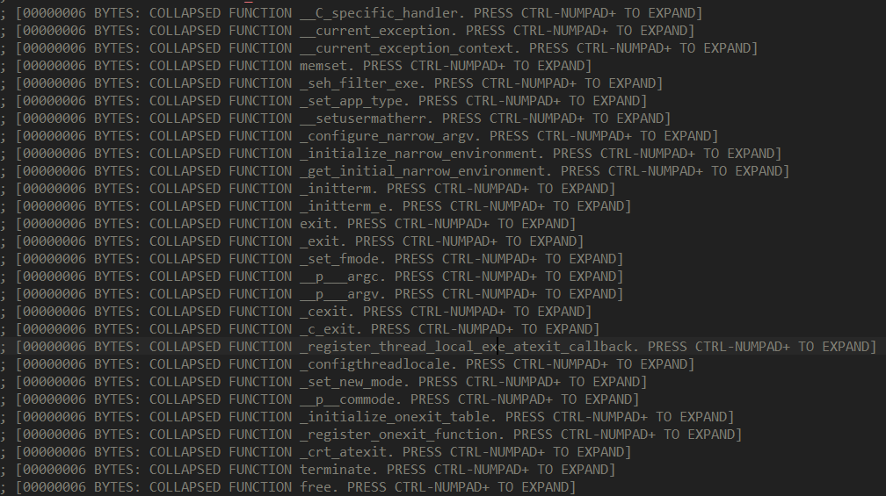

**상위 포스트 -** [IDA 고급](/2024-12/IDA_고급)

**Index**

[Interactivity](#interactivity)

[&emsp;개요](#개요)

[&emsp;기능들](#기능들)

[Graph View](#graph-view)

[&emsp;개요](#개요-1)

[&emsp;기본 기능들](#기본-기능들)

[&emsp;Address Naming](#address-naming)

[&emsp;Coloring](#coloring)

[&emsp;group node](#group-node)

[&emsp;Flow charts](#flow-charts)

[Pseudocode + Disassembler](#pseudocode--disassembler)

[&emsp;Synchronize with Pseudocode view](#synchronize-with-pseudocode-view)

[&emsp;Copy pseudocode to assembly](#copy-pseudocode-to-assembly)

## Interactivity

### 개요

IDA disassembler의 가장 큰 장점은 Interactivity.

기계어와 어셈블리어는 1 대 1 대응이기 때문에, 대부분의 disassembler는 강력한 디스어셈블 기능을 제공함.

하지만, 난독화 등의 이유로 디스어셈블 결과가 잘못될 수 있고, recursive하게 disassemble하는 디스어셈블러의 경우(IDA 포함) 해독이 되지 않는 경우도 존재. 분석 시 마주할 수 있는 문제점들을 사용자가 직접 해결할 수 있도록 disassembler에 여러 상호 작용을 수행할 수 있음.

### 기능들

Convert to instruction: `C`

Convert to data: `D`

- data로 간주되는 영역에 커서를 올리고 `D`를 누르면 `db → dw → dd → dq → db`이런 식으로 data의 size 단위를 조절할 수 있음

Undisassemble(assemble): `U`

- 명령어에 커서를 올린 상태에서 작동 시 `D`와 수행 결과가 같음

Make function: `P`

- 커서가 위치한 부분이 함수로 해석될 수 있으면 함수로 만들고 function list에 추가함
- 함수가 되면 디컴파일을 수행할 수 있음
- 함수를 해제하고 싶다면, 함수의 포멧을 구성하는 명령어를 해제하면 함수가 파괴되는 효과를 얻을 수 있음.

Anchor : `Alt + L`

- 매우 큰 범위를 동시에 선택해야 할 때, Anchor 기능을 사용하면 드래그가 아닌 클릭 두 번으로 선택할 범위의 처음과 끝을 선택할 수 있음.

collapse function: `Ctrl - Numpad +`, `Ctrl - Numpad -`

- 함수를 한 줄로 축약이 가능하다.

---

## Graph View

### 개요

함수 단위로 Flow chart를 그려 주는 기능.

이 graph view에 적응하면 text view는 보기가 힘들다.

그런데, 그냥 graph view로 볼 수 있다는 것은 알지만 graph view와 관련된 다른 기능들도 꽤 있어서 소개하고자 한다.

참고로 `option > General` 창에 가면 graph view에서도 가상 주소나 stack offset을 표시하거나 등의 설정을 건드릴 수 있다.

### 기본 기능들

확대/축소: Ctrl을 누른 채로 마우스 휠을 움직이면 확대 or 축소가 가능하다.

graph node를 드래그해서 위치를 옮길 수 있다.

graph overview

기본 인터페이스 설정 기준으로 functions subview 아래에 위치한다.

여기서 보고 싶은 부분을 클릭하면, IDA view의 시야를 결정할 수 있다.

크고 복잡한 크기의 그래프에서도 원하는 부분으로 쉽게 이동할 수 있게 해준다.

또는 전반적인 구조를 보기 쉽게도 해줌.

### Address Naming

IDA에서는 Label에다가도 rename을 할 수 있다는 것을 알고 있을 것이다.

graph의 Node도 가능하다. 해당 주소에 Label을 붙이고 그 라벨을 네이밍 하는 것과 거의 동일한 효과를 내는 듯 하다.

원하는 노드에서 빨간색 네모 표시 버튼을 누르면 naming이 가능하다.

이런 식으로 Label이 생성되게 되고, text 뷰에서도 유지된다.

### Coloring

별로 중요하지 않게 느껴질 수도 있는데, 단순 외관 상의 이유 뿐 아니라 타 노드와 구분하는 용도로 사용할 때 유용하다.

예를 들어서 위 노드는 assertion_err가 발생할 대 진입하는 node이므로 에러의 느낌을 풍기는 빨강으로 색칠해 둘 수 있다.

### group node

노드 여러 개를 하나의 노드로 합칠 수 있다. 노드가 너무 불필요하게 많다고 느껴지거나, 아니면 하나의 모듈처럼 간주하고 싶다면 이런 방법이 유용하다.

Ctrl을 누른 채로 노드를 클릭하면 여러 개의 노드를 동시에 선택할 수 있다.

그 상태에서 우클릭을 눌러서 `group node`를 선택하면 된다.

한 개의 node도 이를 수행할 수 있다.

group을 수행하면 이렇게 해당 node를 표현하는 text 문구를 표시할 수 있다. 이런 목적으로 한 개의 node에 grouping을 수행한다.

assembly handray를 할 때 특정 노드에 대한 분석이 끝나고 해당 노드의 동작을 group후 작성하는 표현 문구로 요약할 수 있다.

### Flow charts

우리가 맨날 보는 거 말고도 다양한 그래프가 있다는 사실 알고 계신가요.

함수 끼리의 xref들을 graph로 볼 수도 있음.

`subview → proximity browser` 선택하면 볼 수 있다.

바이너리 전체의 flow chart를 한 눈에 볼 수 있다.

함수 별로 볼 수 있음.

`+`로 되어 있는 노드들은 생략된 노드들인데 현재 함수에서 1 떨어진 함수들만 보여 주는 듯. 그 외에는 `+`표시로 축약된다.

더블 클릭하면 확대 가능

이거 말고도 함수 내부에 커서를 둔 체 우클릭하면 xref to graph, xref from graph를 볼 수 있는데

때때로 유용하다.

---

## Pseudocode + Disassembler

### Synchronize with Pseudocode view

이렇게 디컴 코드 한 줄에 대응하는 어셈블리 뭉치를 표시해준다.

disassembly 창에서 `우클릭 > Synchronize with.. > Pseudocode View`으로 사용 가능하다

disassembly와 pseudocode 창을 동시에 볼 일이 있으면 항상 사용하는 것이 좋은 기능이다.

특히 anti-decompile이 적용되어 일부 decompile이 되지 않은 assembly block을 찾는 것에 매우 좋다.

### Copy pseudocode to assembly

pseudocode창에서 우클릭 → `copy to assembly` 누르면 됨

요렇게 어셈블리 창에 디컴 코드가 추가된다.

기본적으로는 위에서 소개한 기능인 decompile창과 disassembler창을 동기화하는 것만으로 충분하다고 생각하지만, IDA를 작은 창으로 켜 놔야 해서 동시에 decompile 창과 disassembler 창을 켜기 힘들 때 사용하기 좋은 기능이라고 생각한다.